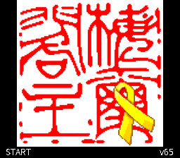

# 新桃太郎傳說：繁體中文化

《新桃太郎傳說》（Shin Momotarou Densetsu）日文 Rev 1 版的繁體中文化專案，採用臺灣常用用語，包含譯文、中文字庫、ROM 建置工具與原生模擬器驗證資料。

**本作平台是 Super Famicom／SNES，不是 NES。** 儲存庫名稱保留歷史命名；本專案處理的是 `.sfc` ROM。

| 項目 | 目前狀態 |
| --- | --- |
| 最新版本 | **v65**，已安裝並完成 ROM 回讀與獨立複核 |
| 文字索引收錄 | **7,126／7,788 筆（91.5%）** |
| 尚未收錄 | 662 筆，包含輸入字表、保留欄位及技術資料 |
| 中文字形 | 2,660 個 |
| 發布驗證 | 23 項發布工作、164 項測試、301 個原生文字場景通過 |
| 尚未完成 | 中文命名輸入、完整自然流程與通關驗證、實體裝置啟動確認 |

索引比例**不是整體遊戲完成度**，未收錄記錄也不等於同等數量的未譯對話。這仍是持續開發中的中文化版本。

**GitHub 發布範圍：** 程式碼、譯稿、IPS 補丁、文件與公開預覽。原版／中文化 ROM、玩家存檔、錄影、私人備份及本機驗證封存不會上傳。本文保留完整研究日誌，其中指向 ROM、備份、原始擷取或 `verification` 封存的連結僅適用於本機工作目錄；從 GitHub 取得專案時，請使用 IPS 並自行準備合法原版。封存報告描述當時本機的驗證結果，不表示所有證據檔案都隨 Git 儲存庫提供。

[最新版](#v65-完整發布包目前已部署) · [使用方式](#使用方式) · [開發與驗證](#開發與驗證) · [已知限制](#已知限制) · [歷史紀錄](#歷史紀錄)

## v65 完整發布包（目前已部署）

[v65 ROM](opening-preview-v65/opening-zh-Hant.sfc)與 [IPS 補丁](opening-preview-v65/opening-zh-Hant.ips)已封裝完成。全部 **23 項發布工作、164 項測試、301 個原生文字場景及 485 項詞句比對**通過，11 張發布預覽及原生 v65 歡迎畫面已檢視。見[完整發布驗證](opening-preview-v65/release-verification.json)。SHA-256：`6a726fb79df36a21b46a1eeec33409930ec282d110c312e4025e5538af25d470`。

**已由 v56 升級為 v65，4 MiB 裝置 ROM 完整回讀相符。** 舊 v56 ROM、405 個存檔及兩份作弊檔均已[備份](opening-preview-v65/deployment-backup/backup-manifest.json)。存檔與作弊設定保持原雜湊，包含新錄影在內的全部 215 個截圖目錄項目保留，刪除數為零。[部署紀錄](opening-preview-v65/deployment-verification.json)與[獨立複核](opening-preview-v65/deployment-audit.json)確認 448 個發布檔案、所有受保護檔案及備份均相符。先前因錄影仍在寫入而中斷的備份也另外保留，未覆蓋退出遊戲後的新檔案。

請完全退出遊戲／核心後重新啟動，歡迎畫面應顯示 **v65**。即時存檔會略過歡迎畫面，其中已繪製的舊文字需重新開啟對話／選單才會更新。尚未確認實體裝置啟動；中文命名輸入、自然事件流程及完整通關仍待驗證。下方舊版本的「未安裝」及裝置版本敘述是當時紀錄，現況以上方 v65 部署驗證為準。



## 使用方式

### 套用 IPS 補丁

1. 準備自行合法取得的日文 Rev 1 原版 ROM，先核對下方 SHA-256。
2. 使用支援 IPS 的補丁工具，將 [v65 IPS](opening-preview-v65/opening-zh-Hant.ips) 套用至原版 ROM 的副本。**不要套用至舊中文化版或其他修訂版**。
3. 核對輸出 ROM 的 SHA-256 與上方 v65 值一致；輸出大小應為 **4 MiB（4,194,304 位元組）**。
4. 備份既有 ROM、一般存檔及即時存檔，停止錄影並完全退出模擬器，再換入新版。
5. 使用 SNES 模擬器啟動。從重置狀態開始時會顯示 v65 歡迎畫面，按下並放開 Start 進入遊戲。

原版必須為 [Shin Momotarou Densetsu (Japan) (Rev 1).sfc](assets/Shin%20Momotarou%20Densetsu%20(Japan)%20(Rev%201).sfc)，SHA-256：

```text
3f79f2f44303e316994fad9d0b2ae6dc96146c5f2efc3f095a632c04c4fbbf7c
```

macOS 可用 `shasum -a 256` 核對檔案；原版若帶有額外檔頭或版本不同，雜湊不會相符。工具會拒絕不符的來源，不應略過檢查。

### 存檔與作弊設定

- 更新時保留原有 ROM 檔名，避免模擬器因檔名不同而找不到存檔；仍應先另行備份。
- 本次部署沒有改寫存檔、玩家自訂姓名或作弊開關，但不代表已驗證所有模擬器與存檔組合。
- 即時存檔可能保留舊文字畫面；重新開啟對話／選單，或重新進入戰鬥，才會重新繪字。
- [Snes9x 作弊檔](cheats/Shin%20Momotarou%20Densetsu%20(Traditional%20Chinese).cht)為選用功能。既有「一擊」設定排除普通蜥蜴，以保留斷尾機會；自然斷尾及物品取得仍未驗證。v65 安裝沒有重新套用或切換作弊設定。
- 不要直接重跑已完成的專用部署程式；它包含特定裝置路徑、舊版雜湊及備份保護，不是通用安裝器。

## 開發與驗證

### 環境需求

- 支援 ES modules 與 `node --test` 的 Node.js；核心工具不需要安裝 npm 套件。
- ImageMagick，建置時須能執行 `magick`。
- [Noto Sans CJK TC Regular](https://github.com/notofonts/noto-cjk/tree/main/Sans) 固定字重 OTF 字型。
- 上述雜湊相符的原版 ROM，放在 [assets](assets) 目錄的指定檔名。
- 原生畫面驗證另需 C++ 編譯器、Snes9x libretro 核心及對應測試存檔；一般單元測試與完整發布驗證是不同層級。

v65 使用的字型 SHA-256 為 `dce08bd4fd91aa8aa76ed8fea4b694c2dfb8550f67871e326843212ddbeb88b4`。字型或 ImageMagick 版本不同可能改變點陣結果，不應只憑建置成功就宣稱與發布版一致。

### 基本檢查

在專案根目錄執行：

```sh
node --test tests/*.test.mjs tools/*.test.mjs
node tools/inspect-rom.mjs self-test
node tools/font-codec.mjs verify
node tools/text-codec.mjs self-test
node tools/text-codec.mjs verify-fixtures tests/lz-runtime.json
node tools/text-catalog.mjs self-test
node tools/build-menu-patch.mjs self-test
```

這些指令不會安裝 ROM 到裝置，也不等於完成全部原生場景驗證。完整 v65 的測試結果與限制以[發布報告](opening-preview-v65/release-verification.json)為準。

### 重建 v65

使用[封存的翻譯清單](opening-preview-v65/resolved-translation-manifest.json)，不要用仍在編輯中的總清單替代。字型路徑需自行指定，輸出目錄必須尚不存在：

```sh
MOMOTARO_MANIFEST=opening-preview-v65/resolved-translation-manifest.json \
	node tools/build-menu-patch.mjs build-welcome \
	/path/to/NotoSansCJKtc-Regular.otf /tmp/momotaro-v65-rebuild \
	translations/opening.zh-Hant.json assets/welcome-new.png v65
```

建置器會檢查來源、控制碼、字庫、配置範圍、IPS 往返及校驗碼；完成後仍須比對輸出雜湊，不能將新建置自動視為已驗證發布包。[發布計畫](translations/release-v65.plan.json)列出本版回歸範圍；原生驗證使用 Snes9x 修訂 `1bcc369e89f08243e0a462882fb1f3e42e51de3a` 與 [ROM 執行器](tools/run-rom.cpp)。

### 專案導覽

| 路徑 | 內容 |
| --- | --- |
| [translations](translations) | 譯稿、文字映射與發布計畫；草稿不一定已納入發布版 |
| [tools](tools) | ROM 分析、編解碼、字庫建置、原生驗證與部署工具 |
| [tests](tests) | 單元測試與執行期資料樣本 |
| [opening-preview-v65](opening-preview-v65) | 最新 ROM、IPS、凍結清單、預覽與部署證據 |
| [verification](verification) | 各項修正的局部驗證與封存資料 |
| [cheats](cheats) | 作弊檔、測試與部署紀錄 |
| [maps](maps) | 地名與區域關係參考；不是逐格世界地圖 |

## 已知限制

- 中文命名輸入尚未實作完成。原作姓名欄位的單位元組容量已建立測試基準，不代表可直接輸入中文字。
- 原生測試包含合成場景，未涵蓋所有自然事件分支、動態姓名與數值上限、完整商店交易或通關流程。
- 畫面逐像素相符只能支持顯示驗證，不能單獨證明譯意正確。v65 已修正 v64 的「アオマヤ」誤讀，譯為「阿歐瑪亞」。
- 部署回讀通過不等於實體裝置啟動已確認；目前沒有完整實機遊玩驗證。
- 模擬器自己的選單、截圖與錄影通知不屬於遊戲 ROM 的中文化範圍。

## 回報問題

請提供版本號或 ROM SHA-256、模擬器／核心版本、出現問題的地點與操作步驟，以及能看清完整文字框的截圖。若可重現，請保留問題發生前的存檔副本，並註明是否載入即時存檔、是否啟用作弊。分享前請移除不必要的個人資料，不要附上原版 ROM。

地名可參考[世界地圖說明](maps/world-map-notes.md)；它是區域關係示意，包含後期地點資訊。

## 權利與字型

遊戲內容及原始素材的權利屬於各自權利人；中文化補丁不代表取得原版遊戲的散布授權。請自行合法取得所需原版，不將字型授權視為整個專案或遊戲的授權。

Noto 字型使用 SIL Open Font License，隨發布包附有[字型授權全文](opening-preview-v65/FONT-LICENSE.txt)。

## 歷史紀錄

下方完整保留先前的版本、研究及驗證筆記。當中的「目前」、部署狀態、容量與待辦均以記錄當時為準，可能已由後續版本取代；請以上方 v65 摘要與封存報告判斷現況。歷史建置指令不一定適用於 v65。

<details>
<summary>展開版本日誌與早期技術筆記</summary>

### v65 固定暱稱與範圍驗證紀錄

新增 27 個固定暱稱的繁體中文音譯，不猜人物本名，全部維持四字格內。連同 v63 的三個月相名稱，這一輪新增 **30 筆**，索引收錄達 **7,126／7,788 筆（91.5%）**，未收錄由 692 降至 **662 筆**。這不是整體遊戲完成度；保留資料未算成翻譯進度。

全部 45 個已選角色標籤的原生顯示、來源／重定位比對、23 組字庫邊界／六組負向檢查，以及完整 **163 項測試**通過。新暱稱截圖已逐項檢視，見 [v65 候選與驗證](verification/fixed-nicknames-v65/README.md)。v65 修正 v64 將「アオマヤ」誤讀為「アオヤマ」的問題，正確音譯為「阿歐瑪亞」；此修正不另計新增筆數。既有翻譯、預設動物名字及玩家自訂姓名保持原狀。

中文命名輸入、建議姓名資料與自然角色呼叫仍待處理；v63 已建立十二種原生命名模式的容量及資料保留回歸基準。上述 163 項測試是範圍封存時的結果；目前完整發布包通過 164 項測試，安裝狀態以上方紀錄為準。

## v63 月相名稱與命名回歸（本機範圍驗證，未安裝）

新增「娥眉月／十九夜／十八夜」三筆月相名稱，其餘月相與順序不變。索引收錄 **7,099／7,788 筆（91.2%）**，未收錄 **689 筆**；保留資料未算成新翻譯，這不是整體遊戲完成度。三個原生文字場景、23 組字庫邊界／六組負向檢查與完整 **162 項測試**通過，截圖已檢視。

新增可重跑的十二模式命名驗證，共 60 次原生執行、144 個容量樣本：確認原作四／五個單位元組字元的上限、B 只移動游標、確認時補齊名字內空格，以及狀態重載後資料保留。其他受測名字欄位與原始測試存檔未被改動。**這不是中文鍵盤實作，也不是遊戲內存讀檔驗證**；雙位元組輸入、舊自訂姓名相容與自然月相版面仍待處理。

候選、來源與測試證據見 [v63 封存說明](verification/moon-labels-v63/README.md)。尚未完成完整發布回歸，**未安裝，裝置 ROM 仍為 v56**。

## v61／v62 剩餘文字（本機範圍驗證，未安裝）

相較 v60 新增 **13 筆**：v61 補上十筆戰鬥診斷文字及一筆特殊處理註記；v62 補上固定角色名稱「貧窮大王／阿文」。索引收錄增為 **7,096／7,788 筆（91.1%）**，未收錄由 705 降為 **692 筆**。這不是整體遊戲完成度；保留資料沒有當作新翻譯計數。

v61 的 11 個原生文字場景、23 組字庫邊界／六組負向檢查，v62 的 18 個角色名稱場景，以及各候選的來源保留／IPS／校驗碼檢查通過；最新完整 **161 項測試**通過。預覽已檢視，見 [v61 證據](verification/residual-v61/README.md)與 [v62 候選及剩餘分類](verification/fixed-names-v62/README.md)。兩者尚未完成完整發布回歸，**未安裝，裝置 ROM 仍為 v56**。

已在本機副本打開原生命名鍵盤並測試 A／B：原作會立即覆寫固定長度的姓名欄位，B 在此案例只移動游標，不還原原字。因此剩餘 194 筆輸入字表不能只替換鍵帽，中文雙位元組輸入、長度限制及確認／取消／存讀檔仍需實作和驗證。其餘 498 筆含保留欄位、署名、數字、刻意異語及需檢查呼叫的片段，並非 498 句未譯對話。

## v60 完整發布包（本機驗證完成，待安裝）

[v60 ROM](opening-preview-v60/opening-zh-Hant.sfc)與[IPS 補丁](opening-preview-v60/opening-zh-Hant.ips)已完成打包，包含 v57 城堡戰鬥、v59 問答標題與分數、v60 商店「珍寶」及接收者「自動」修正。全部 **23 項發布工作、154 項測試、101 個原生文字場景及 130 項詞句比對**通過；11 張發布預覽及 v60 歡迎畫面已檢視，149 個封裝檔案雜湊獨立複核相符。見[發布驗證](opening-preview-v60/release-verification.json)。

SHA-256：`1adb065eab4c8782817c59177316eae3f7442a61efbefc5fc9e9e9535bff0762`。索引收錄 7,083／7,788 筆非空記錄，約 **90.9%**；705 筆未選取包含保留與技術資料，不等於全部仍需翻譯。此比例不是完整遊戲完成度；中文命名、自然購物／問答流程與完整通關仍待驗證。

**尚未安裝，最後核對裝置為 v56。** 2026-10-06 重新連線後已核對 v56 雜湊，但發布驗證期間 `/Volumes/share` 再次離線。沒有寫入裝置、改動存檔／作弊檔或刪除截圖。重新連線後仍須執行備份、安裝及完整回讀；下方候選階段紀錄保留其當時驗證範圍。

## v56 累積修正（歷史部署，現由 v65 取代）

已產生並安裝 [v56 ROM](opening-preview-v56/opening-zh-Hant.sfc)，包含 v51 至 v56 的親族圖、城堡／仙豆店選單、持有金、語速／隊列、重傷、村、滿月及預設「波奇／琪可」修正，沿用既有「蒙太」與字形基線。自訂姓名不改寫。另提供 [IPS 補丁](opening-preview-v56/opening-zh-Hant.ips)，僅適用日文 Rev 1 原版。

從[凍結清單](opening-preview-v56/resolved-translation-manifest.json)重新建置後，ROM 與 IPS 均與封存候選逐位元組一致。SHA-256：`cdd864a94f3e058d4ff775e94f8aa76b311794e778221b2312376a762434bcf4`。索引收錄 **7,083 筆**、未選取 705 筆、空記錄 82 筆；未選取包含保留與技術資料，不等於全部仍需翻譯。2,652 個字碼及字形保留。

全部 **23 項發布工作、144 項測試**通過，包括 101 個原生文字場景、130 項詞句比對、實際字典引用、完整選單、247 個敵名與讀音、相撲、啟動畫面、字庫邊界、八種戰鬥狀態、44 個指揮圖字格、50 個親族圖字格與九種動物姓名案例。11 張發布預覽已檢視，實際文字比對畫面一併封存。詳見[發布驗證](opening-preview-v56/release-verification.json)。

**4 MiB 裝置 ROM 完整回讀相符**。舊 v50 ROM、317 個存檔及兩份作弊檔均已[備份](opening-preview-v56/deployment-backup/backup-manifest.json)；存檔與作弊檔保持原雜湊，全部 201 個截圖目錄項目保留，截圖刪除數為零。[部署紀錄](opening-preview-v56/deployment-verification.json)與[獨立複核](opening-preview-v56/deployment-audit.json)確認 149 個發布檔案及所有受保護檔案、備份均相符。

請完全退出遊戲後重新啟動，歡迎畫面應顯示 **v56**。即時存檔中已繪製的舊文字需重新開啟對話／選單才會更新。尚未確認實體裝置啟動；中文命名輸入、自然問答選項／計分及完整通關仍未完成。下方 v51 至 v56 候選階段的「未發布／未安裝」與裝置版本敘述為當時紀錄，現況以上方 v56 部署驗證為準。

## v57 城堡戰鬥選單（本機範圍驗證，未發布）

補上截圖左上角的「突擊／逃跑」，並把右側彈藥欄「玉」改成「彈」。原字「大砲／修理／耐久度」與玩家命名的城堡名稱保留。逃跑後補兩格原生空白，維持原版邊框寬度；完整保留兩個視窗的動態欄位與指令回呼。

未裝大砲、0 發、10 發三種條件通過原生字形與數字顯示檢查；兩種大砲條件共八次指令選取，受測遊戲資料及兩個視窗的非翻譯區域一致。原有工房的 14 次選取、5 次取消回歸與 146 項測試通過。見[預覽、候選與證據](verification/castle-battle-v57/README.md)。

**未發布、未安裝，裝置仍為 v56。** 這是由測試入口呼叫原生視窗的局部驗證，不是自然城堡戰鬥；未涵蓋砲擊傷害、修理消耗與逃跑結果。場景動畫及部分未分類 RAM 差異有另外記錄，不宣稱整張場景或完整遊戲狀態一致。

## v58 戰鬥驗證補強（ROM 未改動）

補測狀態位元組 `7E180A` 的 `02／04／08／40` 四個單一值，每組 30 次取樣確認原版對照與候選均保留設定值；字形、受測遊戲資料及 HUD 外畫面比較通過。原有八組戰鬥案例也重新通過，合計 12 組、360 次 RAM 比較；三項新增回歸測試通過，兩張預覽已檢視。見[證據與重跑方式](verification/battle-status-followup-v58/README.md)。

**這是 v57 候選的驗證補強，不是新 ROM，也未安裝。** 四個位元的語意與自然取得方式尚未確定，不宣稱睡眠／混亂／冰凍／封術已完成。中文命名、自然問答與完整通關仍待驗證。最新索引仍為 7,083 筆收錄、705 筆未選取，其中共用情境審核 175 筆、保留／技術資料 530 筆；未孤立翻譯字典句尾或改寫玩家姓名。

## v59 問答選單（本機範圍驗證，未發布）

補上前期與中期問答標題「選擇」及分數欄「分數」，保留原生選項順序、正解表、回呼與計分程式。兩個題庫共 **88 題、264 次選取、88 次 B 鍵檢查**通過；正解加 20 分，錯答不加分，B 鍵維持原本的忽略行為。另跑六輪五題流程，兩個題庫均核對總分 0／80／100，以及 20／40／60／80 的可見數字變化。

146 項測試、來源／IPS／校驗和與 v59 原生啟動畫面檢查通過。相較 v57 僅改動 260 個位元組，限制於三份選單與指標、版本圖塊、校驗碼；全部 2,652 字形及既有索引譯文保留。見[候選、預覽與重跑方式](verification/quiz-menus-v59/README.md)。

**未發布、未安裝，裝置仍為 v56。** 題庫與題號是在測試 ROM 中固定，再由場景測試入口呼叫原生控制器，不是自然 NPC 對話。連續五題的背景圖塊異常在對照與候選都可見，清場後為黑畫面；只確認問答視窗與計分，不宣稱自然場景、結束評語、獎勵、完整發布回歸或通關完成。事件表工作索引的已知差異另列，其他受測遊戲資料維持嚴格比較。中文命名及完整自然流程仍待處理。

## v60 商店遺漏標籤（本機範圍驗證，未發布）

修正新截圖中的「掘り出し物 → 珍寶」與「おまかせ → 自動」。使用既有安全字碼並補原生空白，保留視窗寬度、角色姓名、動態欄位、兩個接收者入口與原選取回呼。五個商店分支及四人接收者選單共 **27 次選取、六次取消**通過；自動與手動選擇均返回原生隊員 ID，金錢、隊伍與姓名不變。

147 項測試、工房／城堡選單回歸、來源／IPS／校驗和及 v60 啟動畫面檢查通過。相較 v59 僅改動 316 個位元組，全部 2,652 字形及索引譯文保留。見[候選、預覽及驗證範圍](verification/shop-followup-v60/README.md)。

**未發布、未安裝，裝置仍為 v56。** 這是測試入口呼叫原生函式的局部驗證，不是自然購物流程；未驗證背包已滿、全員不可接收、實際扣款與物品交付。未存取裝置或修改存檔、作弊檔、截圖。

### v60 接收者人數補測與待安裝狀態

新增一至四名隊員的自動／手動接收者檢查，共 14 次選取、四次取消通過；原有六個商店情境重新通過，148 項測試通過。ROM 不變，見[補測證據](verification/recipient-party-sizes-v60/README.md)。

使用者已要求安裝新版；重新連線時已核對裝置 ROM 為 v56，但 2026-10-06 完整發布驗證期間 `/Volumes/share` 再次離線，尚未執行安裝。v60 完整發布包已通過 23 項工作及 154 項測試，149 個封裝檔案雜湊相符；部署檢查須待重新連線，未寫入裝置，不宣稱 v60 已安裝。

## 世界地名參考圖

[繁體中文地名圖](maps/world-map-zh-Hant.png)列出 71 個不同地點，並標示金太郎村與足柄山的建議目的地。這是**區域關係示意，不是實際地形或逐格世界地圖**；包含後期地名。來源、未定位名稱及重建方式見[地圖說明](maps/world-map-notes.md)。

## v50 標點與字形基線修正（歷史部署，現由 v56 取代）

截圖中的「一」與逗號偏高，原因是大字字形使用左上角定位，讓較矮的筆畫也貼齊頂端。新[候選清單](translations/font-alignment-v50.release.json)改用固定基線；舊清單保留原定位方式，以便重建既有版本。繁體中文標點依臺灣字型原有位置排版，並非全部置底。

已檢查全部 **20 種標點、4 種符號及「一」**：完整筆畫未裁切、四組原生文字框逐像素比對及舊字形反例均通過。「遭龍捲風打擊，損失…」與「會心一擊！」兩筆截圖對白另行原生重播通過。11 項字庫相關測試、IPS 回套與校驗和檢查通過；除大字字庫、版本畫面及校驗和外，ROM 與 v49 位元組一致。12 像素下「一／─」為已確認的相同橫線，僅允許這組字形重複。

[v50 ROM](opening-preview-v50/opening-zh-Hant.sfc)、[IPS 補丁](opening-preview-v50/opening-zh-Hant.ips)、[完整標點預覽](opening-preview-v50/punctuation-review.png)及[發布驗證](opening-preview-v50/release-verification.json)已保存。SHA-256：`8430627185a7bebf8cf369e5c663a70498a26c2cc02f210d93f3a5d89edb74a3`。2,652 個字碼全部保留，308 個字形重新對齊，其餘 2,344 個字形完全相同；索引譯文與 v49 一致，並沿用其指揮圖與預設「蒙太」修正。

本版全部 42 項建置／驗證工作通過，包括 **106 個原生對白場景、416 項詞句比對、135 項測試**，以及完整選單、247 個敵名與讀音、商店／洞窟、相撲、啟動畫面、字庫邊界、八種戰鬥狀態、44 個指揮圖字格及四種名字案例。戰鬥對照 ROM 僅同步大字字庫，以免把已修正的對白基線當成戰鬥異常；舊版狀態字形反例與戰鬥資料檢查保留，麻痺排序差異另有記錄。13 張正式預覽已檢視，410 個發布檔案雜湊已核對。合成場景不代表完整自然通關，動態角色欄位可能留白。

**v50 已安裝，4 MiB ROM 完整回讀相符**。舊 v48 ROM、305 個存檔、兩份作弊檔及 68 張本遊戲截圖均有[備份清單](opening-preview-v50/deployment-backup/backup-manifest.json)。存檔與作弊檔保持原雜湊；安裝成功後，依「移除全部本遊戲截圖」授權刪除已備份的 68 張，其他 200 個截圖目錄項目保留，並完成獨立複核。詳見[部署驗證](opening-preview-v50/deployment-verification.json)。先前 67 張的單獨清理僅完成備份，本次已完成清理，不重複計數。

v50 當時的歡迎畫面顯示 **v50**；目前安裝版本與重新啟動方式請以上方 v56 紀錄為準。

## v56 動物預設名字（本機範圍驗證，未發布）

補上預設「波奇／琪可」的動態姓名顯示，沿用既有「蒙太」。僅在指定角色欄位完全符合原預設名字時替換顯示，不改寫存檔。九組原生案例涵蓋預設名、自訂後綴、完全自訂、其他角色使用相同文字，以及蒙太回歸；姓名 RAM 不變，非姓名區像素一致。143 項測試與全部編解碼檢查通過，見[畫面與證據](verification/default-animals-v56/README.md)。

**未發布、未安裝**；這是原生動態姓名繪製器的局部測試，不代表中文命名輸入、所有自然戰鬥／選單或完整存讀檔流程完成。索引譯文與 2,652 字形沿用 v55。

## v55 剩餘標籤（本機範圍驗證，未發布）

補上能力頁「重傷」、字典「村」及月相「滿月」。最終候選通過正常／重傷能力頁比較、真正 `02 C7` 字典引用及滿月字形重播；101 筆選取草稿通過來源檢查，142 項測試通過。見[候選與驗證限制](verification/residual-v55/README.md)。

**未發布、未安裝**。能力頁背景動畫時序與部分未分類 RAM 差異另列，不宣稱完整場景一致；先前候選的 35 筆字典報告與最終 ROM 的兩筆詞條驗證分開保存。刻意保留的異語、輸入鍵碼與可直接沿用的漢字不算新增翻譯。

## v54 隊列設定標題（本機範圍驗證，未發布）

補上隊列設定畫面的「順番 → 隊列」，完整保留動態角色參照與原回呼。從未修改的世界地圖存檔正常操作，通過第二／第三人、第二／第四人交換，以及直接取消、選人後取消；標題外像素與受測遊戲資料均與 v53 一致。原生起始游標在第二名成員，並非主角。見[隊列預覽與證據](verification/formation-menu-v54/README.md)。

141 項測試通過，新增模式後亦重跑 v53 的金額與精簡選單驗證。**本機候選，未發布、未安裝**；本次只測四人隊伍，不代表所有隊伍人數或完整發布回歸。索引收錄及 2,652 個字形不變。

## v53 右下角選單修正（本機範圍驗證，未發布）

補上「持有金」，並修正精簡「特別」選單漏接翻譯的入口，使其顯示既有譯文「語速／隊列」。兩個尾端空白保留原版視窗寬度；完整版五項選單亦已檢視。見[本機候選與證據](verification/field-menu-v53/README.md)。

原生世界地圖存檔複本通過 0／65,535 金額顯示、文字區域外像素一致、語速設定套用、隊列設定入口與取消檢查；受測遊戲資料一致，140 項測試通過。金額實際位址為 `7E1621`，並驗證不同數值會改變畫面，避免無效測試。**未發布、未安裝**，不代表完整發布回歸或通關。

## v52 截圖選單修正（本機範圍驗證，未發布）

已檢視三張新截圖，補上仙豆店、嘉市城堡改裝與補給品的 **3 組選單、11 個標籤**。價格與既有對白不變；保留原生「砲／１／０」字形以避開內嵌選單的控制碼，並完整搬移剩餘彈數的動態欄位描述。沿用 v51 親族圖與讀音修正，不新增索引譯文。

原生測試通過 **14 次選取、5 次取消**，包含隱藏已改裝項目、價格位置與數值逐像素比較，以及剩餘 **0／42 發**；139 項測試全部通過，五張修正預覽已檢視。見[本機候選與範圍](verification/screenshots-v52/README.md)及[驗證紀錄](verification/screenshots-v52/verification.json)。索引仍為 7,081 筆收錄、707 筆未選取、82 筆空記錄。

**未發布、未安裝，裝置仍為 v50；三張原始截圖皆保留。** 本次以局部入口呼叫原生選單，不代表自然 NPC 對話、實際付款／城堡效果或完整發布回歸；場景 RAM 差異另有記錄，不宣稱全部遊戲狀態一致。

## v51 收尾候選（本機範圍驗證，未發布）

補上「鬼族系譜」的 **50 個中文字格**，包含王族、月族公主與輝夜姬；沿用原座標與關係線，不全域改寫共用拆字。另補道具讀音第 40 筆「修城道具」，保留原有字典參照，道具名稱「修城工具」及既有譯文不變。見[親族圖預覽](verification/followup-v51/family-chart.png)、[讀音預覽](verification/followup-v51/item-reading.png)與[候選證據](verification/followup-v51/verification.json)。

原生檢查通過指揮圖 44 字格、親族圖 50 字格、四種預設／自訂名字案例及完整讀音詞句；137 項測試通過，2,652 個既有字形保持相同。親族圖測試同時設定原生視窗與文字的系譜模式，確認右頁真的顯示，並逐像素核對字格外區域；先前只切換字表的測試會停在空白左頁，不能證明親族圖文字正確。這仍是局部模式測試，不是從道具選單自然選取的完整流程。

候選索引為 **7,081 筆收錄、707 筆未選取、82 筆空記錄**；圖表字格不重算為新增索引譯文。剩餘 177 筆情境審核記錄已逐頁檢視原版字形，另有 530 筆保留或技術性資料，詳見[逐筆清單](verification/followup-v51/remaining-review.json)。零索引引用不代表程式不會直接呼叫。

**不是最終版，也未安裝。** 中文命名、自然問答選項／計分、其餘暫時性戰鬥狀態、完整通關及完整候選發布回歸仍未完成。目前沒有命名／問答入口測試存檔，依使用者指示先處理其他可驗證項目。[範圍與限制](verification/followup-v51/README.md)及 43 個證據檔案的雜湊已保存；裝置仍為 v50。

## v48 戰鬥文字優先預覽（歷史版本，現由 v50 取代）

[v48 ROM](opening-preview-v48/opening-zh-Hant.sfc)、[IPS 補丁](opening-preview-v48/opening-zh-Hant.ips)與[預覽驗證](opening-preview-v48/release-verification.json)已保存。SHA-256：`d963f67aaf196142ff517f52857b2f7acd57256296b38c9400f20504caa2ce85`。本版沿用 v47 的 7,079 筆索引譯文，普通攻擊、傷害與戰鬥效果句型不另重算為新增翻譯。

補上未經文字索引繪製的戰鬥圖像字樣：**麻痺、中毒、詛咒、絕好調、無敵**，以及戰鬥體力小字「血」。共用小字另將「両／呪／マヒ／体」改為「兩／咒／痺／血」；數字、箭頭與已可用的「毒／技／段」保留。敵人數量的漢字量詞「匹」保留，未改為「隻」。

[八組原生狀態預覽](opening-preview-v48/battle-statuses.png)與[逐像素驗證](opening-preview-v48/battle-status-verification.json)涵蓋正常、中毒、詛咒、麻痺、複合狀態、重傷、絕好調、無敵。使用本機洞窟存檔的測試複本設定旗標，再由遊戲正常進入戰鬥；共 16 項字形像素比對及相應的舊版反例通過，每組核對 30 個 RAM 樣本。麻痺與複合狀態的 `7E1D06` 行動排序工作值差異有單獨記錄，其餘受測角色與戰鬥欄位一致；無敵案例只排除已定位的閃爍繼續箭頭，不宣稱相同行動時序。

[建置範圍驗證](opening-preview-v48/build-scope-verification.json)確認除兩組圖像字型、載入指標、封面版本與校驗和外，ROM 其餘位元組與 v47 完全一致，包含戰鬥程式、大字庫及索引譯文。完整[選單](opening-preview-v48/menu-verification.json)、[相撲](opening-preview-v48/sumo-verification.json)、[啟動畫面](opening-preview-v48/welcome-verification.json)、122 項草稿／字庫／場景測試及完整編解碼檢查通過；[普通攻擊回歸](opening-preview-v48/ordinary-battle.png)的 2,400 幀中，20 個取樣畫面與戰鬥資料均與 v47 相符。

這是戰鬥狀態圖像的範圍限定預覽，**尚未窮舉睡眠、混亂、冰凍、封術等暫時性狀態的全部實戰組合，也未驗證完整自然通關**；不是重新執行 v47 的全部 2,808 個對話場景。舊即時存檔已繪製的字形可能保留舊字，須重新進入戰鬥才更新。可使用[戰鬥狀態驗證工具](tools/verify-battle-status.mjs)重跑本機測試。

已依要求安裝 v48，**4 MiB ROM 完整回讀相符**，並獨立複核全部受保護檔案。舊 v46 ROM、277 個存檔與兩份作弊檔均有[備份清單](opening-preview-v48/deployment-backup/backup-manifest.json)；裝置上的 277 個存檔、兩份作弊檔、52 張相關截圖與其他截圖目錄項目全部保留，截圖刪除數為零。詳見[部署驗證](opening-preview-v48/deployment-verification.json)及[安裝計畫](translations/battle-v48.deployment.json)。安裝器新增發布格式驗證並通過五項隔離測試，沒有略過 v47 譯文繼承檢查。請完全退出遊戲再啟動，歡迎畫面應顯示 **v48**；尚未確認實體裝置啟動。

## 剩餘工作與 v49 整合

重新抽取全部 249 個文字區塊後，目前 v50 為 **7,080／7,788 筆非空索引記錄收錄，約 90.9%**；另有 82 筆空記錄。708 筆未選取記錄不能直接當成 708 句待譯對話，也不能把索引比例當作整個專案的完成率。

- 原有 179 筆共用片語、名稱及一筆道具讀音需要逐項釐清；其中一筆已隨 v50 部署，**其餘 178 筆仍待情境審核**，不一定每筆都需翻譯。
- 另外 **530 筆為保留或另需技術處理的資料**，包含預留欄位、符號、原作異語、姓名及假名輸入資料。其中 194 筆涉及鍵盤／建議名字，中文命名輸入尚未實作。
- 自然問答選單／計分、所有暫時性戰鬥狀態組合與完整通關仍待驗證，無法用剩餘句數估算完成時間。

[v49 後續計畫](translations/followup-v49.plan.json)已整合共用訊息 124「現在不能更換！」，另修正鬼族指揮圖與預設名字「蒙太」，不改寫存檔中的自訂名字。65 筆共用訊息、66 張已審查截圖對應的 41 筆不同對白、44 個指揮圖字格及四組預設／自訂名字案例通過原生檢查；完整發布檢查與 133 項測試也已通過。[v49 ROM](opening-preview-v49/opening-zh-Hant.sfc)與[發布驗證](opening-preview-v49/release-verification.json)保留本機封裝紀錄，索引收錄 7,080 筆、未選取 708 筆。**v49 未單獨安裝，其全部譯文與修正已隨 v50 部署。**

## v47 剩餘文字整合（本機驗證完成，尚未部署）

以 v46 為基礎，已整合 **84 份草稿、2,434 筆新增索引記錄**，另有 374 筆既有記錄一併回歸。內容涵蓋後期與終盤劇情、戰後居民、共用戰鬥訊息、道具／裝備／法術讀音、城堡介面與字幕職稱；兩份題庫共 88 題及各三個選項，保留原有選項順序、數字與主角參照。

[v47 ROM](opening-preview-v47/opening-zh-Hant.sfc)、[IPS 補丁](opening-preview-v47/opening-zh-Hant.ips)、[凍結清單](opening-preview-v47/resolved-translation-manifest.json)與[發布驗證](opening-preview-v47/release-verification.json)已保存。SHA-256：`12531ca2adcf913d37312d4c29e55f723d564dc76262b07d19c0531b0de24bda`。使用相同清單、字型及[新版封面](assets/welcome-new.png)重新建置後，ROM 與 IPS 逐位元組一致。

**2,808 個原生合成場景、9,115 個詞組逐像素核對全部通過**，原文搬移對照畫面一致；20 張首尾頁校對圖已人工檢閱。完整選單、商店確認／取消、洞窟、相撲與啟動畫面回歸，以及 122 項草稿／字庫／場景對照測試和編解碼檢查亦通過。詳見[對話驗證](opening-preview-v47/dialogue-verification.json)、[選單驗證](opening-preview-v47/menu-verification.json)與[字庫驗證](opening-preview-v47/font-verification.json)。

字庫使用 **2,652／3,328 格**，原有 2,366 個字碼與字形保持不變。受測 v47 ROM 通過 23 組字庫邊界及六組舊上限對照；封裝檢查已改用相同測試定義，避免誤用舊版 15 組／三組規則。來源、未選取記錄保留、IPS 回套與校驗和均通過。

目前索引收錄 **7,079 筆，709 筆未選取，另有 82 筆空記錄**。709 筆包含預留欄位、人名／建議名字、假名輸入鍵盤、純控制與待釐清呼叫情境的共用片語，並非 709 句待譯對話；逐表理由見[工作計畫](translations/remaining-v47.plan.json)。中文命名輸入尚未實作；自然問答選單／計分及完整通關仍未驗證。校對圖也可能處於打字或捲動途中，隔離測試的動態角色欄位可能留白。

v47 未單獨安裝，其全部譯文已隨上方 v48 部署；本節保留 v47 當時的本機驗證紀錄。

## v46 後續整合版（歷史版本，現由 v48 取代）

依本次產生 ROM 並安裝的要求，已完成 [v46 發布計畫](translations/followup-v46.plan.json)的 42 份草稿整合。以 v45 為基礎新增 **1,159 筆**，包含商店、城堡、後續劇情、共用訊息及讀音；另八筆既有譯文一併回歸測試。字庫使用 **2,366／2,368 格**，原有 2,187 個字碼與字形保持不變；受字庫容量限制及其他未列入計畫的草稿仍未發布。

[v46 ROM](opening-preview-v46/opening-zh-Hant.sfc)、[IPS 補丁](opening-preview-v46/opening-zh-Hant.ips)、[凍結發布清單](opening-preview-v46/resolved-translation-manifest.json)、[發布驗證](opening-preview-v46/release-verification.json)及[部署驗證](opening-preview-v46/deployment-verification.json)已保存。SHA-256：`bafeb819522b92aa1de9505329a9cbf319357cfe1b7057c4eeb83c2daedd12a2`。另從凍結清單重新建置一次，確認完整 ROM 與受測版本逐位元組一致；IPS 僅套用至日文 Rev 1 原版。

全部 **1,167 個原生場景、4,039 段詞句逐像素檢查**通過，原文與搬移對照影格一致。完整選單、247 個敵名與讀音、商店購買／拒絕／取消、既有洞窟存檔、15 組字碼邊界與三組舊上限對照、相撲選招及戰鬥繼續、歡迎畫面、103 項草稿／映射測試與全部編解碼檢查均通過。十張預覽已目視檢閱，包含[前段](opening-preview-v46/dialogue-first-pages-1.png)及[後段](opening-preview-v46/dialogue-last-pages-5.png)；部分影格仍在打字／捲動，合成場景的動態欄位可能為空，不代表完整自然流程或所有自訂姓名上限均已驗證。

已安裝至裝置固定檔名，**4 MiB 完整回讀相符**，並獨立複核全部發布檔案雜湊。舊 v45 ROM、259 個存檔及兩份作弊檔均有[本機備份清單](opening-preview-v46/deployment-backup/backup-manifest.json)；裝置上所有存檔與作弊檔保持原雜湊。使用只更新 ROM 的模式，**14 張相關截圖及其他遊戲截圖全部保留，刪除數為零**。安裝器另通過三項隔離環境回歸測試，檢查保留檔案、互斥旗標及拒絕覆蓋未知 ROM。

目前索引覆蓋 **4,645 筆已漢化、3,143 筆未收錄、82 筆空記錄**，仍非完整漢化。請完全退出遊戲後重新啟動，歡迎畫面應顯示 **v46**；即時存檔中已快取的當頁對話可能要等下次載入才更新。實體裝置啟動與完整自然遊玩尚未驗證。

## v45 希望之都（歷史版本，現由 v46 取代）

以 v44 為基礎，新增希望之都 **112 筆、7 個完整區塊**：圍城、居民、寺院、日常生活、報紙與風鈴、阿修羅交涉、城堡建設。其他未整合草稿未一併發布，也不代表希望之都所有相關題庫、商店與事件文字都已完成。

[v45 ROM](opening-preview-v45/opening-zh-Hant.sfc)、[IPS 補丁](opening-preview-v45/opening-zh-Hant.ips)、[發布清單](opening-preview-v45/resolved-translation-manifest.json)、[發布驗證](opening-preview-v45/release-verification.json)與[部署驗證](opening-preview-v45/deployment-verification.json)已保存。IPS 僅套用至日文 Rev 1 原版 ROM。SHA-256：`d20959b6de3c0e27df204887829ed4385718c7f2c7c301b1798f55c9397a63c7`。

- 全部 **112 個原生對話場景、621 段詞句逐像素檢查**通過，原文與搬移對照影格一致；七個區塊的全部索引均已核對候選 ROM 實際編碼。
- 完整選單、247 個敵名與讀音、商店購買／拒絕／取消、既有洞窟存檔、15 組字碼邊界與 3 組舊上限對照通過；相撲三招、取消再開啟、戰鬥繼續及舊版卡死重現亦通過。
- 歡迎畫面、21 項草稿／映射測試、全部編解碼檢查、IPS 回套與校驗和通過。字庫共 **2,187 字**，v44 的全部 2,141 個既有字碼與字形保持不變。
- [前段預覽](opening-preview-v45/dialogue-first-pages.png)與[後段預覽](opening-preview-v45/dialogue-last-pages.png)已目視檢閱。部分為打字或捲動中影格；合成場景驗證不等同完整自然遊玩、所有自訂姓名上限或實體裝置啟動驗證。

已依授權安裝至裝置固定檔名，**4 MiB 完整回讀相符**。安裝前備份舊 v44 ROM、251 個存檔、兩份作弊檔及 **37 張本遊戲截圖**，再於 ROM 回讀成功後刪除這 37 張雜湊相符的截圖；其他遊戲的截圖保留。所有存檔與作弊檔保持原雜湊，沒有還原或改寫存檔。逐檔備份與刪除清單見[部署備份清單](opening-preview-v45/deployment-backup/backup-manifest.json)。截圖清理依本次「移除相關截圖」授權執行，不宣稱這 37 張都已完成文字對應或修正。

目前版本索引覆蓋 **3,486 筆已漢化、4,302 筆未收錄、82 筆空記錄**。請完全退出遊戲後重新啟動，歡迎畫面應顯示 **v45**；即時存檔中已快取的當頁對話，可能要等下一次載入對話才更新。

## v44 截圖漢化版（歷史版本，現由 v45 取代）

已依使用者授權，把 **108 張已審核截圖**涉及的遊戲文字整合並安裝。以已修正相撲回呼的 v42 為基礎，新增 **186 筆索引文字與 7 個內嵌選單標籤**，涵蓋大江山、寢太郎村、大太郎取繩、冰之塔、夜叉姬戰鬥／加入、王宮對話，以及動物動作、能力下降、逃跑與三個故事／四天王選項。補譯了動態引用的「攻擊力、防禦力、速度」，不修改玩家存檔中的自訂名字或模擬器介面。

[v44 ROM](opening-preview-v44/opening-zh-Hant.sfc)、[IPS 補丁](opening-preview-v44/opening-zh-Hant.ips)、[凍結發布清單](opening-preview-v44/resolved-translation-manifest.json)、[發布驗證](opening-preview-v44/release-verification.json)及[部署驗證](opening-preview-v44/deployment-verification.json)已保存。IPS 只套用至日文 Rev 1 原版 ROM。SHA-256：`93ae5613e3dcd6dbafa6fe25114b57774ac49a64cc65004d76a9ef2e831c0d09`。

- **100 個原生對話場景、572 項精確詞句檢查**通過；108 張截圖皆有對應、已漢化／模擬器介面排除說明，或另交選單回歸驗證。
- 兩組新增選單的全部選項、排除旗標、回呼及原本禁止 B 鍵取消的行為通過。相撲三招、取消再開啟、戰鬥繼續及舊版拍掌卡死重現亦通過。
- 字庫共 **2,141 字**；修正原生字型派送仍停在 `0x10ff`、漏掉 `28xx` 字碼的上限問題。15 組字碼邊界及 3 個舊上限對照測試通過。
- 完整選單、247 個敵名及讀音、商店購買／拒絕／取消、既有洞窟存檔、v44 歡迎畫面、IPS 回套與編解碼檢查通過。合成原生測試不代表完整自然劇情遊玩，也未窮舉所有動態姓名與數字長度。

裝置 ROM 的 **4 MiB 完整回讀與發布檔一致**。安裝前已備份舊 ROM、247 個存檔及兩份作弊檔；存檔與作弊檔全部保持原雜湊。確認安裝回讀成功後，僅刪除已授權、備份雜湊相符的 **108 張截圖**，另外 **10 張新截圖保留**。備份位置與逐檔清理結果見[部署備份清單](opening-preview-v44/deployment-backup/backup-manifest.json)和[部署驗證](opening-preview-v44/deployment-verification.json)。

請重新啟動遊戲；歡迎畫面應顯示 **v44**。若讀取的是正在顯示對話的即時存檔，已快取的那頁仍可能是舊文字，下一次重新載入對話才會使用新版。實體裝置啟動尚未由使用者確認。

本版索引覆蓋為 **3,374 筆已漢化、4,414 筆未收錄於本版、82 筆空記錄**；未收錄者可能已有未整合草稿，不能等同尚未翻譯。其他批次草稿未一併發布，工作用總清單未被此版覆蓋。

重建使用獨立發布清單，不使用尚含其他候選內容的工作用總清單：

```sh
node --test tests/text-draft.test.mjs
MOMOTARO_MANIFEST=translations/screenshots-v44.release.json \
  node tools/build-menu-patch.mjs build-welcome FONT.otf NEW_OUTPUT \
  translations/opening.zh-Hant.json assets/welcome-new.png v44
node tools/verify-screenshot-release.mjs NEW_OUTPUT
```

草稿編譯器現支援 raw／LZ／Huffman 三種來源；raw 回傳實體 ROM 記錄位址，壓縮來源回傳解壓偏移。發布整合器會依實際字碼的壓縮大小檢查配置衝突，保留既有譯文與相撲回呼。

## v45 後續翻譯草稿（歷史進度，部分已納入 v46）

以下保留起草時的進度與限制；後續已發布範圍以頂端 v46 凍結清單與驗證報告為準，不能將本節全部條目仍視為未整合。

續譯累計 **1,660 筆：31 個完整區塊及 13 份選擇性草稿**，其中共用字典、角色名稱、共用文字與道具／裝備讀音仍有待查證條目。已排除既有譯文，不重算 v45 已發布的 112 筆，也不重算飯糰供奉區塊原有六筆、咳嗽藥區塊原有兩筆與花咲訪客原有四筆；選擇性草稿不覆蓋既有譯文。另有 18 筆原作異語／羅馬字、12 筆戰鬥診斷／開發佔位文字、兩筆純控制記錄、83 筆道具／裝備預留名稱及其 83 筆讀音保留原樣，不計為新增翻譯。本階段沒有產生或封裝新 ROM；依最新安裝要求重新完整讀取裝置 ROM，確認已是雜湊相同的 v45，無須重複覆寫。未操作裝置上的存檔、作弊檔或截圖。

- [染衣店](translations/kimono-dye-shop.draft.zh-Hant.json)：7 筆，保留每次 300 兩、角色與顏色選擇分支。
- [順安醃菜店](translations/junan-pickle-exchange.draft.zh-Hant.json)：19 筆，保留 8／16 根白蘿蔔兌換比例及最多寄放 64 根的限制。
- [志井料亭](translations/ishii-restaurant.draft.zh-Hant.json)：46 筆，包括用餐、晶石線索、收購魚貨、銀次家人與食客對話。
- [麥芽糖攤](translations/mizuame-stall.draft.zh-Hant.json)：5 筆，保留 30 兩售價及重複招呼。
- [希望之都彩券](translations/hope-capital-lottery.draft.zh-Hant.json)：19 筆，保留 100 兩票價、三等獎金、原始特獎暗號與 1994 年 4 月 30 日截止日期。這是原版歷史活動，不是現行兌獎公告；暗號的 13 個假名刻意不翻譯。
- [城堡木匠服務](translations/castle-carpenter-services.draft.zh-Hant.json)：20 筆，包括增建設施、圈地絲、只能搬遷一次與不可建於樹木／河川的限制。
- [犬隻品評會](translations/dog-show-contest.draft.zh-Hant.json)：20 筆，保留開賽提示、評分部門、40 年裁判經歷、每日十公斤餵食的誇張台詞與兩種獎金分支。
- [澡堂服務](translations/bathhouse-services.draft.zh-Hant.json)：12 筆，包括每人 10 兩、體力與技力回復、離開按鈕及泡湯對話。
- [飯糰供奉、地藏指引與城堡操作](translations/rice-ball-offering.draft.zh-Hant.json)：補齊 68 筆，使原有六筆的部分草稿成為完整 74 筆區塊。包括同伴被吹散後的方位線索、建城／搬遷確認與取消、潛水限制及釣魚結果。測試確認原有六筆編譯結果及配置與 v45 相同；僅保留配置資料，未寫入 ROM，未來整合仍須重新檢查擴充後容量。
- [新村沿途茶店](translations/new-village-teahouse.draft.zh-Hant.json)：8 筆，包括人與鬼合建新村、黑河童的小黃瓜弱點及旅人贈食。
- [海上航路茶店](translations/sea-route-teahouse.draft.zh-Hant.json)：8 筆，包括飛燕術辨認方位、機關村位置、七夕村種子入口及人魚村資訊。
- [竹取島災變與避難](translations/taketori-island-refuge.draft.zh-Hant.json)：25 筆，保留大地隆起／沉沒、海面變紅與輝夜姬遭遇的不同時點；含黃泉之塔位於竹取村西側、月上豐饒村隕石的線索，以及浦島、金太郎和避難者的對話。
- [猴蟹村咳嗽藥與後續事件](translations/village-cough-remedy.draft.zh-Hant.json)：新增 15 筆，補齊為 17 筆，原兩筆及既有配置與 v45 相同。保留水缸回復、芝麻未能回春、失竊木材與建船支援等分支。
- [猿樂師與諧音冷笑話](translations/mashira-pun-contest.draft.zh-Hant.json)：24 筆，包括斷續對話、歷史人物諧音、藍猴群與商店欄位。諧音為繁中改寫，正式發布前仍需專項文字校閱。
- [猿樂師舞台與淘汰賽](translations/mashira-stage-tournament.draft.zh-Hant.json)：49 筆，包括完整戲仿自述、50 兩報名費、100 點四項能力分配、八人賽制與動態賽果。保留原作年代與戲仿人物，不將台詞當作真實歷史主張。
- [伏龍洞窟附近旅店](translations/fukuryuu-cave-inn.draft.zh-Hant.json)：10 筆，包括東南山間的洞窟、夜叉姬療養、失散動物伙伴，以及雷神洞窟的落石開路線索。
- [新村危機與同伴營救](translations/new-village-crisis.draft.zh-Hant.json)：73 筆，包括迦樓羅挾持同伴、「黃昏之夢」與夢之村、阿闍世王子救援，以及經牢房地下趕往猴蟹村搭船的路線；保留長篇停頓、同伴姓名與各人獲救反應。
- [造船村暴風與風雷神](translations/shipbuilding-village-storm.draft.zh-Hant.json)：53 筆，保留木材受災、船匠救援、西山及東北航路、封印術的適用區別，以及風雷神入隊與淨化之雨。原文「海すら独占」經放大確認為「連大海都想獨占」。
- [竹取村避難者](translations/taketori-village-refugees.draft.zh-Hant.json)：27 筆，包括村民前往黃泉之塔、竹取島隆起、東側湖底密道、北角舉劍前往鬼島及鳳凰進入地獄的條件。
- [輝夜家人與尋劍線索](translations/kaguya-family-sword-clue.draft.zh-Hant.json)：9 筆，保留家人對話、月上重新鍛劍與託付物品；尋劍道具確認為既有的「勇氣之鏡」。
- [竹林事件與勇氣之劍探索](translations/kaguya-bamboo-sword-search.draft.zh-Hant.json)：13 筆，保留原作竹子 120 年開花的敘述、阿闍世守候、挖掘／取消／發現鏽劍，以及四向動態步數提示。
- [迦樓羅的體重之門](translations/karura-weight-gate.draft.zh-Hant.json)：6 筆，保留一至四人「平均 48 公斤」的門謎題、動態平均體重、成功／失敗及吹散同伴的分支。
- [眾神之里守門對話](translations/gods-village-gate.draft.zh-Hant.json)：7 筆，包括尚未建城的提醒、神之味噌湯通行條件及拒絕分支；地名暫譯仍待專名校閱。
- [眾神村同伴招募](translations/gods-village-companions.draft.zh-Hant.json)：21 筆，保留貧窮神取名、露肚怪與比隆語言的關係、南方半島位置，以及天邪鬼的反話和五階段物品要求。
- [眾神村線索與人氣](translations/gods-village-hints.draft.zh-Hant.json)：5 筆，保留月之水晶碎片、人氣招募條件及原作年齡反話，未杜撰人氣門檻或改成現實選舉規定。
- [比隆森林與晶石](translations/biron-forest-crystal.draft.zh-Hant.json)：選譯 15 筆，保留八筆原作異語；包括族長、所有權證明、露肚怪語言關係與月之水晶碎片，未把原本不能理解的話翻成提示。
- [露肚怪村與里吉](translations/haradashi-village-satokichi.draft.zh-Hant.json)：19 筆，保留西方金瘡仙人、里吉懂比隆語、一般蜥蜴尾巴招募、芋頭麻糬、苦茶及進食停頓。
- [露肚怪與比隆村民](translations/haradashi-biron-dialogue.draft.zh-Hant.json)：選譯 22 筆，保留九筆異語及一筆羅馬字台詞；包括村長大里、餵食反應、動態姓名、分福茶釜與鬼爪痕線索。未來整合必須保留未選取記錄。
- [神仙鄉指引](translations/immortal-retreat-guidance.draft.zh-Hant.json)：14 筆，保留人氣超過 90、八位仙人、海底勇氣鎧甲、迦樓羅往事與從南方小島種天樹前往七夕村的線索；確認神仙鄉與神々の里不是同名地點。
- [七夕村與星之井](translations/tanabata-star-well.draft.zh-Hant.json)：23 筆，保留三族同源、輝夜姬身世、三名王族血統及每把四神劍只能許一次願的限制；含重選、能力上限、最大技力無法提升與動態提升結果。
- [天樹成長](translations/heaven-tree-growth.draft.zh-Hant.json)：1 筆，保留天樹轉眼直達天際的敘述。
- [花咲訪客與各地旅人](translations/hanasaka-visitors.draft.zh-Hant.json)：補齊 38 筆成為完整 42 筆。保留仙界商店、足柄山救援、造船木材與啟程村西側海底人魚村的線索；原四筆編譯結果及配置與 v45 相同。斷續台詞、歷史人物諧音與植物名稱仍需正式發布前的專項校閱，擴充配置容量尚未驗證。
- [鬼族詛咒與毒息](translations/oni-curses-and-breath.draft.zh-Hant.json)：30 筆，包括 128 步倒下、最大體力／技力降低、道具袋封鎖、不同毒息、援軍與吸血提示；保留所有戰鬥終止碼。「莫克之毒」仍為待考證的暫譯。
- [其餘術式詠唱](translations/spell-chants-remaining.draft.zh-Hant.json)：選譯 27 筆，沿用既有術名與詠唱風格；原有 15 筆譯文與 52 筆空記錄均不改寫，也不重算為新增翻譯。
- [其餘王子、迦樓羅及共通戰鬥事件](translations/battle-events-remaining.draft.zh-Hant.json)：選譯 148 筆，補齊該區塊其餘缺口，包括獎賞、飯糰口味、歷史／算術題、雪人互動、各角色天氣反應、迦樓羅石化、風雷神與阿修羅台詞。保留 48 行石化過程、11 段阿修羅停頓、題目數字與八五折條件；不覆蓋已發布內容或既有夜叉姬截圖草稿。
- [其餘一般戰鬥訊息](translations/battle-messages-remaining.draft.zh-Hant.json)：選譯 140 筆，包含寶箱、異常狀態、束縛、反彈、天候、回復與城堡受損；排除既有發布／截圖譯文及 11 筆診斷文字。招術訊息保留原作字典參照，後綴已有字典草稿，仍須配合未來整合；同列兩組姓名等受限布局仍待原生驗證。
- [其餘戰鬥效果與角色動作](translations/battle-effects-remaining.draft.zh-Hant.json)：選譯 141 筆，保留已發布 28 筆；包括城堡修理、商人收費、低於 30 人氣時拒食、河童動作、雪人重開戰局、天邪鬼偷竊／分配技力／投敵，以及音樂招式。冷笑話為同題材改寫，音樂專名與同列多人姓名布局仍需專項校閱及原生驗證。
- [共用字典](translations/shared-dictionary-remaining.draft.zh-Hant.json)：已選譯 34 筆，包括橋費、固定名詞與「之術／術」後綴；其餘片語及預設姓名讀音仍需引用情境審核。原文「たから」也出現在因果句尾，不能一律替換成「寶物」；尚未整合或改寫玩家姓名。
- [最後一則首領施術訊息](translations/boss-battle-final-message.draft.zh-Hant.json)：選譯 1 筆；「鬼道とうろう」暫音譯為「鬼道托羅術」，尚待專名考證，不據此推定招式效果。開發佔位記錄原樣保留。
- [其餘戰鬥指令與問答選項](translations/battle-command-labels-remaining.draft.zh-Hant.json)：選譯 62 筆，保留原作題目數字與單位、既有譯文，以及相同漢字、純數字和分隔符號；短能力／天候標籤限制於三格。
- [其餘角色標籤](translations/character-labels-remaining.draft.zh-Hant.json)：選譯 16 筆，沿用故事專名，限制於四格；動物姓名與用途未明的名稱先保留，尚未推定其為隨機或預設姓名。
- [其餘共用狀態與訊息](translations/common-status-labels-remaining.draft.zh-Hant.json)：選譯 62 筆，包括能力、裝備部位、寶箱金錢、丟棄道具、旅途記錄異常、動物特技與統計欄位。保留前置控制碼、縮排、既有能力標籤、月相漢字與拆分姓名；「今はかえられない」仍待呼叫情境判定動詞含義。
- [其餘道具讀音](translations/item-readings-remaining.draft.zh-Hant.json)：選譯 140 筆，沿用已發布道具名稱，不另造中文音譯；保留 16 筆預留讀音及七筆空記錄。修城工具與勇氣之鏡的字典相依條目暫留原樣，尚需組合與整合檢查。
- [其餘裝備讀音](translations/equipment-readings-remaining.draft.zh-Hant.json)：選譯 158 筆，逐項對照已發布裝備名稱；保留 67 筆預留讀音及一筆空記錄。六筆勇氣裝備與兩筆正義裝備保留原始字典參照，尚未改譯；讀音表的執行時用途、排序與畫面仍待驗證。

新增 1,660 筆原版字形均已逐頁檢閱，通過原版 SHA、各草稿宣告的完整／選定索引、控制碼順序與 14 格行寬檢查。新草稿以三字主角名、五字角色名、八字物品名及五位數數字字串測試；星之井能力欄位以五字測試，戰鬥名字／後綴、飯糰口味、雪人贈物及共用訊息雙姓名另有情境樣本，詳見草稿註記。這不等同已驗證遊戲所有自訂姓名上限或所有動態欄位呼叫方式。[草稿測試](tests/text-draft.test.mjs)共 **97 項通過**，另保留價格、獎金、搬遷條件、暗號、旅途方位、重複分支、異語、讀音與名稱一致性及預留欄位不改寫的回歸檢查。

原文明確核對了「寢太郎村」，並沿用「露肚怪／雪人／比隆／阿濱」等既有用語。證城寺、突風布里太夫及新出現的假名人名，仍有待正式發布前的專名考證，詳見各草稿註記。本批尚未做 ROM 整合或原生畫面驗證；先前下列 109 筆草稿也仍未整合。

## v44 後續翻譯草稿（歷史進度，已納入 v46）

以下五個區塊的 109 筆已於 v46 整合並通過原生驗證；本節保留原起草紀錄。

續譯 **109 筆、5 個完整區塊**，已排除現有草稿，沒有重算既有譯文：

- [仙豆攤](translations/senzu-bean-stall.draft.zh-Hant.json) 3 筆、[風鈴攤](translations/windchime-stall.draft.zh-Hant.json) 4 筆，保留仙豆功效描述、神仙鄉來源及風鈴 30 兩售價。
- [阿修羅謎題提示與解答](translations/ashura-riddle-hints.draft.zh-Hant.json) 49 筆，涵蓋三首謎句、居民提示、櫻花與飛燕城佛像線索、夜叉姬新娘裝扮及銀次情報；沿用既有謎句與「蜂乃屋」譯名，保留重複解謎分支。
- [虎信和菓子店](translations/toranobu-wagashi-shop.draft.zh-Hant.json) 14 筆，包含購買、缺貨、價格、收件人、道具袋已滿，以及辰巳供貨的前後對話。
- [識字與心算私塾](translations/literacy-arithmetic-school.draft.zh-Hant.json) 39 筆，涵蓋邀請、成績評語、排名公告與題號欄位；保留原作故意算錯的笑話及 10 兩封口費。這個區塊不含實際考試題庫，未宣稱考題已全部漢化。

109 筆均已檢閱原版字形，通過原版 SHA、完整索引、控制碼順序及 14 格行寬檢查。行寬以三字主角名、五字收件人姓名、八字自訂菓子名與五位數價格／分數測試；保留動態姓名位置、末尾空行及題號前的兩個空格。相關檢查已加入[草稿測試](tests/text-draft.test.mjs)，`node --test tests/text-draft.test.mjs` 共 11 項通過。

**本輪僅新增草稿與測試，未整合建置清單、產生 ROM／IPS、安裝或操作裝置檔案。** 新增字形的原生顯示、實際動態欄位上限、購買／考試流程及自然劇情仍待驗證；不計入上方 v44 的已部署數量。下方舊草稿總數保留為歷史檢查點，不用本輪增量直接推算目前全部待整合數。

## v42 相撲選招修正版（歷史版本，現由 v44 取代）

[修正版 ROM](opening-preview-v42-sumo-fix/opening-zh-Hant.sfc)、[IPS 補丁](opening-preview-v42-sumo-fix/opening-zh-Hant.ips)、[發布驗證](opening-preview-v42-sumo-fix/release-verification.json)及[重播對照圖](opening-preview-v42-sumo-fix/sumo-regression.png)已保存。IPS 應套用至日文 Rev 1 原版 ROM，不是已漢化的 ROM。

修正「相撲技 → 拍掌」卡死：先前只搬移選單文字，漏掉尾端三組共 9 位元組的招式回呼表。此版以已部署的 v42 為基礎，只補回該表並更新 4 位元組校驗和，共改 13 位元組；所有其他 ROM 位元組、譯文、字庫與顯示 v42 的歡迎畫面均不變，未引入 v43 的字庫問題。凍結清單亦只修正相撲選單的搬移終點。

18 次原生重播完成三招選取回呼與時序的日文原版對照、選擇「使用」後戰鬥 HP 持續變動、取消及重新開啟選單，並重現舊版無法執行拍掌回呼、停留於相同畫面的問題。另通過 IPS 回套、逐位元組差異檢查與全部編解碼自測。詳見[相撲回歸結果](opening-preview-v42-sumo-fix/verification.json)及[樣本來源與修改範圍](opening-preview-v42-sumo-fix/replay-fixture.json)。測試使用本機合成戰鬥樣本，替換角色編號並提高招式等級；未驗證每一種招式效果、傷害公式、完整遊玩或實體裝置，也未重跑與此次變更無關的完整選單套件。

SHA-256：`598c791126d88360435c4c37e5d3c06b8902a1f95d8ded12add8b5d8596c604a`。**已依使用者授權安裝至裝置同名 ROM，4 MiB 完整回讀相符。** 205 個存檔檔案、52 張截圖及 Snes9x／0QuickLoad 兩份作弊檔的雜湊均未變；沒有刪除、還原存檔或覆蓋作弊設定。詳見[部署驗證](opening-preview-v42-sumo-fix/deployment-verification.json)與[舊 v42 備份清單](opening-preview-v42-sumo-fix/deployment-backup/backup-manifest.json)。請完全退出遊戲後重新啟動，再讀取卡死前的存檔；歡迎畫面仍顯示 v42。實體裝置啟動尚未驗證。

## 翻譯草稿進度（截圖版發布前的歷史檢查點）

以下保留當時「只翻譯、不產生 ROM」階段的進度及驗證限制，不代表目前裝置狀態。使用者後續已授權發布全部 108 張截圖的相關文字，現已完成上節的 v44 安裝；其餘未整合草稿仍不視為已部署。

### 2026-10-03 截圖優先補譯與後續草稿

已逐張檢閱裝置上本遊戲的 **100 張截圖**（其中 48 張為當日新增），保存本機副本並逐檔核對 SHA-256；裝置原圖全部保留。來源記錄、重複分支的候選對應、備份位置及驗證限制見[截圖審核清單](translations/screenshot-review-20261003.json)。畫面仍顯示日文不一定代表沒有草稿：大江山、龍宮與冰之塔的多數對話已起草，但未全部部署。

後續追加檢閱並備份 **8 張王宮事件截圖**，累計 **108 張**，新增副本與裝置原圖的 SHA-256 全部相符。這批對應既有[伐折羅王宮廷事件草稿](translations/vajra-court-deceptions.draft.zh-Hant.json)的 `0x702ca` 第 4、6、7、8、9 筆；已比對原版字形，55 筆完整區塊通過控制碼檢查，5 筆畫面對應記錄通過五字姓名的 14 格行寬檢查。未新增譯文，不增加下列草稿數量；仍未進行中文原生顯示測試或生成、安裝新版 ROM。

本次優先新增 **58 筆截圖相關譯文／標籤**：

- [寢太郎村避難洞](translations/netarou-refuge-cave.draft.zh-Hant.json) 13 筆、[大太郎湖畔取繩](translations/daitaro-rope-lake.draft.zh-Hant.json) 4 筆、[大太郎庵](translations/daitaro-rope-hermitage.draft.zh-Hant.json) 2 筆、[大江山出口旅館](translations/ooeyama-exit-inn.draft.zh-Hant.json) 8 筆；完整保留鉤繩、木樁、西方海岬與冰室袋線索。
- [夜叉姬戰鬥及戰後勸說](translations/screenshot-yashahime-battle.draft.zh-Hant.json) 20 筆；特別補上實際戰鬥流程使用的 `0x70051` 區塊，不以冰之塔另一份相似台詞代替。
- [能力下降與敵人逃跑](translations/screenshot-battle-status-escape.draft.zh-Hant.json) 2 筆。
- [動物能力／招式名稱與小選單](translations/screenshot-inline-animal-references.draft.zh-Hant.json) 9 個標籤：身手、站立作揖、三個故事與四天王選項。已記錄原始選單控制與回呼範圍，沒有搬移或修改選單。

完成上述優先項後，另續譯[阿闍世與夜叉姬重逢](translations/ajase-yashahime-reunion.draft.zh-Hant.json) 3 筆，以及[雪國以物易物與救出金太郎](translations/snow-country-barter.draft.zh-Hant.json) 32 筆。保留飯糰、酸漿果、糖塑、木屐的交換順序，及希望之都的南行提示。

合計新增 **86 筆索引文字與 7 個內嵌選單標籤**，不重算已存在的譯稿。相較下方前次的 1,197 筆檢查點，待整合索引譯稿累計 **1,283 筆**，7 個內嵌標籤另計。62 筆壓縮來源通過草稿編譯、控制碼及五字姓名的 14 格行寬檢查；31 筆未壓縮文字／標籤通過原版 SHA、位元組、邊界、控制序列與條件式行寬檢查。戰鬥動態名稱／數字上限尚未在執行時確認，未壓縮文字與內嵌選單尚未接入建置，也未進行原生顯示測試。**沒有產生新 ROM、IPS 或安裝任何檔案。**

重新核算目前工作清單：3,265 筆已收錄於建置清單（包含未部署的候選內容）、1,283 筆另有草稿、3,240 筆仍未起草，另有 82 筆空記錄。這是來源索引的覆蓋統計，**不是裝置版已漢化數量或完整遊玩驗證結果**。

### 前次完整草稿檢查點

本輪新增 **1,020 筆、53 個完整區塊**，加上下節先前完成的 99 筆，共 **1,119 筆、63 個完整待整合區塊**：

- [山姥與造船師](translations/yamanba-shipbuilders.draft.zh-Hant.json) 55 筆、[竹取村避難者](translations/taketori-refugees.draft.zh-Hant.json) 44 筆。
- [黃泉塔倖存者](translations/yomi-tower-survivors.draft.zh-Hant.json) 34 筆、[羅生門對峙](translations/rashomon-confrontation.draft.zh-Hant.json) 12 筆。
- [迦樓羅終盤事件](translations/karura-finale.draft.zh-Hant.json) 131 筆，包含各夥伴分支、動態發言者及公主後續事件。
- [三途川守門人](translations/sanzu-river-keepers.draft.zh-Hant.json) 5 筆、[地獄補給](translations/hell-rebel-supplies.draft.zh-Hant.json) 4 筆、[血池抵抗軍](translations/blood-pool-resistance.draft.zh-Hant.json) 3 筆。
- [地獄反抗軍前線](translations/hell-rebel-front.draft.zh-Hant.json) 4 筆、[羅生門斷後](translations/hell-rashomon-rearguard.draft.zh-Hant.json) 3 筆、[三千世界消息](translations/hell-sanzen-sekai-news.draft.zh-Hant.json) 7 筆。
- [地獄傷兵](translations/hell-wounded-rebels.draft.zh-Hant.json) 3 筆、[三千世界對決](translations/sanzen-sekai-duel.draft.zh-Hant.json) 3 筆、[三千世界警告](translations/sanzen-sekai-warning.draft.zh-Hant.json) 1 筆。
- [伐折羅王與迦樓羅真相](translations/vajra-karura-revelation.draft.zh-Hant.json) 48 筆、[浦島取得臥待水晶](translations/urashima-fushimachi-crystal.draft.zh-Hant.json) 1 筆。
- [勇氣頭盔發現訊息](translations/courage-helmet-discovery.draft.zh-Hant.json) 1 筆、[雪地救援夜叉姬](translations/yashahime-snow-rescue.draft.zh-Hant.json) 5 筆、[月之祠停用](translations/moon-shrine-closed.draft.zh-Hant.json) 1 筆、[月船遭毀](translations/moon-ships-destroyed.draft.zh-Hant.json) 8 筆。
- [豐饒村與藍色隕星](translations/yutaka-blue-meteor.draft.zh-Hant.json) 26 筆、[夢之村傳聞](translations/dream-village-rumors.draft.zh-Hant.json) 14 筆。
- [達伊達與月宮鳳凰事件](translations/daida-reconciliation.draft.zh-Hant.json) 46 筆，包含和解、夥伴回應、八顆水晶與鳳凰復活的完整區塊。
- [海底水壓限制](translations/undersea-pressure-limit.draft.zh-Hant.json) 1 筆、[閻魔重新加入](translations/undersea-enma-rejoin.draft.zh-Hant.json) 3 筆。
- [閻魔牢獄與酒吞救援](translations/enma-prison-hope.draft.zh-Hant.json) 79 筆，保留四人體力合計 500 的條件、動態角色訊息及所有夥伴分支；嵌入姓名的訊息另以五字角色名檢查行寬。
- [閻魔秘密出口](translations/enma-secret-exits.draft.zh-Hant.json) 1 筆、[人魚村與人魚之淚](translations/mermaid-village-tears.draft.zh-Hant.json) 35 筆、[左源內深海改造](translations/genai-deep-sea-upgrade.draft.zh-Hant.json) 14 筆、[辰巳和菓子](translations/tatsumi-wagashi.draft.zh-Hant.json) 13 筆；保留出口方位、道具埋藏位置、風神雷神條件及 300 兩售價，自訂菓子名稱另以八字測試行寬。
- [迦樓羅石像與友誼海岬](translations/karura-epilogue.draft.zh-Hant.json) 64 筆、[宮廷謊報與阿修羅](translations/vajra-court-deceptions.draft.zh-Hant.json) 55 筆、[赤海災變](translations/red-sea-disaster.draft.zh-Hant.json) 5 筆、[六年後的旅程告誡](translations/journey-six-year-warning.draft.zh-Hant.json) 1 筆；保留投鈴、宮廷事件控制、造船一百艘的命令，以及所有夥伴感言。
- [伐折羅王戰鬥分支](translations/vajra-battle-dialogue.draft.zh-Hant.json) 105 筆；此區塊為未壓縮來源，已直接核對原版位元組，但目前草稿編譯器尚不支援，不能直接加入建置。
- [戰後重建](translations/postwar-rebuilding.draft.zh-Hant.json) 12 筆、[村莊友人後日談](translations/postwar-village-friends.draft.zh-Hant.json) 10 筆、[城堡夥伴後日談](translations/postwar-castle-companions.draft.zh-Hant.json) 26 筆、[輝夜姬與月之鈴](translations/kaguya-moon-bell.draft.zh-Hant.json) 4 筆。
- [戰後竹取村居民](translations/postwar-taketori-residents.draft.zh-Hant.json) 27 筆、[結局與系統提示](translations/ending-system-prompts.draft.zh-Hant.json) 10 筆；保留重建、月之鈴線索、結局與畫面測試提示，以及動態平均體重欄位。
- [祭典釣水球](translations/festival-water-balloon.draft.zh-Hant.json) 3 筆、[桃太郎知識問答](translations/festival-momocult-quiz.draft.zh-Hant.json) 6 筆、[釣魚攤送客](translations/festival-fishing-farewell.draft.zh-Hant.json) 2 筆、[攤位送客](translations/festival-stall-farewell.draft.zh-Hant.json) 1 筆。
- [射箭成績](translations/festival-archery-results.draft.zh-Hant.json) 9 筆、[對決成績](translations/festival-duel-results.draft.zh-Hant.json) 9 筆、[射擊成績](translations/festival-shooting-results.draft.zh-Hant.json) 2 筆；保留題號、回合、差距分數、一百分評語，以及三種計分欄位的原始前置空格。
- [各地路線與危機消息](translations/regional-route-updates.draft.zh-Hant.json) 27 筆、[貧窮神落腳](translations/poverty-god-residence.draft.zh-Hant.json) 1 筆；保留銀次提供的牢獄圖、海底裂縫與城堡強化提示，以及刻意斷續的原始話音。
- [夜叉姬龍鱗治療](translations/yashahime-dragon-scale-treatment.draft.zh-Hant.json) 12 筆、[松葉山與祖父母消息](translations/matsuba-crisis-updates.draft.zh-Hant.json) 11 筆、[麻雀旅館危機消息](translations/sparrow-inn-crisis.draft.zh-Hant.json) 13 筆；保留伏龍洞窟位於東南方的指引、治療與甦醒分支、彩虹提示、月之水晶及災變後居民反應。

上述 1,119 筆均已對照原文字形，並合併通過原版 SHA、控制碼順序與 14 格行寬檢查：1,014 筆壓縮來源通過草稿編譯，105 筆未壓縮來源則直接核對區塊邊界、全部索引與控制碼，建置支援仍待實作。行寬以「桃太郎」代入主角姓名，`09`／`11` 姓名欄以五字測試，自訂菓子名以八字、旅程天數、平均體重與祭典分數以五位數測試；這些替代值不代表已證明原生動態欄位語意。保留空行、重複分支與事件控制；另核實 `02:c2` 是固定的「おお！」開場文字，已補入固定參照表並翻譯。這些草稿**未通過原生字形、動態名稱、自然事件流程或實機驗證，也不計入已部署翻譯數**。

另完成[人名諧音冷笑話](translations/historical-name-puns.draft.zh-Hant.json) 78 筆初稿，連同上述完整區塊，合計 **1,197 筆待整合譯文**。此檔只覆蓋第 36–113 筆，刻意保持 `complete: false`，讓原有 36 筆數字與英文字母不被覆寫，也不算新增翻譯。78 筆均通過來源、控制碼與行寬檢查，但中文笑點仍待編輯複核；`チコ` 暫譯「奇科」，人物指涉未確認。

「阿留」「阿濱」「義吉」「證城寺」「蟬乃屋」「突風布里太夫」「冷笑話權之助」仍需相關劇情交叉核對，其中後五者為明確暫定譯名；「往昔村」亦待後續地名一致性複核。發布前必須完成這些檢查及下節所述字庫問題修正。

## v43 大江山與冰之塔（字庫驗證失敗，禁止部署）

已將前輪 77 筆草稿整合至候選版，涵蓋大江山後半謎題、酒吞童子與四天王對峙、冰之塔及夜叉姬加入。索引已收錄 3,265 筆、未譯 4,523 筆、空記錄 82 筆；v42 的全部既有譯文保持不變。

中文字庫候選容量由 2,112 擴至 2,368 格，本版使用 2,114 格。99 組對話／245 個抽樣詞、完整選單、存檔回歸及歡迎畫面已通過，但發布檢查發現抽樣詞未包含新字碼「秩／測」。補上精確斷言後，`0x2800`「秩」確實未正確顯示；先前宣稱此字已通過逐像素比對不正確。字碼分類器雖接受 `0x28`，原生派送上限仍為 `0x10ff`，未涵蓋其內部字碼 `0x1100`。**候選 ROM 禁止部署，需修正並重新驗證；目前裝置已安裝上節的 v42 相撲選招修正版。** 問題候選 SHA-256：`4a51c756d70a12f712a1ebf0b05663e4893e12259299228495cf7e7d556688ec`。

另備妥下一批 99 筆完整草稿：[怨恨洞窟入口](translations/grudge-cave-entry.draft.zh-Hant.json)、[洞窟石碑](translations/grudge-cave-inscription.draft.zh-Hant.json)、[伏龍試煉](translations/fukuryuu-trial.draft.zh-Hant.json)、[地獄王子與囚犯](translations/hell-prince-and-prisoners.draft.zh-Hant.json)、[地獄命令傳聞](translations/hell-orders-rumors.draft.zh-Hant.json)、[雷神與夥伴救援](translations/raijin-companion-rescue.draft.zh-Hant.json)、[迦樓羅召喚魂鬼](translations/karura-soul-summoning.draft.zh-Hant.json)、[牢獄救援](translations/hell-prison-rescue.draft.zh-Hant.json)、[地獄密道](translations/hell-secret-passage.draft.zh-Hant.json)、[達伊達王子的疑念](translations/daida-doubts.draft.zh-Hant.json)。原文字形、控制碼與行寬已審核，尚未整合進候選版或完成原生驗證，不計入上述已收錄數。

## v42 野外訊息與大江山推岩（已部署，含新版作弊檔）

**後續已確認此版有相撲選招卡死問題；請見上方獨立修正版。本節保留原發布與部署記錄。**

[v42 ROM](opening-preview-v42/opening-zh-Hant.sfc)、[IPS 補丁](opening-preview-v42/opening-zh-Hant.ips)及[發布記錄](opening-preview-v42/release-verification.json)已保存。新增 68 筆野外／隊員返回訊息及五筆大江山四樓推岩謎題，共 73 筆新譯文。野外訊息表全部 188 筆有文字的記錄已翻譯；另外四筆空白／純控制記錄原樣保留，未修改事件規則。所有 v41 既有譯文保持不變。

索引統計為 3,188 筆已收錄、4,600 筆未譯、82 筆空記錄：相較 v41 增加的 74 筆中，73 筆是新譯文，一筆僅為原樣收錄的 `[0b]` 控制記錄，不能當作新增翻譯。字庫使用 2,084／2,112 個字形，仍非完整漢化。[剩餘索引清單](opening-preview-v42/remaining-indexed-records.json)保留未譯原文。SHA-256：`f28e1a47b4b4534ce3f38dff0bae92d92080db96b6b2e355f051a5eab4642b78`。

此精確 ROM 通過 193 組原生場景、341 個詞組逐像素比對、原文搬移對照、完整選單、247 個敵名與讀音、商店確認分支、洞窟存檔回歸、歡迎畫面、IPS 回套與編解碼自測。建置工具新增空記錄保護測試：只允許原本為空的文字保持為空，仍禁止把有內容的記錄清空。

三張代表性預覽已目視檢閱：[技能與野外訊息](opening-preview-v42/dialogue-preview-1.png)、[隊員返回](opening-preview-v42/dialogue-preview-2.png)及[貧窮大王與推岩提示](opening-preview-v42/dialogue-preview-3.png)。測試使用合成場景，未驗證全部自然事件分支、動態姓名與數值、方向片段自然串接、完整遊玩或實體裝置啟動。

依使用者授權，裝置固定檔名已由 v40 更新為最新完整驗證版本 v42，4 MiB ROM 完整回讀相符；v43 因上述字庫問題未安裝。`Snes9x` 與 `0QuickLoad` 兩處作弊檔同步加入金太郎、浦島各自的 HP／MP 999 開關，保留全部既有設定，安裝時新增四項預設關閉。203 個存檔檔案與 51 張遊戲截圖的雜湊未變，未刪除任何截圖。詳見[部署驗證](opening-preview-v42/deployment-verification.json)與[備份清單](opening-preview-v42/deployment-backup/backup-manifest.json)。請完全關閉並重新啟動遊戲；作弊需重新載入同名檔案（替換）、開啟所需項目，再套用變更。後續唯讀複核看到 Snes9x 已啟用桃太郎、金太郎、浦島的體力／技力，十組代碼仍正確，這些裝置端變更已保留，未再次覆蓋。實體裝置啟動與作弊效果尚未驗證。

另備妥大江山後續 13 筆草稿：[五樓方向字謎](translations/ooeyama-direction-cipher.draft.zh-Hant.json)、[六樓壓岩](translations/ooeyama-crushing-rocks.draft.zh-Hant.json)、[迦樓羅台詞](translations/ooeyama-karura-taunts.draft.zh-Hant.json)及[彩虹謎題](translations/ooeyama-rainbow-puzzle.draft.zh-Hant.json)。原始字形、控制碼與行寬已核對，尚未整合或原生驗證。五樓將日文假名拆解改寫為中文同音字謎，以「冬」提示「東」的規則，解出的七步方向與原作完全一致，不直接列出答案，未修改機關程式。

另完成[酒吞童子對峙的全部 35 筆草稿](translations/ooeyama-shuten-confrontation.draft.zh-Hant.json)，涵蓋兩位王子、四天王選戰與勝敗分支、三日月水晶交付。原始字形、控制碼及行寬已核對；動態對手姓名與自然戰鬥流程尚待原生驗證。加上前述謎題共 48 筆，均未納入 v42 的索引統計。

[冰之塔與夜叉姬加入的 29 筆草稿](translations/ice-tower-yashahime.draft.zh-Hant.json)也已完成原文字形、控制碼與行寬檢查，包含銀次離隊、冰室袋及大太郎補送寶箱。以上待整合草稿共 77 筆，尚未計入已譯數或通過原生事件流程驗證。全批整合需 2,114 個字形，超過目前 2,112 格上限；下一版須先擴充並驗證字庫編碼及配置，不能只提高容量常數。

## v41 龍宮完整對話（本機驗證完成，尚未部署）

[v41 ROM](opening-preview-v41/opening-zh-Hant.sfc)、[IPS 補丁](opening-preview-v41/opening-zh-Hant.ips)及[發布記錄](opening-preview-v41/release-verification.json)已保存。三個龍宮區塊全部 82 筆對話已納入，相較 v40 新增 72 筆，涵蓋救援前後、城堡來訪、海底線索、乙姬舞蹈與赴月告別。全部 v40 既有譯文保持不變，未修改事件規則。

此精確 ROM 通過全部 82 組原生對話、197 個詞組逐像素比對、原文搬移對照、完整選單、247 個敵名與讀音、商店確認分支、洞窟存檔回歸、歡迎畫面、編解碼及 IPS 回套檢查。三張代表性預覽均已目視檢閱，包括[軍神與神仙鄉](opening-preview-v41/dialogue-preview-1.png)、[乙姬舞蹈與海底線索](opening-preview-v41/dialogue-preview-2.png)及[赴月告別](opening-preview-v41/dialogue-preview-3.png)。測試使用合成場景，未驗證所有自然事件分支、動態姓名與數值、完整遊玩或實體裝置啟動。

共 3,114 筆已譯、4,674 筆未譯、82 筆空記錄，使用 2,069／2,112 個字形；不是完整漢化。[剩餘索引清單](opening-preview-v41/remaining-indexed-records.json)保留未譯原文。SHA-256：`e752122a88c4371c94ae7d34ae5550449570f3ed0c29b2a8e184d0e83fd8669d`。**裝置維持 v40，本次未安裝、刪除截圖或寫入存檔及作弊檔。**

另已補齊[野外與隊員返回草稿](translations/party-returns.draft.zh-Hant.json)：43 筆返回訊息加上 25 筆技能習得、狀態、挖掘及變身訊息，共 68 筆。與既有 120 筆合併可覆蓋該表全部 188 筆有文字的記錄，四筆空白／純控制記錄保持原樣。全部原始字形、控制碼與個別行寬已檢查；「邦比拉斯」及「貧窮大王」採本專案譯名。已於後續 v42 候選版整合，不計入 v41 的 3,114 筆。

另完成[大江山四樓推岩謎題五筆草稿](translations/ooeyama-rock-puzzle.draft.zh-Hant.json)，包含迦樓羅台詞與石板提示；保留四樓、剩餘五題、青色岩石及左右滑動的原始條件。字形、控制碼與行寬已核對，已於後續 v42 候選版整合，不計入 v41。

## v40 月亮區域與截圖補譯（已部署並讀回驗證）

目前已納入 3,042 筆翻譯，尚有 4,746 筆未譯、82 筆空記錄。已知索引表的 249 個區塊均可完整解碼；這份統計不包含獨立選單、圖像文字及尚未發現的文字來源，不能當作整體漢化完成率。後續按完整區塊主動推進，不再以玩家提供截圖作為翻譯前提。

相較 v39 新增 90 筆索引翻譯，其中月亮區域六個完整區塊共 66 筆，包含寧靜村、夕月、月亮公主身世、迦樓羅往事、寶物殿與臥龍試煉的全部分支；另有龍宮、祭典、戰鬥訊息與相撲指令補譯。相撲選單的「拍掌／推掌／頭槌」另計三個內嵌標籤。字庫使用 2,061／2,112 個字形，全部 v39 既有譯文保持不變。

[v40 ROM](opening-preview-v40/opening-zh-Hant.sfc)、[IPS 補丁](opening-preview-v40/opening-zh-Hant.ips)及[發布記錄](opening-preview-v40/release-verification.json)已保存。清理被取代的合成測試資料後，最終精確 ROM 已完成 124 組原生文字場景、原文搬移對照、全部新增記錄覆蓋、完整選單、247 個敵名與讀音、商店確認分支、洞窟存檔回歸、歡迎畫面、IPS 回套及編解碼檢查。五張對話預覽圖與[相撲選單](opening-preview-v40/sumo-menu.png)已目視檢閱。測試仍為合成場景，未驗證全部自然事件分支、動態數值、完整遊玩或實體裝置啟動。

[部署記錄](opening-preview-v40/deployment-verification.json)確認：依使用者授權，裝置固定檔名由 v37 更新為 v40，4 MiB 完整讀回相符。87 張已檢閱截圖先備份並核對雜湊，再移除裝置副本；200 個其他截圖目錄項目保留。139 個存檔檔案及兩處作弊檔均未變，沒有寫入或還原存檔。舊 v37 ROM 與全部截圖見[備份清單](opening-preview-v40/deployment-backup/backup-manifest.json)。請完全關閉並重新啟動遊戲，不能只繼續先前仍在執行的模擬器。

本版[截圖對照](opening-preview-v40/source-review/screenshot-review.json)保存 51 張原始截圖，另 36 張已在 v39 保存。其中三張乙姬舞蹈對話對應龍宮入口區塊第 44 筆，已辨認來源但仍未翻譯，不算新增譯文。[剩餘索引清單](opening-preview-v40/remaining-indexed-records.json)保留全部 4,746 筆未譯原文。SHA-256：`bdd11c37f3338a121972091e4a0725f0f3c6584c6aa46152b0b2f41d570123b1`。

後續[龍宮救援完整草稿](translations/dragon-palace-rescue-complete.draft.zh-Hant.json)與[龍宮赴月完整草稿](translations/dragon-palace-moon-complete.draft.zh-Hant.json)另補的 22 筆缺譯已納入 v41 候選版，不計入本節 v40 的已譯數。

以下舊版章節保留各版完成時的狀態；目前裝置版本以本節的 v40 部署記錄為準。

## v39 截圖對話與夥伴戰鬥訊息（本機驗證完成，尚未部署）

[v39 ROM](opening-preview-v39/opening-zh-Hant.sfc)、[IPS 補丁](opening-preview-v39/opening-zh-Hant.ips)及[發布記錄](opening-preview-v39/release-verification.json)已保存。新增 63 筆翻譯：村民求救與後續反應 15 筆、瀑布交鋒 18 筆、咳嗽與足柄山線索 2 筆、夥伴戰鬥動作 18 筆、移動咒語 6 筆、浦島登場 2 筆，以及突襲、學會術法訊息各 1 筆。全部 v38 既有譯文保持不變；未修改事件規則。

目前 36 張截圖均已檢閱並複製至本機，其中 35 張對話對應本次翻譯，另 1 張僅有室內場景與「愛」字掛牌。[截圖對照記錄](opening-preview-v39/source-review/screenshot-review.json)包含檔案雜湊、來源指標及記錄索引。代表性中文預覽包括[村民求救](opening-preview-v39/village-rescue-rumors-3.png)、[瀑布交鋒](opening-preview-v39/waterfall-confrontation-0.png)、[猴酒攻擊](opening-preview-v39/battle-effects-45.png)、[飛燕咒語](opening-preview-v39/spell-chants-51.png)及[學會術法](opening-preview-v39/field-messages-12.png)。

此精確 ROM 通過 93 組原生文字場景、188 個詞組逐像素比對、原文搬移對照、完整選單、全部 247 個敵名與讀音、商店確認分支及洞窟存檔回歸、歡迎畫面、IPS 與編解碼檢查。全部 63 筆新增記錄均有原生測試，17 張代表性預覽經目視檢閱。為配置新區塊及容納重新編碼後的壓縮大小，搬移了三個短篇提示／修行區塊及花咲村水牢區塊，並完成回歸測試。

測試為合成文字場景，部分動態姓名、道具或數值為空或零；未驗證所有自然事件分支、戰鬥效果、完整遊玩或實體裝置啟動。存檔中的夥伴姓名（例如「モンタ」「ポチ」）、戰鬥小型體力標籤、天氣與詛咒文字仍未處理，不能視為所有截圖上的每一個字均已中文化。

SHA-256：`4f88b3bdef2863d084637ce1ad61c0735d484b9d74e4c7afef67aa189a8f9dad`。共 2,952 筆已譯、4,836 筆未譯、82 筆空記錄，使用 2,013／2,112 個字形，仍非完整漢化。**裝置 ROM 已重新讀回確認仍為 v37；本次未安裝、刪除截圖或寫入存檔及作弊檔。** 以下各版章節保留當時狀態。

## v38 夥伴指令與寢太郎村（本機驗證完成，尚未部署）

[v38 ROM](opening-preview-v38/opening-zh-Hant.sfc)、[IPS 補丁](opening-preview-v38/opening-zh-Hant.ips)及[發布記錄](opening-preview-v38/release-verification.json)已保存。新增 98 筆翻譯：69 筆夥伴指令訊息，涵蓋探索、尋物、偵察、請大夫、跑腿購物、能力變化及返回反應；另完整納入寢太郎村 29 筆對話，包括冰雪災害後的村民反應、冷笑話及叫醒寢太郎的事件。同一野外訊息表已有 119／192 筆譯文；全部 v37 既有譯文保持不變。

此精確 ROM 通過 166 組原生文字場景、原文搬移對照、完整選單、全部 247 個敵名與讀音、商店確認分支及洞窟存檔回歸、歡迎畫面、IPS 與編解碼檢查。十一張代表性預覽經目視檢閱，包括[叫醒寢太郎](opening-preview-v38/netarou-village-20.png)、[探索尋物](opening-preview-v38/field-messages-124.png)及[跑腿購物](opening-preview-v38/field-messages-179.png)。寢太郎村配置於 `0x3d4800`，與前後兩個區塊均無重疊，未修改事件規則。

測試使用合成文字場景，部分動態姓名、道具或數值為空或零；未驗證所有自然事件流程。東西南北方向片段均單獨通過，但實際探索時的組合顯示尚未驗證：人工直接串接會使日文原文與中文都超出畫面，不能當成原始呼叫情境的有效測試。保留原始控制碼，未以刪除文字或強行換行掩蓋此驗證限制。

SHA-256：`0fdde8d9e933bf8c56c842fdefc35b64418b567844d50c830493a09de317d86e`。共 2,889 筆已譯、4,899 筆未譯、82 筆空記錄，使用 1,995／2,112 個字形，仍非完整漢化。**裝置仍為 v37；本次未安裝、刪除截圖或寫入存檔及作弊檔。** 新截圖 `261001-233344` 已檢閱，僅見室內場景與「愛」字掛牌，沒有待翻譯對話，裝置副本保留。

另完成[下一批 43 筆隊員回城草稿](translations/party-returns.draft.zh-Hant.json)的原始字形檢閱、控制碼及個別行寬檢查。尚待原生測試及兩個貧窮大王相關專名確認，未納入 v38。以下各版章節保留當時的狀態。

## v37 地名統一與完整檢查（已部署並讀回驗證）

[v37 ROM](opening-preview-v37/opening-zh-Hant.sfc)、[IPS 補丁](opening-preview-v37/opening-zh-Hant.ips)及[完整地名索引](opening-preview-v37/place-names.md)已保存。ROM 地名表全部 87 筆及飛燕選單全部 26 個目的地均為繁體中文，涵蓋城鎮、村莊、祠、仙人庵、宮殿、旅館、山谷、洞窟、塔與其他區域；目的地是地名表的子集，不是另外 26 個新地點。

這些標籤先前已有譯文，本次逐筆重新驗證，並將兩筆對話中的「靜村／夢村」統一為「寧靜村／夢之村」。日文原作分別使用「ほほえみの村」與「微笑みの村」，兩種寫法均對應「微笑村」。[地名驗證記錄](opening-preview-v37/place-name-verification.json)保留原始位元組、中文名稱與目的地對應；主角老家及自訂城名仍使用動態姓名，未覆寫玩家命名。

此精確 ROM 通過 89 組原生文字場景、95 個詞組逐像素比對、全部目的地的 14 組選單測試、原文搬移對照、完整選單、247 個敵名與讀音、商店及洞窟存檔回歸、歡迎畫面、IPS 與編解碼檢查。全部 87 個地名及兩筆修正對話均經目視檢閱，見[仙人庵與塔](opening-preview-v37/locations-5.png)及[統一後的村名](opening-preview-v37/moon.png)。驗證為合成文字與選單場景，不代表逐一實際抵達所有地點；尚未翻譯的一般對話仍可能包含日文地名提及。

SHA-256：`b4f7d64a740ea2906c2fda9c949563a8fcf6dd236c647e567ca02367538f820c`。未增加已譯記錄數，共 2,791 筆已譯，使用 1,968／2,112 個字形；其餘既有譯文保持不變。[發布記錄](opening-preview-v37/release-verification.json)列出完整範圍與限制。**裝置已由 v33 更新為 v37，包含 v34 至 v36 的全部翻譯。** 寢太郎村及後續夥伴指令草稿尚未納入本版。

[部署記錄](opening-preview-v37/deployment-verification.json)確認：依使用者授權，以固定檔名安裝 v37，4 MiB 完整讀回相符。十六張已檢閱截圖先備份及核對雜湊，再移除裝置副本；201 個其他截圖項目保留，安裝期間新出現的一張未檢閱截圖亦保留。97 個存檔與兩處作弊檔均未變，未寫入或還原存檔。舊 v33 ROM 與截圖已保存在[備份清單](opening-preview-v37/deployment-backup/backup-manifest.json)所列目錄。實體裝置啟動尚未驗證，請完全關閉並重新啟動遊戲以載入新版。以下舊版章節保留各版建置當時的狀態。

## v36 截圖與夥伴訊息（本機驗證完成，尚未部署）

[v36 ROM](opening-preview-v36/opening-zh-Hant.sfc)、[IPS 補丁](opening-preview-v36/opening-zh-Hant.ips)及[發布記錄](opening-preview-v36/release-verification.json)已保存，包含 v34、v35 的全部翻譯。新增 22 筆夥伴訊息，涵蓋交付道具、餵食反應、成長與獎勵、未攜帶夥伴，以及人氣不足時的拒絕反應；同表已有 50／192 筆譯文。保留原始控制碼、動態姓名及數值條件，未修改事件規則。

最新六張截圖均已檢閱、備份並[對應原始記錄](opening-preview-v36/source-review/screenshot-review.json)。其中交付道具與未攜帶夥伴的訊息本次新增；村民變老及瀑布對話已有先前譯文，也在此版本重新驗證。三張截圖仍顯示已收錄於裝置 v33 檔案的日文，實際執行中模擬器的原因尚未確認，不能僅憑已安裝檔案判定執行版本。存檔中的夥伴姓名（例如「ポチ」）未覆寫。

此精確 ROM 通過 128 組原生對話重播、261 個詞組逐像素比對、原文搬移對照、完整選單、全部 247 個敵名與讀音、商店及洞窟存檔回歸、歡迎畫面、IPS 與編解碼檢查。十張代表性預覽經目視檢閱，包括[未攜帶夥伴](opening-preview-v36/field-messages-40.png)與[瀑布對話](opening-preview-v36/moon-crystal-guidance-7.png)。這些是合成文字測試，部分動態姓名及道具值為空；未驗證自然餵食流程、所有動態值、完整遊玩或實體裝置啟動。

SHA-256：`c6f789cdcc11fab6e0dda249bd1599d69cdfa143f40c0c6806eb4142c06d5708`。共 2,791 筆已譯、4,997 筆未譯、82 筆空記錄，使用 1,968／2,112 個字形，仍非完整漢化。**裝置仍為 v33；本次未安裝、刪除截圖或寫入存檔。**

另完成[後續 69 筆夥伴指令草稿](opening-preview-v36/next-companion-commands.draft.zh-Hant.json)，涵蓋探索、偵察、請大夫、購物及返回訊息。原文控制碼與個別行寬檢查通過；尚未整合至 ROM，也未驗證方向片段串接及自然執行流程。先前寢太郎村 29 筆草稿同樣尚未納入 v36。

## v35 戰鬥與頭目台詞（本機驗證完成，尚未部署）

[v35 ROM](opening-preview-v35/opening-zh-Hant.sfc)、[IPS 補丁](opening-preview-v35/opening-zh-Hant.ips)及[發布記錄](opening-preview-v35/release-verification.json)已保存。新增 221 筆戰鬥記錄，涵蓋特殊攻擊、狀態與能力變化、敵人台詞、同伴加入、頭目交鋒及仙人修行；同表 254 筆中已有 252 筆譯文。第 1 筆內部處理註記及第 50 筆尚未確認名稱的「鬼道とうろう」保留原樣，未猜造漢字名稱。

此精確 ROM 通過全部 252 筆已譯戰鬥記錄的原生重播、546 個詞組逐像素比對、原文搬移對照、完整選單與敵名、商店及洞窟存檔回歸、歡迎畫面、IPS 與編解碼檢查。新增記錄的數值與控制碼、v34 既有譯文均保持不變。八張代表性預覽經目視檢閱，包括[頭目交鋒](opening-preview-v35/battle-237.png)與[修行規則](opening-preview-v35/battle-250.png)。這些是測試場景重播，尚未逐一驗證自然戰鬥呼叫、術法效果、事件進度或完整遊玩。

SHA-256：`e77d8c2a6f96134e0d5c6769f770d94a890e93f8e89f43a44a6e8058dbee15bd`。共 2,769 筆已譯、5,019 筆未譯、82 筆空記錄，使用 1,966／2,112 個字形。**裝置仍為 v33；本次未安裝、刪除截圖或寫入存檔。** 戰鬥天氣、詛咒標籤、小型體力字樣及其他未譯文字仍待處理，仍非完整漢化。

另已完成[寢太郎村 29 筆草稿](translations/netarou-village.draft.zh-Hant.json)的原文控制碼與行寬檢查，包含叫醒寢太郎及村莊後續對話；尚未配置 ROM 空間或整合，不包含於 v35。

## v34 浦島村與變老事件（本機驗證完成，尚未部署）

[v34 ROM](opening-preview-v34/opening-zh-Hant.sfc)、[IPS 補丁](opening-preview-v34/opening-zh-Hant.ips)及[發布記錄](opening-preview-v34/release-verification.json)已保存。完整翻譯[浦島村與變老事件的 55 筆記錄](translations/urashima-aging.draft.zh-Hant.json)，涵蓋最新十張截圖中的玉手箱、迦樓羅嘲諷、回春之泉與瀑布枯竭，以及村民反應、恢復年輕和返回龍宮的後續提示。保留動態姓名及原始分頁控制，未修改事件規則。

此精確 ROM 通過 61 組原生對話重播及 125 個詞組逐像素比對，包括全部 55 筆新事件與六筆搬移後的修行回歸；完整選單、全部敵名、商店與洞窟存檔、歡迎畫面及編解碼檢查亦通過。六張事件預覽經目視檢閱，見[玉手箱](opening-preview-v34/event-43.png)、[變老](opening-preview-v34/event-46.png)及[瀑布](opening-preview-v34/event-47.png)。第 47 格未修改本機副本可載入；該存檔已在事件之後，不能據此宣稱驗證了自然變老流程。

SHA-256：`55a39e644e75011beeb66548a6e58c9ed6b958305a48e0904ed65886a77c75e6`。共 2,548 筆已譯、5,240 筆未譯、82 筆空記錄，使用 1,867／2,112 個字形；仍非完整漢化。**裝置仍為 v33；本次未安裝、刪除截圖或寫入存檔。** 原始截圖、第 47 格副本及審查記錄已保存在本機套件中。自然事件進度、完整遊玩與實體裝置啟動尚未驗證。

## v33 最新存檔的月之水晶對話（已部署並讀回驗證）

[v33 ROM](opening-preview-v33/opening-zh-Hant.sfc)、[IPS 補丁](opening-preview-v33/opening-zh-Hant.ips)及[發布記錄](opening-preview-v33/release-verification.json)已保存。SHA-256：`bc3f8dfc9ededf9961d3d6bac28e7fd84e83acb3a59e78bfafa20555848e6bb8`。已檢閱最新七張截圖與第 46 格存檔，完成[月之水晶全部十二筆對話](translations/moon-crystal-guidance.draft.zh-Hant.json)，包括八顆水晶名稱、重新聽取說明、鏡子線索及後續事件。亦收錄先前六張截圖所對應的[村莊路口全部二十三筆對話](translations/sparrow-inn-crossroads.draft.zh-Hant.json)，保留原始分頁與動態姓名控制。

使用第 46 格存檔的未修改本機副本，在此精確 ROM 重播「是／否」兩條分支，目視確認六頁水晶說明、鏡子提示及說明結束後返回場景；見[中文畫面](opening-preview-v33/slot46-chinese-review.png)與[存檔驗證記錄](opening-preview-v33/slot46-verification.json)。另通過 35 組原生對話測試、81 個詞組逐像素比對、原文搬移對照、完整選單、全部敵名、商店與洞窟存檔回歸、歡迎畫面及編解碼檢查。首次問候及其他事件分支僅以測試場景驗證，未驗證完整自然流程、所有舊對話或實體裝置啟動。

相較 v32 新增 35 筆索引翻譯，共 2,493 筆已譯、5,295 筆未譯、82 筆空記錄；使用 1,846／2,112 個字形，仍非完整漢化。原始截圖與第 46 格副本保存在本機套件中。

[部署記錄](opening-preview-v33/deployment-verification.json)確認：依使用者授權，以固定檔名將裝置 v31 更新為 v33，4 MiB 完整讀回相符。十四張本遊戲截圖全部先備份並核對雜湊，再移除裝置副本；其他遊戲截圖保留。部署當時 93 個存檔與兩處作弊檔未變，未寫入或還原存檔。舊 ROM 與截圖保存在[備份清單](opening-preview-v33/deployment-backup/backup-manifest.json)所列目錄。實體裝置啟動尚未驗證，需完全關閉並重新啟動遊戲以載入新版。

## v32 法術說明與地名（本機驗證完成，內容已併入 v33）

[v32 ROM](opening-preview-v32/opening-zh-Hant.sfc)、[IPS 補丁](opening-preview-v32/opening-zh-Hant.ips)及[發布記錄](opening-preview-v32/release-verification.json)已保存。相較 v31 新增 107 筆法術說明／訊息與 52 筆地名，完成全部 127 筆含文字的法術記錄及 87 筆地名；兩筆純控制記錄維持原樣。新譯法術的數值位元組及既有翻譯保持不變。

此精確 v32 ROM 通過 214 組原生場景、307 個詞組逐像素比對、完整選單與敵名、商店與洞窟存檔、歡迎畫面及編解碼檢查；三張預覽另經目視檢閱。共 2,458 筆已譯，使用 1,825 個字形。未驗證每項法術的自然戰鬥情境、每個地名的實際抵達或完整遊玩。**v32 未單獨部署；內容已隨 v33 安裝。**

## v31 鹿角之里、仙人修行與大江山（已部署並讀回驗證）

[v31 ROM](opening-preview-v31/opening-zh-Hant.sfc)、[IPS 補丁](opening-preview-v31/opening-zh-Hant.ips)與[發布記錄](opening-preview-v31/release-verification.json)已保存。SHA-256：`e77a840dad9dfe290e7b723a407e6ea806c399d4273392013f56f9e010d79168`。完整翻譯[鹿角之里七筆對話](translations/rokkaku-village.draft.zh-Hant.json)及[大江山十一筆事件與謎題說明](translations/ooeyama-puzzles.draft.zh-Hant.json)，另補十五筆修行反應、三筆勝負結果與仙人回應、一筆刀刃變鋒利訊息及兩筆地名。保留動態姓名、分頁、戰鬥停頓及謎題規則，並包含 v30 的全部內容。

相較 v30 新增 39 筆索引翻譯，共 2,299 筆已譯、5,489 筆未譯、82 筆空記錄；使用 1,798／2,112 個字形，仍非完整漢化。此精確 ROM 通過 132 組原生對話重播、219 個詞組逐像素比對、原文搬移對照、完整選單與存檔場景回歸、全部敵名回歸、歡迎畫面、編解碼及 IPS 檢查。[村民](opening-preview-v31/village-preview.png)、[洞窟](opening-preview-v31/cave-preview.png)及[修行](opening-preview-v31/training-preview.png)預覽另經目視檢閱。戰鬥天氣、詛咒標籤與小型體力字樣仍待處理；尚未驗證自然事件流程、實際解謎、完整遊玩或實體裝置啟動。

[部署記錄](opening-preview-v31/deployment-verification.json)確認：固定檔名由 v29 更新為 v31，4 MiB 完整讀回相符。只移除已檢閱的十六張本遊戲截圖，全部先備份並核對雜湊；未檢閱及其他遊戲截圖保留。81 個存檔與兩處作弊檔未變，未寫入或還原存檔。舊 v29 ROM 與截圖保存在[備份清單](opening-preview-v31/deployment-backup/backup-manifest.json)所列目錄，未解決的畫面問題仍可由備份追查。

**請完全關閉並重新啟動遊戲以載入 v31，勿只恢復仍在執行的舊版核心。**

## v30 村民、祭典與移動目的地（本機驗證完成，內容已併入 v31）

[v30 ROM](opening-preview-v30/opening-zh-Hant.sfc)、[IPS 補丁](opening-preview-v30/opening-zh-Hant.ips)與[發布記錄](opening-preview-v30/release-verification.json)已保存。SHA-256：`09516b5fbc974d676db69c4aa861eacac5b3b835e0b38867bb409779737654a5`。完成[村民與祭典區塊](translations/festival-village.draft.zh-Hant.json)全部 35 筆，包括先前五張未譯村民畫面、路線提示、祭典吆喝、煙火與後續事件；保留動態姓名及原始分頁控制。祭典吆喝採中文節奏語氣改寫，並非逐音音譯。

另完成移動選單全部 26 個目的地，並補上索引地名表中的 16 筆對應譯名。選單實際使用獨立內嵌文字，並非先前已翻譯的索引地名表；本次保留各欄原始顯示寬度、條件與回呼程式。詳見[目的地對照](opening-preview-v30/travel-names.json)、[移動選單預覽](opening-preview-v30/travel-preview.png)及[五頁村民畫面](opening-preview-v30/village-review.png)。為容納完整村民區塊，將原有短篇月宮守衛對話搬至空位，亦重播驗證；未修改編解碼器或配置保護。

相較 v29 新增 51 筆索引翻譯及 26 個內嵌標籤；共 2,260 筆已譯、5,528 筆未譯、82 筆空記錄，字形使用 1,782／2,112，仍非完整漢化。此精確 ROM 通過 77 組原生對話／地名重播、116 個詞組逐像素比對、14 組移動選單版面與導覽、原文搬移對照、完整選單及存檔場景回歸、全部敵名回歸、歡迎畫面、編解碼與 IPS 檢查。五頁村民畫面與移動選單預覽另經目視檢閱。

**v30 未單獨部署；內容已隨 v31 安裝。** 尚未驗證村莊事件的自然進度、每個目的地的實際抵達、所有舊對話、完整遊玩或實體裝置啟動；其他地名、對話與介面文字仍待翻譯。

## v29 全敵人名稱（已部署並讀回驗證）

[v29 ROM](opening-preview-v29/opening-zh-Hant.sfc)、[IPS 補丁](opening-preview-v29/opening-zh-Hant.ips)、[完整敵名對照](opening-preview-v29/enemy-names.json)與[發布記錄](opening-preview-v29/release-verification.json)已保存。SHA-256：`52d10219f8c501b33d7841c363b79304932fd1fd33ab84fae9f28843afbd54cd`。全部 247 筆非空敵人名稱及 247 筆讀音表替代標籤已中文化；保留兩表的空白第零筆、既有 15 筆譯名及重複遭遇索引的一致性。替代標籤使用中文敵名，最後一筆保留原作趣味讀音，譯為「嗚喲」。部分假名名稱採編輯音譯，不宣稱為官方中文名稱。

相較 v28 新增 479 筆索引翻譯，另補寄存總選單「金錢／道具／說明／取消」與商店「製藥」。共 2,209 筆已譯、5,579 筆未譯、82 筆空記錄；字形使用 1,759／2,112，敵名最長 72 像素，仍非完整漢化。原始字模核對修正「殺殺餓鬼」「極苦」及「機雷一號／二號／三號」。

此精確 ROM 通過全部敵名與替代標籤編碼、所有不重複名稱的合成選單版面、八組代表性讀音表原生重播與逐像素字形比對、原文搬移對照、完整選單與存檔場景回歸、v29 歡迎畫面、編解碼及 IPS 檢查。尚未逐一驗證每個敵人的自然戰鬥、每個讀音標籤的實際呼叫流程、所有舊對話、完整遊玩或實體裝置啟動。

[部署記錄](opening-preview-v29/deployment-verification.json)確認：以固定檔名將裝置 v28 更新為 v29，4 MiB 完整讀回相符。三張本遊戲截圖先備份並核對雜湊，再移除裝置副本，相關截圖剩餘零張；73 個存檔與兩處作弊檔未變，其他遊戲截圖保留。舊 v28 ROM 與全部三張截圖保存在[備份目錄清單](opening-preview-v29/deployment-backup/backup-manifest.json)。此次未檢閱新增截圖內容；v28 備份中的五張村民對話畫面及其他未譯文字仍待處理。

**請完全關閉並重新啟動遊戲以載入 v29，勿只恢復仍在執行的舊版核心。** 尚未在實體裝置啟動驗證，未寫入或還原存檔。

## v28 全道具名稱與說明（已部署並讀回驗證）

[v28 ROM](opening-preview-v28/opening-zh-Hant.sfc)、[IPS 補丁](opening-preview-v28/opening-zh-Hant.ips)與[發布記錄](opening-preview-v28/release-verification.json)已保存。SHA-256：`7b25d20e6192297155fcc3f69e7971b790fbbcb02ad0cd4e6bd4a8c5c5f6e09f`。完整翻譯 142 筆可用道具名稱、166 筆可用裝備名稱、204 筆道具說明／使用訊息與 37 筆裝備說明／效果訊息；空白與內部預備名稱保留原樣。另補寄存／取回選單、頭目選術台詞及選項，並翻譯共用複數後綴。字庫容量擴充為 2,112，目前使用 1,698 個字形；索引共 1,730 筆已譯、6,058 筆未譯、82 筆空記錄，仍非完整漢化。

此精確 ROM 通過全部道具／裝備名稱版面、完整選單、商店選取、存檔場景回歸、v28 歡迎畫面、編解碼與 IPS 檢查。頭目對話在不含歡迎畫面的同內容建置上重播通過；241 筆說明先前的逐像素重播報告另存，並逐筆確認新版文字、控制碼與字形像素相同，未宣稱在本次雜湊上重跑全部說明。驗證範圍及各報告雜湊均記錄於發布記錄；尚未完成完整遊玩、每種道具自然使用效果、選術回呼、複數後綴實際流程或實體裝置啟動驗證。

[部署記錄](opening-preview-v28/deployment-verification.json)確認：以固定檔名將裝置 v27 更新為 v28，4 MiB 完整讀回相符；14 張本遊戲截圖先備份並核對雜湊，再移除裝置副本，相關截圖剩餘零張。69 個存檔與兩處作弊檔未變，其他遊戲截圖保留。舊 v27 ROM 與全部截圖保存在 [備份目錄清單](opening-preview-v28/deployment-backup/backup-manifest.json)。最新五張村民對話畫面、製藥選項與寄存總選單部分標籤仍待翻譯，截圖備份保留供後續處理。

**請完全關閉並重新啟動遊戲以載入 v28，勿只恢復仍在執行的舊版核心。**

## v27 刀劍、防具與足袋（已部署並讀回驗證）

[v27 ROM](opening-preview-v27/opening-zh-Hant.sfc)、[IPS 補丁](opening-preview-v27/opening-zh-Hant.ips)與[發布記錄](opening-preview-v27/release-verification.json)已保存。SHA-256：`809a14248fd4489a065f537f8debf215d128878bb21f2e2b389a2db7a9009ec2`。包含 v26 的全部譯文，再新增 34 筆裝備名稱：15 筆刀劍、八筆身體防具、三筆共用頭具及八筆足袋／雪鞋，補齊主角刀劍與身體防具、共用頭具及足部裝備中的可用名稱；內部預備項目保留原樣。

最新商店截圖中的「木の葉切りの刀」「麻糸の胴」已譯為「斬葉刀」「麻線護甲」，並延伸翻譯同類裝備，不只處理截圖中的兩筆。「隱身蓑衣」沿用 v24 譯文。26 張截圖皆已在本機備份並核對雜湊，包含先前未能備份的 `121926` 截圖；未刪除裝置截圖。

此精確建置通過全部新增名稱索引及合成版面檢查、完整選單與商店「是／否／取消」回歸、29 組對話／地名重播及 43 個詞組逐像素比對、歡迎畫面與編解碼檢查。對話範圍為無聲洞窟、路線提示及 17 筆已譯地名，未重跑所有前版對話。開場往返對照建置改為保留原始索引名稱及對話，避免混入其他翻譯；驗證器會拒絕仍混用譯文的對照建置，原有像素相等檢查保留。

字形 1,595／1,600，僅剩五個字形空位；後續大批譯文需先處理字庫容量。已知索引共 1,334 筆已譯、6,454 筆未譯、82 筆空記錄，仍非完整漢化。其他角色裝備、裝備說明、敵人讀音及戰鬥狀態橫幅仍待處理；尚未逐一實測新裝備的自然購買、出售、穿戴、完整遊玩或實體裝置啟動。

[部署與清理記錄](opening-preview-v27/deployment-verification.json)確認：以固定檔名將裝置 v23 更新為 v27，4 MiB 完整讀回相符，仍只有一個本遊戲 ROM。27 張本遊戲截圖先備份並核對雜湊，再移除裝置副本，相關截圖剩餘零張；61 個存檔與兩處作弊檔未變，其他遊戲截圖保留。新增 `144149` 商店截圖的裝備名稱已包含於 v27。**請完全關閉並重新啟動遊戲，勿只恢復仍在執行的舊版核心。**

## v26 足柄山金礦與金太郎救援（本機驗證完成，尚未部署）

[v26 ROM](opening-preview-v26/opening-zh-Hant.sfc)、[IPS 補丁](opening-preview-v26/opening-zh-Hant.ips)與[發布記錄](opening-preview-v26/release-verification.json)已保存。新增 68 筆索引翻譯，涵蓋兩個完整事件區塊，而非只補單句。SHA-256：`f2d61733994de852db7d2da25a5ba2ea5b936893e03741194d8f531c51121c3b`。

- [足柄山金礦](translations/ashigara-mine.draft.zh-Hant.json)：完整 18 筆，包括被抓來工作的村民、萬吉、守衛、祭典與尋找金太郎的提示。
- [金太郎救援](translations/kintarou-rescue.draft.zh-Hant.json)：完整 47 筆，包括深處的村民及孩子、金太郎撐住岩石、達伊達王子挑戰、龍燈鬼戰前與戰後、迦樓羅離去及返回村莊的祭典邀請。重複台詞的各個原始索引也保留並翻譯。
- 敵人名稱「龍燈鬼」及地名「足柄山」「金太郎村」。

全部新增記錄通過來源與控制碼檢查，保留動態主角名稱。祭典字典引用經原始位元組核對後展開為中文。兩個區塊配置於 `FD:3400` 及 `FD:7200`；最初的較小配置被重疊檢查拒絕，已依實際編碼大小修正，未放寬配置保護。

此精確建置通過 82 組對話重播、123 個詞組逐像素比對、原文搬移對照、完整選單、歡迎畫面、IPS 往返及編解碼檢查，涵蓋全部 67 筆新增對話與地名，以及敵人名稱索引；未重跑所有前版對話。字形 1,585／1,600，新增對話以預設主角名稱計算最長 14 格；已知索引共 1,300 筆已譯、6,488 筆未譯、82 筆空記錄，仍非完整漢化。實際救援、頭目戰、祭典進度、完整流程與實體裝置啟動均未驗證；本次未部署或改動裝置資料。

## v25 無聲洞窟與猴子救援（本機驗證完成，尚未部署）

[v25 ROM](opening-preview-v25/opening-zh-Hant.sfc)、[IPS 補丁](opening-preview-v25/opening-zh-Hant.ips)與[發布記錄](opening-preview-v25/release-verification.json)已保存。SHA-256：`89b125b1686987985782f673cca0ac20038eeb495bbbf3631060a6cba85f1852`。包含 v24 的全部譯文，再新增 14 筆索引翻譯：

- [無聲洞窟](translations/soundless-cave.draft.zh-Hant.json)完整九筆：天賊鬼戰前、猴子救援、給予黍糰、拒絕及附近居民的事件前後對話。
- [洞窟路線提示](translations/cave-route-hints.draft.zh-Hant.json)完整三筆：花咲水牢牆壁提示、贈物及洞窟後三間仙人庵的指引。
- 敵人名稱「天賊鬼」及地名「無聲洞窟」，保留原始索引與動態角色名稱。

此精確建置通過 27 組對話重播、41 個詞組逐像素比對、原文搬移對照、完整選單、歡迎畫面及編解碼檢查。對話套件涵蓋全部新增記錄及地名回歸；未重跑所有 v24 對話，不冒用前版報告。尚未實際完成洞窟頭目戰、夥伴加入、完整遊玩或實體裝置啟動。

字形 1,569／1,600；已知索引共 1,232 筆已譯、6,556 筆未譯、82 筆空記錄，仍非完整漢化。**本次未部署、刪除截圖或寫入存檔；裝置最後核對為 v23。**

## v24 雉雞救援、花咲村與水牢（本機驗證完成，尚未部署）

本次依 25 張截圖追查完整事件區塊及相關分支，不只翻譯畫面上的單句。新增 81 筆索引譯文與七個內嵌選單標籤，保留動態角色名稱、數值及控制碼。最終建置 SHA-256：`7b9d2ffcd958348b0f522716f43711ddbe8e981351c2ac67e55b76b0ff3e562b`；字形 1,566／1,600，已知索引共 1,218 筆已譯、6,570 筆未譯、82 筆空記錄，仍非完整漢化。**裝置最後核對為 v23，本次未安裝或刪除截圖。**

- [雉雞救援](translations/pheasant-rescue.draft.zh-Hant.json)：完整五筆，包括戰前、救援、給予黍糰與拒絕分支。
- [花咲村](translations/hanasaka-village.draft.zh-Hant.json)：完整 36 筆，包括村民、迦樓羅縱火、救援後及後續櫻花事件。
- [水牢入口](translations/hanasaka-prison-entrance.draft.zh-Hant.json)及[水牢對峙](translations/hanasaka-water-prison.draft.zh-Hant.json)：完整五筆及十一筆，含挑戰、戰鬥前後與迦樓羅事件。敵名「巴坎鬼」依原文假名音譯，不宣稱為官方中文名稱。
- [花咲村訪客](translations/hanasaka-visitors.draft.zh-Hant.json)：家具商人與尋寶者的事件前後四筆；同表其他地區的記錄保留原樣。
- 另補人氣增減與門檻、夥伴加入及能力加成、稻妻喊聲、地名、飯糰村完成邀請與蜥蜴半血逃走提示；新增術法「使用／說明／場所」、戰鬥施術及大小藤箱選項，並補上最後一張商店截圖中的「隱身蓑衣」。

[v24 ROM](opening-preview-v24/opening-zh-Hant.sfc)、[IPS 補丁](opening-preview-v24/opening-zh-Hant.ips)與[發布記錄](opening-preview-v24/release-verification.json)已保存。最終建置通過 117 組對話重播、200 個詞組逐像素比對、原文搬移對照、完整選單、歡迎畫面及編解碼檢查。已保存 24 張截圖副本；最後一張商店截圖經 OCR 與原始索引核對，但裝置路徑在備份前已不可用，因此未保存該圖，亦未宣稱再次核對裝置現況。

新增事件主要以合成重播驗證，尚未實際完成水牢解謎、頭目戰、術法與藤箱選取效果、完整流程或實體裝置啟動。敵人假名讀音、戰鬥狀態橫幅及其他未譯文字仍待處理。

## v23 麻雀旅館、松葉山與稻妻修行（已部署並讀回驗證）

[v23 ROM](opening-preview-v23/opening-zh-Hant.sfc)、[IPS 補丁](opening-preview-v23/opening-zh-Hant.ips) 與[發布記錄](opening-preview-v23/release-verification.json) 已保存。SHA-256：`70a7098e8b3ebf167813c69f5beec785bdd6bb926dce7ecfe336443b2a94a89c`。已使用固定檔名將裝置 v22 更新為 v23，4 MiB 完整讀回一致，仍只有一個本遊戲 ROM。**請完全關閉並重新啟動遊戲以載入新版。**

新增 51 筆索引譯文：兩鐵遭遇與村莊後續、麻雀旅館對話、松葉山守門與銀次離隊事件、稻妻仙人與敲岩修行、七間麻雀旅館及附近地名，以及截圖中的道具、敵人名稱與戰鬥開場訊息。修行仍為數到一百以前，打碎八塊岩石中的至少五塊；未修改遊戲規則。已知索引共 1,137 筆已譯、6,651 筆未譯、82 筆空記錄，字形 1,511／1,600，仍非完整漢化。

[對話驗證](opening-preview-v23/dialogue-verification.json) 通過 60 組合成重播、113 個詞組逐像素比對及原文搬移對照；[完整選單回歸](opening-preview-v23/verification.json)、[歡迎畫面驗證](opening-preview-v23/welcome-verification.json) 與編解碼檢查通過。短對話測試增加空記錄以限制合成重播越界，僅影響測試 ROM。尚未驗證實際完整修行流程、全遊戲流程或實體裝置啟動。

[部署與清理記錄](opening-preview-v23/deployment-verification.json) 確認 43 張已檢閱截圖先備份、核對雜湊後從裝置刪除，相關截圖剩餘零張；57 個存檔與兩處作弊檔均未變。未寫入或還原存檔，舊 ROM 亦已備份。備份位置記錄於部署報告，保留供後續翻譯查閱。

v23 發布時仍有飯糰村完成邀請、蜥蜴半血逃走提示、大小藤箱選項、敵人讀音與戰鬥狀態橫幅未譯；前三項已在 v24 補上，歷史發布記錄保留當時狀態。

## v22 法術、道具與戰鬥訊息（歷史部署，已由 v23 取代）

[v22 ROM](opening-preview-v22/opening-zh-Hant.sfc)、[IPS 補丁](opening-preview-v22/opening-zh-Hant.ips)、[新封面](opening-preview-v22/welcome-preview.png) 與[發布記錄](opening-preview-v22/release-verification.json) 已保存。SHA-256：`83095c7cc470cd1090d58943b71e184b8ee25c4678c9af853f2ea9461a946660`。已使用固定檔名將裝置 v21 更新為 v22，4 MiB 完整讀回一致，仍只有一個本遊戲 ROM。**請完全關閉並重新啟動遊戲以載入新版。**

新增 64 筆索引譯文，涵蓋金丹系列施術與喊聲、回復／復活／解毒及道具使用訊息、菜刀回復、攻擊力下降、絕佳狀態、寶箱取得及體力／技力全回復。使用新的歡迎圖片，已知索引共 1,086 筆已譯、6,702 筆未譯、82 筆空記錄，字形 1,497／1,600；仍非完整漢化。

[對話驗證](opening-preview-v22/dialogue-verification.json) 通過 89 組合成重播、125 個詞組逐像素比對及原文搬移對照；[完整選單回歸](opening-preview-v22/verification.json)、[歡迎畫面驗證](opening-preview-v22/welcome-verification.json) 與編解碼檢查通過。所有報告對應上述精確 ROM 雜湊，尚未驗證完整流程或實體裝置啟動。

[部署記錄](opening-preview-v22/deployment-verification.json) 確認 39 個存檔、19 張本遊戲截圖及兩處作弊檔均未變，未刪除截圖或寫入／還原存檔，舊 ROM 已備份。後續九張截圖列入下一批；「兔子足袋」及發現道具訊息的來源修改尚未包含在本次已安裝的 v22。

## v21 背包、寶箱與耙鋤中文化（歷史部署，已由 v22 取代）

[v21 ROM](opening-preview-v21/opening-zh-Hant.sfc)、[IPS 補丁](opening-preview-v21/opening-zh-Hant.ips)、[封面預覽](opening-preview-v21/welcome-preview.png)、[建置資訊](opening-preview-v21/build.json) 及 [發布狀態](opening-preview-v21/release-verification.json) 已保存。SHA-256：`413ed9d937a94a9783e31caa0efb33c0c818f723f5f673a011ba3b3d2eea504f`。**已使用固定檔名將裝置 v20 更新為 v21，4 MiB 完整讀回一致；裝置仍只有一個本遊戲 ROM。**

依要求將 13 張本遊戲截圖備份至本機、核對雜湊後刪除，相關截圖剩餘零張，其他 200 個截圖目錄項目保留。39 個本遊戲存檔檔案雜湊及目錄項目未變，未寫入或還原存檔。詳見 [裝置部署與清理記錄](opening-preview-v21/deployment-verification.json)。請完全關閉並重新啟動遊戲以載入 v21，不要只恢復仍在執行的舊版核心；尚未在實體裝置啟動驗證。

核對裝置上 13 張新截圖的 OCR 與原始 ROM 字模，新增 18 筆索引譯文：8 筆背包已滿、丟棄確認與取得道具訊息，5 筆寶箱訊息，2 筆道具說明／使用限制，以及「耙鋤」「鬼火」「渦蜘蛛」三個名稱。「渦蜘蛛」對應 `ウズグモ`，不同於既有的「土蜘蛛」。耙鋤說明為帶在身上即可挖土前進，保留永久使用的原意。模擬器的截圖及存檔通知不屬於 ROM 文字，未修改。

主訊息表新增與既有對話相同的分段編碼及控制碼檢查，保留動態角色、道具、索引與未選取記錄。中文使用 1,487／1,600 個字形；已知索引表共 1,022 筆已譯、6,766 筆未譯及 82 筆空記錄，仍非完整漢化。

[部分對話驗證](opening-preview-v21/dialogue-verification.json) 通過 24 組重播與 34 個詞組逐像素比對，包含全部 15 筆新增訊息，原文與搬移對照畫面一致。[完整選單回歸](opening-preview-v21/verification.json)、[歡迎畫面驗證](opening-preview-v21/welcome-verification.json) 及編解碼檢查通過，包含新名稱索引與合成版面、商店「是／否／取消」、第 15 槽既有對話與角色資料比對。**新增訊息採合成重播；尚未驗證實際背包已滿後丟棄、寶箱獎勵、耙鋤挖土、新敵人戰鬥、實體裝置啟動或完整流程。**

## v20 洞窟、升段與戰鬥中文化（歷史部署，已由 v21 取代）

[v20 ROM](opening-preview-v20/opening-zh-Hant.sfc)、[IPS 補丁](opening-preview-v20/opening-zh-Hant.ips)、[封面預覽](opening-preview-v20/welcome-preview.png)、[建置資訊](opening-preview-v20/build.json) 及 [發布狀態](opening-preview-v20/release-verification.json) 已保存。SHA-256：`7d4ec0ad7ae3ab3071c9e0424e48cc118b52e96276e3c2a06d9f327dcb4c3158`。**已使用固定檔名將裝置 v19 更新為 v20，4 MiB 完整讀回一致；裝置仍只有一個本遊戲 ROM。**

33 個本遊戲存檔檔案雜湊及 200 個截圖目錄項目未變，未寫入或還原存檔。前一步已依要求將五張本遊戲截圖備份到本機後刪除；此次安裝未再刪除截圖。詳見 [裝置部署記錄](opening-preview-v20/deployment-verification.json)。請完全關閉並重新啟動遊戲，以載入 v20 及新版歡迎封面；尚未在實體裝置啟動驗證。

已依五張截圖的 OCR 與原始 ROM 字模核對來源，新增 33 筆索引譯文：6 筆飯糰洞窟居民對話、6 筆升段與體力／技力／攻擊力／防禦力／速度訊息、19 筆戰鬥訊息，以及「土蜘蛛」「兩鐵」兩個敵人名稱。除截圖中的長翅膀鬼與蜘蛛吐絲外，也翻譯纏住武器、纏住身體、甩開蛛絲、睡眠、吸收體力、加倍反彈及相關戰鬥效果。保留原始動態角色名稱、數值及控制碼，不把截圖上的數字寫死。

[部分對話驗證](opening-preview-v20/dialogue-verification.json) 通過 36 組重播、60 個詞組逐像素比對及原文搬移對照，其中包含全部 31 筆新增訊息；[完整選單回歸](opening-preview-v20/verification.json)、[歡迎畫面驗證](opening-preview-v20/welcome-verification.json) 與編解碼檢查亦通過。包含兩個新敵人名稱的索引及合成版面、原生調查、商店「是／否／取消」與「出售」、既有第 15 槽洞窟對話及角色資料比對。**新升段與戰鬥訊息採合成重播，尚未實際完成升段、蜘蛛戰鬥或驗證其數值效果；也未驗證實體裝置啟動及完整流程。**

目前使用 1,485／1,600 個中文字形；已知索引表共 1,004 筆已譯、6,784 筆未譯及 82 筆空記錄，仍非完整漢化。新增洞窟對話配置於 `FD:6000`，保留未選取記錄、既有索引與其他配置區域。

## v19 截圖中文化（歷史部署，已由 v20 取代）

[v19 ROM](opening-preview-v19/opening-zh-Hant.sfc)、[IPS 補丁](opening-preview-v19/opening-zh-Hant.ips)、[第 15 槽實景預覽](opening-preview-v19/slot15-preview.png)、[建置資訊](opening-preview-v19/build.json) 及 [發布狀態](opening-preview-v19/release-verification.json) 已保存。SHA-256：`9a7552fd7bbf488ec3a16bcaf3e50e3b2834314c33f1823935bddfb175c0ab89`。**已使用固定檔名將裝置 v18 更新為 v19，4 MiB 完整讀回一致。**

依要求，23 張本遊戲截圖先備份到本機，再從裝置刪除；相關截圖剩餘零張，其他 200 個截圖目錄項目保留。31 個本遊戲存檔檔案雜湊未變，未寫入或還原存檔。詳見 [裝置部署記錄](opening-preview-v19/deployment-verification.json)。請完全關閉並重新啟動遊戲，以載入 v19 ROM 及歡迎封面；尚未在實體裝置啟動驗證。

這版涵蓋本次截圖中的金丹仙人名稱、十五段修行戰鬥台詞、「一人」、金丹仙人庵、供奉飯糰及進入洞窟事件、洞窟入口與居民對話、調查及找不到物品的訊息，以及兩處體力／技力全回復訊息。相較 v18 新增 43 筆索引譯文，其中本次洞窟等補充為 27 筆；目前共 971 筆已譯、6,817 筆未譯、82 筆空記錄，仍非完整漢化。

狹窄的狀態欄以「血」表示體力，保留「技」；獨立小字庫只有該字形改動，其他字形位元組不變。小字庫配置於 `FC`，新增對話配置於 `FD`，不碰 `FE` 歡迎畫面與 `FF` 測試區。部分翻譯草稿會保留未選取記錄，並檢查原始控制碼、索引及配置範圍。使用 1,471／1,600 個中文字形。

[選單與第 15 槽驗證](opening-preview-v19/verification.json)、[部分對話驗證](opening-preview-v19/dialogue-verification.json)、[歡迎畫面驗證](opening-preview-v19/welcome-verification.json) 均對應上述精確雜湊：34 組對話、80 個詞組逐像素相符，原文搬移對照一致；原生調查操作、商店「是／否／取消」及「出售」回歸通過。只在本機載入第 15 槽的副本，重播地裂警告對話，中文字形與角色資料比對通過。尚未驗證全部洞窟事件、供品獎勵、實際修行戰鬥完成或全遊戲流程。

## v18 歡迎封面（歷史部署，已由 v19 取代）

啟動 ROM 時先顯示使用者提供的 [歡迎封面](assets/welcome.png)，完整縮放、不裁切；底部另列 `START` 與版本號 `v18`。按下並放開 Start 後，才進入原本的開場與標題畫面。啟動時已按住 Start 不會直接跳過封面；載入既有即時存檔則不會重播封面。

[v18 ROM](opening-preview-v18/opening-zh-Hant.sfc)、[IPS 補丁](opening-preview-v18/opening-zh-Hant.ips)、[封面預覽](opening-preview-v18/welcome-preview.png)、[建置資訊](opening-preview-v18/build.json)、[歡迎畫面驗證](opening-preview-v18/welcome-verification.json)、[完整選單回歸](opening-preview-v18/verification.json)、[部分對話回歸](opening-preview-v18/dialogue-verification.json) 及 [發布狀態](opening-preview-v18/release-verification.json) 已保存。SHA-256：`da5ad6269b0f022c655b308ed102b11ca4cc82d2901a93cc03715d50821f5fbd`。**已使用固定檔名將裝置 v17 更新為 v18，4 MiB 完整讀回雜湊一致。**

裝置仍只有一個本遊戲 ROM。依要求檢查相關截圖，部署前後均為零張，本次無需刪除；其他 200 個截圖目錄項目保留，封面、作弊檔及遊戲清單共六個檔案雜湊未變，未寫入或還原存檔。詳見 [裝置部署記錄](opening-preview-v18/deployment-verification.json)。請重新啟動遊戲以顯示歡迎封面，勿直接恢復即時存檔。

封面轉為 SNES 256 色背景，保留來源 PNG 不變；顯示尺寸為 256×224，封面置於上方 208×208 區域，版本列不覆蓋圖片。啟動掛鉤位於 `$00:F002`，程式與圖像使用原先未配置的 `FE` 銀行；除此之外僅更新校驗碼，其餘 ROM 位元組與 v17 完全一致。

已驗證整張封面與版本列逐像素相符、閒置與按住 Start 時保持顯示、其他按鍵不跳過，以及原標題、選單、初始化遊戲資料與既有即時存檔相容。完整選單及編解碼檢查通過；本次對話只重跑黃金佛像區塊的四組重播、八個詞組，未宣稱重跑全部 144 組。尚未在實體裝置啟動或完整遊玩驗證。

建置新版時明確指定封面與版本號，輸出目錄必須尚未存在：

```sh
node tools/build-menu-patch.mjs build-welcome /path/to/NotoSansCJKtc-Regular.otf NEW_OUTPUT_DIRECTORY translations/opening.zh-Hant.json assets/welcome-new.png v25
node tools/build-menu-patch.mjs build /path/to/NotoSansCJKtc-Regular.otf NEW_BASELINE_DIRECTORY translations/opening.zh-Hant.json
node tools/verify-welcome.mjs RUNNER CORE NEW_OUTPUT_DIRECTORY NEW_BASELINE_DIRECTORY NEW_VERIFICATION_DIRECTORY
```

`build` 與 `build-roundtrip` 保持原有啟動方式。`verify-welcome` 的基準須使用同一份當前譯文重新建置，只省略歡迎畫面；新增翻譯後不能再使用歷史 v17 作為基準。既有選單與對話驗證器會依建置資訊，在冷啟動時先關閉歡迎畫面。

## v17 新增對話（歷史部署，已由 v18 取代）

新增五個完整區塊，共 125 筆；已使用固定檔名將裝置版本由 v16 更新為 v17。

[v17 ROM](opening-preview-v17/opening-zh-Hant.sfc)、[IPS 補丁](opening-preview-v17/opening-zh-Hant.ips)、[建置資訊](opening-preview-v17/build.json)、[選單驗證](opening-preview-v17/verification.json)、[對話驗證](opening-preview-v17/dialogue-verification.json) 及 [發布狀態](opening-preview-v17/release-verification.json) 已保存。SHA-256：`3195dee3f4676d40689b563f2d497727286332b9cdd57ee60a9fe0645a82332a`。**裝置 ROM 的 4 MiB 完整讀回雜湊與 v17 一致；尚未在實體裝置啟動驗證。**

依要求清除裝置上本遊戲的 17 張截圖，相關截圖已歸零；其他 200 個截圖目錄項目及封面、作弊檔與遊戲清單均保留，共 206 個檔案雜湊未變。裝置仍只有一個本遊戲 ROM，未寫入或還原存檔。截圖已備份至本機暫存目錄，詳見 [裝置部署與清理記錄](opening-preview-v17/deployment-verification.json)。請重新啟動遊戲以載入 v17。

- [隱藏通道修行](translations/hidden-passage-training.draft.zh-Hant.json)：5 筆，包括五分鐘時限及通道提示。
- [避鬼修行](translations/avoid-encounters-training.draft.zh-Hant.json)：3 筆，包括避開鬼、前往大樹的挑戰。
- [中毒護送修行](translations/poison-escort-training.draft.zh-Hant.json)：6 筆，包括護送、取回卷軸及體力歸零時失敗的規則；數字已直接核對原始字模，並非僅憑 OCR。
- [黃金佛像事件](translations/golden-buddha.draft.zh-Hant.json)：5 筆，包括金太郎、天之仙人及阿修羅的相關對話。
- [術法仙人與授術對話](translations/spell-teachers.draft.zh-Hant.json)：106 筆，包括解毒、脫身、避鬼、避魔、浮游、飛燕、金丹、萬金丹、金瘡、稻妻、鹿角、放屁，以及海之仙人的長篇閒談。

所有新增記錄通過來源、完整索引覆蓋及控制碼順序檢查。保留主角名稱、動態術名、次數及回復量，不把數值寫死；固定的阿修羅字典引用則在來源位元組檢查後翻譯。新對話配置於 `F7` 至 `FB` 銀行，不改動 `F0` 字庫及 `FF` 測試暫存區。

本機使用 1,446／1,600 個新增字形；已知索引表有 928 筆譯文、6,860 筆未譯及 82 筆空記錄。這不包含所有內嵌選單與圖像文字，也不是全遊戲完成率。此精確建置已通過完整選單、144 組對話重播、258 個詞組像素比對及編解碼檢查，包含新增的 43 組、90 個詞組。原文與搬移對照畫面一致；「是／否／取消」回傳值及「出售」位置也通過回歸。實際修行事件、授術結果、各術效果及完整遊玩仍未驗證。

`MOMOTARO_DIALOGUE_BLOCKS` 可用逗號分隔區塊名稱，只重跑指定對話區塊；省略時執行完整套件。部分重播報告會標記 `selectedBlocks`，不能當作完整發布驗證。

`verify-dialogue.mjs` 支援 `MOMOTARO_MANIFEST=translations/檔名.json`（預設仍為 `menu.zh-Hant.json`）。
設置 `MOMOTARO_DIALOGUE_SCREENSHOTS=1`，改由 `screenshot-review-20261003.json` 產生逐筆截圖對話測試，
包含候選重複記錄、補充戰鬥記錄及動態標籤；已中文化／模擬器覆蓋畫面明列跳過，內嵌選單交由獨立驗證。
每個探針只保留待測的一筆對話，逐句比對原生畫面字形；長對話也檢查中間頁，仍不代表實際劇情路線已驗證。
磁碟空間不足時可設 `MOMOTARO_DIALOGUE_CLEANUP=1`：每個成功場景立即刪除該次產生的探針 ROM、
未匹配的 `frame-*.ppm` 及已知影音／狀態輸出，保留匹配畫面、標題狀態與逐場景進度報告；不刪除既有 fixture。

## v16 歷史部署（已由 v17 取代）

**v16 修正版已部署並完整讀回驗證；仍非完整漢化。** v16 修正選取「是／否」後卡住及「出售」前的亂碼。2026-09-30 裝置重新連線後，已以固定檔名取代 v15；原始 ROM 未修改。

**v15 已知問題：** 「是／否」模板搬移時漏掉結尾兩個三位元組回呼地址，選取後會跳入未配置資料而卡住。另一個問題是「出售」前的亂碼，來自內嵌選單的 `25` 條件控制碼被誤讀為字碼。修正版同時保留原回呼表及原生內嵌選單讀取器；內嵌標籤限用前 1,088 個新增字形，索引對話仍支援 `24`／`25` 擴充字碼。

本機確認修正版 SHA-256：`7ce51506d0b0fa9582842c500324a3f3f35dda5c5a0106336e8eb6beefd8c574`。完整選單及實際商店存檔的「是／否／B 取消」回歸已通過，原版與譯版的回傳值、游標及遊戲資料一致；101 組對話、168 個詞組及編解碼檢查亦通過。新增測試會拒絕缺少回呼表的舊版本。先前只驗證選項顯示，未驗證選取，不能作為操作成功的證據。

[v16 ROM](opening-preview-v16/opening-zh-Hant.sfc)、[IPS 補丁](opening-preview-v16/opening-zh-Hant.ips)、[建置資訊](opening-preview-v16/build.json)、[選單與確認操作驗證](opening-preview-v16/verification.json)、[對話驗證](opening-preview-v16/dialogue-verification.json)、[發布狀態](opening-preview-v16/release-verification.json) 及 [裝置部署記錄](opening-preview-v16/deployment-verification.json) 已保存。裝置 ROM 的 4 MiB 完整讀回雜湊與上述 v16 一致，仍只有一個本遊戲 ROM。保留現有一張相關截圖；截圖、封面、作弊檔及遊戲清單共七個檔案雜湊未變，未寫入或還原存檔。尚未在實體裝置啟動驗證。請重新啟動遊戲，避免直接恢復已卡住的即時存檔。

選單驗證器會檢查回呼表，並在提供商店存檔時重播三種確認操作。可用 `MOMOTARO_CONFIRMATION_STATES` 指向既有完整選單驗證輸出目錄，只重跑其中 `saved-shop-confirmation` 及 `source-saved-shop-confirmation` 的存檔；輸出目錄必須是新目錄。這項快速檢查不代替所有服務效果或完整遊玩驗證。

## v15 歷史部署（已由 v16 取代）

- [舊版 v15 ROM](opening-preview-v15/opening-zh-Hant.sfc)：有上述已知問題，僅保留作為歷史對照。
- [舊版 v15 IPS 補丁](opening-preview-v15/opening-zh-Hant.ips)：已由 v16 取代，不建議使用。
- [建置資訊](opening-preview-v15/build.json)、[選單與商店回歸](opening-preview-v15/verification.json)、[裝置部署記錄](opening-preview-v15/deployment-verification.json) 與 [驗證限制](opening-preview-v15/release-verification.json)。
- 舊的 [僅選單版](menu-preview/menu-zh-Hant.sfc) 仍保留作為對照。

2026-09-30 已以固定檔名將裝置 v14 更新為 v15，SHA-256：`fc00b3c71c11ddb2dcbcfe122b6ce2c94bc42d197cc7642b5966e18cc04f0765`。4 MiB 檔案完整讀回一致，裝置仍只有一個本遊戲 ROM。依要求刪除 11 張相關截圖，裝置截圖目錄中已無本遊戲截圖；保留其他 200 個截圖目錄檔案。封面、作弊檔與清單共六個檔案雜湊未變，存檔及存檔縮圖未寫入或還原。問題截圖已另存於本機暫存目錄；尚未在實體裝置上啟動驗證。

v12 歷史驗證：服務表 203／203 筆與村莊互動表 99／99 筆通過來源、控制碼、索引完整覆蓋及 LZ 往返檢查。37 組重播涵蓋服務、村莊及既有劇情，80 個詞組逐像素吻合，原文與搬移對照畫面一致。v11 的錢莊失敗原因是原字碼分派上限只有 `07ff`，v12 已受來源保護地擴至 `08ff`，不是放寬測試；「未／末」點陣重複也已修正。v12 未重跑完整選單回歸，後續 v13、v14 已通過；其餘居民、名稱與是非選單仍有日文，完整遊玩、買賣與其他事件效果尚未驗證。

全篇工作以 [文字清單工具](tools/text-catalog.mjs) 追蹤 249 個區塊、7,870 筆索引。v14 覆蓋 771 筆譯文；v15 另加入 24 筆飯糰村對話及八個名稱。未發現的文字、內嵌選單及圖像文字不在統計中，這不是全 ROM 完成率。OCR 不等於經人工確認的日文轉錄，專名與實際語境仍需逐步覆核。

## v15 截圖修正

五組服務選單共 17 個標籤已翻譯，保留條件式選項、原回呼及「是／否」兩個呼叫入口。新增名稱為木刀、刀、樹皮護甲、便服、頭巾、草鞋、羽衣及蜘蛛絲；亦包含先前完成的 [飯糰村 24 筆對話](translations/rice-ball-village.draft.zh-Hant.json)。

使用 1,365 個新增字形。此精確建置通過完整選單回歸、四組服務模板原文搬移對照與中文字形檢查，以及既有商店存檔的商品、確認選項和角色資料比對。完整對話重播只在前一個飯糰村建置通過 101 組、168 個詞組，未冒用為此建置的結果。共用狀態及金額欄仍有「体」「両」等日文字形待處理；未宣稱所有服務效果或完整遊玩已驗證。

## v14 內容

[v14 ROM](opening-preview-v14/opening-zh-Hant.sfc)、[IPS](opening-preview-v14/opening-zh-Hant.ips)、[建置資訊](opening-preview-v14/build.json)、[選單回歸](opening-preview-v14/verification.json)、[對話回歸](opening-preview-v14/dialogue-verification.json) 與 [驗證範圍](opening-preview-v14/release-verification.json) 已保存，**已部署並讀回驗證**。SHA-256：`9a5529f4f360d89ab4da6fedc38dbc28711016bffd0e84f244d68835a7d3fed3`。

新增兩個完整區塊，共 56 筆：

- [各地居民](translations/regional-villagers.draft.zh-Hant.json)：26 筆，包括浦島、養老瀑布、寢太郎、冰之塔、希望之都、木屐交換與被歌聲打斷的台詞。
- [夥伴與居民](translations/companions-and-villagers.draft.zh-Hant.json)：30 筆，包括狗、猴子與雉雞命名、昆布、泡泡哄小孩、雙關語裁判及災後安置提示；三個動態夥伴名字參數保持不變。

使用 1,341 個新增字形，容量仍為 1,600。92 組合成對話重播、152 個詞組逐像素檢查、原文搬移對照、完整既有選單與編解碼檢查均通過。這不代表已實際完成命名、交換道具或安置事件；店名等專名仍需語境覆核，也尚未在實體裝置啟動此建置。

## v13 內容

[v13 ROM](opening-preview-v13/opening-zh-Hant.sfc)、[IPS](opening-preview-v13/opening-zh-Hant.ips)、[建置資訊](opening-preview-v13/build.json)、[選單回歸](opening-preview-v13/verification.json)、[對話回歸](opening-preview-v13/dialogue-verification.json) 與 [驗證範圍](opening-preview-v13/release-verification.json) 均已保存，**已部署並讀回驗證**。SHA-256：`9b088eba66874ea3570611fb758aa64489ace2821c64cc986a084bc439cc0857`。

相較 v12，新加入四個完整區塊，共 115 筆：

- [神社、存檔與占卜](translations/shrines.draft.zh-Hant.json)：72 筆，保留存檔槽、人氣及數值參數。
- [祭典拼五官](translations/face-puzzle.draft.zh-Hant.json)：18 筆，包括對齊空格不同的三種分數模板。
- [王子與勇氣之鏡情報](translations/prince-hints.draft.zh-Hant.json)：2 筆。
- [起始村莊居民](translations/starting-village.draft.zh-Hant.json)：23 筆，包括銀次裝備、井水回復、飛燕卷軸線索與神社存檔提醒。

v13 使用 1,260 個新增字形。[共用中文字庫配置](tools/chinese-font.mjs) 將容量擴為 1,600 字：保留舊字碼，明確跳過原選單的 `20` 至 `23`，使用 `24`、`25` 前綴及獨立字庫銀行。原本嘗試使用 `22`、`23` 的方案被原版對照測試攔下，未發布。原生前綴判斷的全部 256 種輸入均有自測；新增字碼首尾已通過選單與對話兩條路徑的合成繪字測試。

這份精確建置已通過 71 組對話重播、118 個詞組像素檢查，以及完整既有選單、角色數值、道具使用、技能名稱與設定回歸。譯稿編譯器現在也支援具精確邊界的 Huffman 區塊。這些測試不是整段故事的自然遊玩路線，也不代表所有神社、存檔、祭典遊戲及道具效果已完成實際操作驗證。

以下 v7 至 v10 的驗證紀錄保留作歷史參考。

開場文字已包括迦樓羅求情、伐折羅王裁決、達伊達王子與月宮出征、桃太郎的新旅程旁白，以及同區塊中的村民救助與迦樓羅對輝夜姬的台詞。v10 共有 776 個新增字形，分配於十三個字組；桃太郎名稱仍使用原遊戲引用。

v9 新增 60 筆劇情／戰鬥文字：月宮區塊 19／19 筆、醒來區塊 24／24 筆、一般戰鬥 12 筆、王子等劇情戰鬥 5 筆。包括迦樓羅介紹鬼神王子、月宮災變與居民、輝夜姬、鳳凰、奶奶與爺爺、銀次探望及加入、天之仙人鼓勵出發。傷害、吸取術、擊飛裝備等模板仍保留原動態角色、術名及數值參數；其他敵人名稱與未翻譯戰鬥訊息仍可能是日文。

兩個完整劇情區塊的每筆原文、字串邊界與控制碼均由建置器強制覆蓋。v9 的四組重播核對 21 項關鍵詞，v10 擴充至九組、47 項，包含「吸走了」、「阿闍世」、「夜叉姬」、「蘆葦」、「身為鬼的尊嚴」等。原版與搬移對照畫面每 60 幀取樣一致，譯文另以字模像素比對。這是實際遊戲解碼／繪字測試，**不是正常月宮至戰敗、醒來路線或後期戰鬥的完整驗證**；吸取術文字已重播，但實際角色／術名參數、傷害計算、王子戰流程尚未完成驗證。測試 ROM 不會部署。

v10 的 38 筆新增文字包括劇情戰鬥區塊 7 筆，以及另一事件區塊中連續 31 筆達伊達／迦樓羅台詞。內容涵蓋王子理解弱小與同伴的力量、大樹與蘆葦的比喻、不同同伴人數的句型、右魂鬼／左魂鬼、迦樓羅的統治宣言、落敗與腳部石化。這 31 筆連續文字已無中間漏譯，但整個 231 筆區塊仍只有這部分翻譯。累計 `textBlocks` 為 123 筆，其中 25 筆是既有道具訊息，其餘 98 筆為 v9、v10 的劇情與戰鬥文字。

選單已翻譯「開始／繼續／複製／刪除／無存檔」、主指令「交談／術／能力／調查／道具／裝備／命令／特別」、特別子選單「語速／隊列／步行／飛行／音樂」、步行／飛行／訊息速度設定及「立體聲／單聲道」。道具與技能名稱、狀態欄、其他設定、地名、圖像標題、其餘劇情仍有日文。沒有存檔時，部分選項維持停用。請勿將本版本當作完整繁中版發布。完整 ROM 已加入 Git 忽略規則。

KNULLI 使用固定遊戲名稱 **Shin Momotarou Densetsu (Traditional Chinese)**，後續更新不再增加版本號檔名。先前兩個帶版本號的裝置 ROM 已依使用者要求刪除，其他遊戲與存檔未修改。尚未在 KNULLI 本機實際啟動，執行驗證使用下方固定版本的 Snes9x。

本機 v10 已通過上述驗證，SHA-256：`0f1bc7c0bd20c38f4991bef73b06d2108dcaaa5c6262d6dccce8babbab13392e`。2026-09-29 裝置分享重新掛載後，已將確認過的 v7 替換為 v10，固定檔名為 `Shin Momotarou Densetsu (Traditional Chinese).sfc`。先驗證暫存傳輸，再替換正式檔案，最後完整讀回裝置 ROM，確認 4 MiB 檔案雜湊與上述 v10 相同。裝置仍只有一個本遊戲 ROM，其他遊戲與存檔未修改；實機啟動仍未驗證。

能力欄「心值／體力／技力／攻擊力／防禦力／速度」、道具指令「使用／說明／交付／丟棄」、初始裝備、月之水晶／黍糰及六個可見術名稱均已通過精確字形比對。原版與譯版各自從開機走至月宮，能力數值參數及角色資料逐位元組相同。

v7 比 v6 新增 34 筆名稱與 25 則道具文字，累計翻譯 39 筆道具、6 筆裝備索引（含同名劍的三個索引）、17 筆術名稱。新增名稱包括魚類、藥品、仙人桃、恆河沙玉、替身地藏，以及大波／海嘯／旋風／疾風；文字包括月之水晶說明、食用／飲用訊息與部分體力／技力恢復說明。角色、物品與恢復數值仍由原遊戲傳入，原分數及次數保留。

v8 再新增 76 筆術名稱索引，`0x728C7..0x72AA0` 名稱表的 93 筆非空名稱全部翻譯，保留一個空白索引及所有重複索引。共 73 個不同譯名，涵蓋雷系、火系、風雪系、守護、封印、喚醒、料理等。原字形「四半分」譯為「四分之一」，不是減半；「突風」與「はやて」分別譯為「突風／疾風」，避免混用。

所有術譯名已在僅供測試的 ROM 中輪流替換六個可見名稱，分 13 頁通過指定格位的精確字形比對與欄寬檢查；也確認 93 個索引全部使用新增中文字碼。這驗證了顯示與第七、八字組，但不代表已實際學會每種術或逐一驗證其戰鬥效果。正式 ROM 未替換術的效果索引；測試用名稱替換 ROM 不會部署。

月之水晶與黍糰說明、吃下黍糰訊息及返回主選單均通過實際畫面精確字形檢查；兩版黍糰說明皆顯示回復 30 點，說明參數與使用後角色資料一致。另用僅供測試的名稱替換 ROM，確認「腐敗沙丁魚／替身地藏」在背包左右欄完整顯示，涵蓋第六字組；這不是實際取得該道具的流程驗證。其他新增說明目前僅通過來源／控制碼／索引檢查，尚未逐項取得及使用。丟棄／交付、部分狀態標頭與大量其餘文字仍待處理。

已確認新版本能顯示王的裁決與月宮旁白，進入可操作的月宮，開啟中文主選單及速度設定。主選單、子選單與速度選項另以生成字形逐像素比對，並檢查「快速」確實寫入遊戲設定。標題與旁白出現前第 300、600、900 幀一致；原文重新編碼對照版在六個檢查時間點與原版逐像素一致。翻譯後打字及換頁時序並非逐幀相同。

CPU 追蹤驗證原文前 973／1428 位元組與譯文前 1114／1657 位元組全部符合 ROM 解碼結果；村民救助及後段迦樓羅台詞尚未在事件流程中觸發。整個區塊已通過靜態來源／控制碼／壓縮檢查，但不能稱為全段執行驗證。第二種主選單版面已翻譯，尚未完成實際顯示測試；完整遊玩、戰鬥及存讀檔亦未驗證。

中文字目前以 12 像素字型點陣化，複雜字仍需人工逐字檢查與美化。不要把 OCR 或「畫面有變」當成全部字形正確的保證。

## 作弊檔與 QWER

QWER 是 2026-09-29 暫停漢化的位置：當時四張截圖修正只在本機建置，裝置使用 v10。作弊檔已完成，之後已從 QWER 繼續漢化並部署上方 v12 測試版。

[RetroArch / Snes9x 作弊檔](cheats/Shin%20Momotarou%20Densetsu%20(Traditional%20Chinese).cht) 有十五個獨立開關，本機檔全部預設關閉：桃太郎、銀次、金太郎、浦島、阿修羅、夜叉姬各有目前體力固定 999、目前技力固定 999，另有金錢固定 65535、不隨機遇敵及一擊必殺。體力／技力項目只作用於各自指定的角色，不修改等級、自然上限或其他角色，也不會習得新術或清除負傷狀態。原有十項已隨 v42 安裝至裝置兩處作弊目錄；當時保留既有開關，新增四項關閉，之後裝置端自行儲存的開關變更亦保留。四碼同開也通過精確 v42 ROM 的 360 幀記憶體比較，詳見上述部署驗證。

**2026-10-06 已更新一擊必殺，排除普通蜥蜴，兩處裝置開關仍關閉。** 第十一項名稱為 `One-hit defeat except normal lizard (tail) - OFF for scripted battles`，只替換原有一擊必殺的描述和代碼，其餘十四項及裝置既有開關全部保留。普通「蜥蜴」（敵人 ID 25）承受原本傷害，方便正常戰鬥取得尾巴；「金蜥蜴」（ID 26）不在排除範圍。其他敵人的非零傷害提高至 65535，再走原作免疫、扣血及退場流程，未命中／零傷害／特殊免疫仍保留。**劇情戰、必敗戰請關閉，先保留未作弊的存檔。**

日文 Rev 1、v46、v56、v60 共 27 次原生執行通過，包括普通敵人、合成 10000 HP 敵人、一場完整退場及 320 次蜥蜴狀態比較；蜥蜴比較排除並逐項記錄傷害工作位元組與 CPU 堆疊差異，其他 WRAM、HP 與敵人 ID 嚴格相同。這是合成敵人 ID 的測試，未重播自然斷尾／取得道具，也未窮舉所有術、首領或反射傷害。詳見[新版本機驗證](cheats/one-hit-lizard-verification.json)及[驗證工具](tools/verify-one-hit-cheat.mjs)。

裝置 `Snes9x` 與 `0QuickLoad` 兩份作弊檔已備份、更新、完整回讀；v56 ROM、383 個存檔及 210 個截圖目錄項目保持不變，沒有刪圖、改寫 ROM 或還原存檔。見[新版部署驗證](cheats/one-hit-lizard-deployment-verification.json)及[備份清單](cheats/deployment-backup-lizard-exception-20261006/manifest.json)。此碼在執行時覆寫 ROM 指令；更新後請**完全退出遊戲／核心再重開，載入作弊檔（替換），開啟新版項目並套用變更**，勿與舊一擊必殺同時載入。實體裝置啟用效果尚未驗證；[舊版驗證](cheats/one-hit-verification.json)僅作歷史紀錄。

在 RetroArch「快捷選單 → 作弊 → 載入作弊檔（替換）」選取 `Snes9x` 目錄中與遊戲同名的檔案，開啟所需項目，再選「套用變更」。請先保留未使用作弊的存檔，測試時另存新欄位；本檔不會自動開啟作弊。

**開場王子戰等劇情必敗戰，請關閉體力作弊，否則可能無法推進劇情。** 不遇敵已改為 `7E1D6705`，固定隨機遇敵的短暫延遲，不再固定步行計數。舊碼 `7E155700` 會阻止蜘蛛洞窟的耙鋤路徑更新，已移除。**請用「載入作弊檔（替換）」清除舊碼，再開啟新版不遇敵並「套用變更」，勿同時保留兩碼。** 關閉作弊不等於還原已寫入存檔的變更，恢復原狀請載入未作弊的存檔。

新版不遇敵以第 18 槽唯讀副本，在日文 Rev 1 與 v21 各比較正常、舊碼及新碼 3,600 幀：新碼前 540 幀畫面與 VRAM 與正常挖掘逐位元組一致；正常流程第 12 步遇敵，新碼走到第 62 步仍在洞窟，舊碼步數始終為零。續跑新碼到第 126 步仍可移動；關閉後第 74 步恢復遇敵。兩處裝置作弊檔均已備份、更新並回讀，其他開關設定與 ROM 未變。詳見[遇敵與洞窟驗證](cheats/encounter-verification.json)。尚未驗證所有地圖、劇情／頭目戰、其他全部步行效果或實體裝置啟用。

原始代碼位址參考 [SFC Cheat Wiki](https://wikiwiki.jp/snes007/%E6%96%B0%20%E6%A1%83%E5%A4%AA%E9%83%8E%E4%BC%9D%E8%AA%AC)；新版遇敵延遲碼依 ROM `$84:EDBD` 附近流程及上述重播確認。早期四項作弊曾在日文 Rev 1 及 v10 各測試 360 幀，確認目前體力／技力與金錢寫入正確、自然能力上限未變；當時使用的舊版步行計數碼已被取代。尚未完成戰鬥扣血／耗技的實際流程對照，勿把記憶體檢查視為完整遊戲驗證。

本機測試工具支援 `MOMOTARO_CHEATS` 環境變數，以逗號分隔作弊項目、加號串接同項目代碼；未設定時不載入作弊。不修改正式 ROM 或裝置存檔。

銀次角色 ID 為 `0D`，能力陣列索引為 `12`：目前體力代碼 `7E16ADE7+7E16C203`、目前技力代碼 `7E1701E7+7E171603`。已在日文 Rev 1 與 v21 各測試體力單開、技力單開及兩者同開，每組 360 幀、每 60 幀檢查，確認目標值為 999，其他角色資料及自然上限不變；尚未驗證實際戰鬥扣血／耗技。低等級銀次的自然技力上限可能為 0，本項只固定目前值。

加入銀次作弊時，裝置 `Snes9x` 及 `0QuickLoad` 兩處同名作弊檔已備份、更新並回讀驗證，保留各檔原有開關及設定，新增兩項均關閉；`Snes9x` 原有不遇敵開關仍開啟。該次驗證使用 v21，39 個存檔未變，未刪除截圖；之後的 v22 ROM 安裝也保留了兩處作弊檔。詳見[銀次作弊驗證](cheats/ginji-verification.json)。遊戲內須重新載入作弊檔並套用變更，裝置上的實際啟用尚未驗證。

金太郎（角色 `02`、索引 `1`）體力：`7E16A2E7+7E16B703`，技力：`7E16F6E7+7E170B03`。浦島（角色 `03`、索引 `2`）體力：`7E16A3E7+7E16B803`，技力：`7E16F7E7+7E170C03`。以本機第 69 槽副本，在日文 Rev 1 與 v40 各測試四碼單開及全部同開，共十組，每組 360 幀、每 60 幀檢查：指定數值為 999，其他角色資料及自然上限不變。本次未存取裝置檔案，也未修改本機輸入存檔或 ROM；未驗證實際戰鬥扣血、耗技及實體裝置啟用。詳見[金太郎與浦島作弊驗證](cheats/kintarou-urashima-verification.json)。

阿修羅（角色 `05`、索引 `4`）新增體力 `7E16A5E7+7E16BA03`、技力 `7E16F9E7+7E170E03`；夜叉姬（角色 `04`、索引 `3`）新增體力 `7E16A4E7+7E16B903`、技力 `7E16F8E7+7E170D03`。四項均預設關閉，只固定目前 HP／MP 為 999，不提高自然上限或等級。日文 Rev 1 與 v46 各測試四項單開、全部同開及無作弊基準，共十二次執行，每次 360 幀、每 60 幀核對：目標值正確，其他角色資料及自然上限不變。詳見[阿修羅與夜叉姬本機作弊驗證](cheats/ashura-yashahime-verification.json)。原有十一項內容保持不變，一擊必殺的十一項原生回歸亦重新通過；本次未驗證兩人實際戰鬥扣血／耗技或同時在隊的流程。

**2026-10-04 已將新增五項安裝至裝置 `Snes9x` 與 `0QuickLoad` 兩處作弊檔，十五項代碼完整回讀相符。** 原有十項的全部欄位與開關保留，新增五項均關閉；裝置 v46 ROM、271 個存檔、43 張本遊戲截圖及其他十一份作弊檔雜湊不變，目錄項目亦未變。沒有寫入或還原存檔、替換 ROM 或刪除截圖。兩份舊作弊檔已備份，詳見[安裝驗證](cheats/five-cheats-deployment-verification.json)及[備份清單](cheats/deployment-backup-20261004-five-cheats/manifest.json)。請在 RetroArch 重新載入同名作弊檔（替換），開啟所需新項目，再「套用變更」；實體裝置啟用效果尚未驗證。

## 已確認

| 項目 | 結果 |
| --- | --- |
| 主機 | Super Famicom / SNES，並非資料夾名稱中的 NES |
| ROM 檔頭名稱 | `NEW MOMOTARO DENSETSU` |
| 容量 | 2,097,152 bytes（2 MiB） |
| 映射 | Fast HiROM，映射位元組 `0x31` |
| 額外拷貝器檔頭 | 無 |
| 內部檔頭位置 | 檔案偏移 `0xFFC0` |
| 校驗碼 | `0x8705`，與實際計算結果相符 |
| 校驗碼反碼 | `0x78FA`，驗證通過 |
| SHA-256 | `3f79f2f44303e316994fad9d0b2ae6dc96146c5f2efc3f095a632c04c4fbbf7c` |

以 Snes9x 執行遊戲並追蹤 CPU 資料讀取後，已確認：

| 項目 | 已驗證位置或格式 |
| --- | --- |
| 原始字型指標表 | 檔案偏移 `0x1A3800`，22 組 16 位元組內偏移，基底為 CPU 位址 `DA:0000` |
| 字形 | 12×16 像素、兩個圖層；左 8 像素按列存放，右 4 像素以半位元組打包 |
| 字組標頭 | 高／低半位元組分別為首列與末列，包含末列 |
| 每字長度 | `(3 * height + 1) & 0x3E`；右半部奇數列的填補位元保留 |
| 繪字程式 | CPU `84:A9AD` 起；`84:AA03`、`84:AA18` 讀取左右區塊 |
| 文字讀取 | CPU `84:9E57`，透過直接頁指標 `$B1` 讀取 |
| 多位元組字碼 | `0x18..0x1F` 前綴加一個位元組，前綴減 `0x17` 後作為內部字碼高位元組 |
| 文字區塊指標表 | 檔案偏移 `0x70000`，24 位元 CPU 位址 |
| 本次搬移的選單區塊 | `0x704F2` 至 `0x70A09`，區塊類型 `0`，保留原有字串與控制碼順序 |
| 開場區塊 | 指標 `0x702C4` 指向 `0xA6B31`，類型 `1`；壓縮資料為 `0xA6B32..0xA6F14`，解碼長度 1428 |
| 類型 1 壓縮 | 256 位元組零初始化循環字典，寫入起點 `0xEF`；旗標由高位元開始，1 為字面值，0 為字典引用 |
| 引用長度 | 半位元組值加 2；兩次引用共用一個長度位元組，先高位、再低位；共用狀態跨旗標組保留 |
| 解壓縮入口 | 初始化 `80:BCFA`；每個字元返回於 `80:BD36` |

補丁將 ROM 擴充至 4 MiB，將字型表搬至 `E0:0000`、目標文字區塊搬至 `E1:0000`。原字型資料保留於 `E0`，中文字形搬至 `E4:0000`；字組由第 23 組起按需配置，每組 64 字，目前使用第 23 至 35 組。字碼由 `1B C0` 起，第 65 字為 `1C 00`；其中的 `00` 是字形編號，不是結束符。現有字碼格式可容納十七組、1088 個新增字形，最後一字為 `1F FF`。

CPU `84:A9C0` 的固定字型 bank 載入改為呼叫 `E4:FF00`，由 `E0:0080` 的字組 bank 表取得 `E0` 或 `E4`。查表保留原指標計算，建置器檢查字形不碰到新程式。原文字形、中文選單、第五字組「單」均已經過實際畫面回歸。第 22 原字組的真實字數尚未確認；搬移時保留可由 6 位元字形索引存取的完整 64 字槽資料，不把它當成空間覆寫。

開場版另將類型 1 區塊搬至 `E2:0000`，採用已驗證的純字面值 LZ 編碼。v5 將整塊 1428 位元組替換為 1657 位元組；建置資訊沿用的 `originalParagraphBytes`／`replacementParagraphBytes` 欄位代表已翻譯前綴，現在涵蓋整塊資料。譯文以 `continuation` 分段核對來源，逐段比對控制碼，保留說話者、字體切換、換行、結束符與桃太郎名稱引用。只展開已核對 ROM 位元組的固定片語 `02 B6`（おまえ）、`02 BE`（たから）、`02 C5`（ください）。Huffman 編解碼器通過全部 256 種位元組往返測試，v9 另完成月宮原文的逐位元組往返及原遊戲 Huffman 繪字路徑重播驗證。

主選單不在一般劇情區塊中，而是 CPU `81:EF1E`、`81:EF76` 的內嵌資料。兩種版面、特別子選單、步行／飛行／訊息速度與音效設定分別搬至 `E3:0000` 至 `E3:6000`，每份間隔 `0x1000`；保留控制碼與選項處理位址，並修補原呼叫端的位址及 bank。較短的「調查」補上空白以保留右欄位置。

v6 將能力模板 `0x5BFC2..0x5C0E9` 搬至 `E3:7000`，道具操作模板 `0x3A4B5..0x3A4DA` 搬至 `E3:8000`。後者包含／跳過三位元組視窗標頭的兩個入口皆修補至新資料，保留原處理函式。名稱區塊指標 `0x70015`、`0x70018`、`0x7001B` 分別改指向 `E5:0000`、`E5:1000`、`E5:2000`，保留 165／234／94 個字串索引與未翻譯內容。結束符計數會跳過多位元組字碼及字典引用的參數，避免誤算字形編號 `00`。

v7 的 `textBlocks` 將道具說明／訊息指標 `0x7003C` 所指的未壓縮區塊 `0x77027..0x788B0` 搬至 `E6:0000`，保留全部 204 個字串索引。分段譯文逐筆檢查 `09` 動態文字、`0A` 數值、換行、字體切換與結束控制碼順序；只展開已核對來源位元組的固定字典片語。新增固定片語 `02 B3` 為「つかう」，`02 B4` 為「回復した！」。建置資訊的 `textBlocks[].translatedNames` 沿用名稱統計欄位，在此代表已翻譯的訊息筆數。

LZ 解碼器已比對 175 段實際執行輸出，去重後的 166 組雜湊測試保存在 [tests/lz-runtime.json](tests/lz-runtime.json)。重要教訓：相鄰的壓縮資料也可能是兩個獨立字典，追蹤必須依初始化事件分段，不能只看來源位址是否連續。

v9 的 `textBlocks` 支援原始類型 0、LZ 類型 1、Huffman 類型 2；保留各區塊原編碼類型。醒來區塊 `0x700E7` 搬至 `E7:0000`；月宮 `0x7028E` 搬至 `E8:0000`，原解碼長度 1720、譯文 1936 位元組，要求原 Huffman 重編碼完全一致。一般戰鬥 `0x70048` 搬至 `E9:0000`，劇情戰鬥 `0x70045` 搬至 `EA:0000`。新增固定笑聲片語 `02 A8` 的原文核對。`complete: true` 要求沒有未翻譯缺口或尾段，並保留全部索引。

v10 將類型 0 事件區塊 `0x70051` 搬至 `EB:0000`，翻譯索引 126 至 156 共 31 筆；`0x70045` 累計 12 筆。固定片語 `02 C9`（わたし）經 `0x70489` 原始位元組核對後展開翻譯。重播器支援未壓縮區塊，測試用原文暫存於未使用的 `FF:0000`，避免覆蓋正式 `EB` 區塊。所有動態引用的控制碼順序仍受建置檢查。

前 21 組共 1111 個原字形已通過逐位元組解碼／編碼往返測試。初步掃描曾列出的 `0x38000`、`0x44000` 等候選區，不是本次確認的字型位置。

## 重建補丁

需要 Node.js、ImageMagick，以及 Noto Sans CJK TC Regular 固定字重字型。字型使用 SIL Open Font License；可從 [Noto CJK 專案](https://github.com/notofonts/noto-cjk/tree/main/Sans) 取得，未在此專案附帶字型檔。建置資訊記錄本次使用的字型 SHA-256；不同字型版本或 ImageMagick 版本可能產生不同的點陣結果。

```sh
node tools/font-codec.mjs verify
node tools/build-menu-patch.mjs self-test
node tools/build-menu-patch.mjs build /path/to/NotoSansCJKtc-Regular.otf /tmp/momotaro-menu-build
node tools/build-menu-patch.mjs build /path/to/NotoSansCJKtc-Regular.otf /tmp/momotaro-opening-build translations/opening.zh-Hant.json
node tools/build-menu-patch.mjs build-roundtrip /path/to/NotoSansCJKtc-Regular.otf /tmp/momotaro-opening-control translations/opening.zh-Hant.json
```

輸出目錄必須尚不存在。工具檢查來源雜湊、原始位元組、結構控制碼、跨字組編碼、字型容量、字形重複與空白、壓縮往返、IPS 套用往返及 SNES 校驗碼。譯文位於 [translations/menu.zh-Hant.json](translations/menu.zh-Hant.json) 與 [translations/opening.zh-Hant.json](translations/opening.zh-Hant.json)。`build-roundtrip` 僅保留開場區塊的日文旁白及對話，其他清單翻譯仍會套用；用作開場重新編碼對照，不是繁中成品。建置器僅修改這些清單明確列出的範圍。

## 執行驗證

使用 [Snes9x](https://github.com/snes9xgit/snes9x) 的既有模擬核心；本次驗證版本為 `1bcc369e89f08243e0a462882fb1f3e42e51de3a`。以下是 macOS 的建置方式，暫存路徑須尚不存在：

```sh
git clone https://github.com/snes9xgit/snes9x.git /tmp/momotaro-snes9x-clean
git -C /tmp/momotaro-snes9x-clean checkout 1bcc369e89f08243e0a462882fb1f3e42e51de3a
make -C /tmp/momotaro-snes9x-clean/libretro -j8
clang++ -std=c++17 -O2 -Wall -Wextra \
	-I/tmp/momotaro-snes9x-clean/libretro \
	-I/tmp/momotaro-snes9x-clean/libretro/libretro-common/include \
	tools/run-rom.cpp -o /tmp/momotaro-run-rom
node tools/verify-menu.mjs /tmp/momotaro-run-rom \
	/tmp/momotaro-snes9x-clean/libretro/snes9x_libretro.dylib \
	menu-preview /tmp/momotaro-verification
```

驗證器從重置狀態執行原版與補丁版、按 Start 及 A 進入新遊戲，輸出 PPM 畫面、WRAM／VRAM 資料、模擬器狀態及 JSON 報告。它驗證標題與開場未變、選單影像有變，以及原檔未修改；**不會僅憑影像變化判定所有中文字正確**。目前另以遊戲截圖與 macOS Vision 確認可讀的「開始」「複製」「刪除」「無存檔」；停用狀態的「繼續」尚未做帶存檔的視覺驗證。

驗證開場版需要前面建立的原文對照版：

```sh
node tools/text-codec.mjs self-test
node tools/text-codec.mjs verify-fixtures tests/lz-runtime.json
node tools/text-codec.mjs extract-block 0x702c4 /tmp/opening-extracted.json
node tools/verify-menu.mjs /tmp/momotaro-run-rom \
	/tmp/momotaro-snes9x-clean/libretro/snes9x_libretro.dylib \
	opening-preview-v10 /tmp/momotaro-opening-verification /tmp/momotaro-opening-control
node tools/verify-dialogue.mjs /tmp/momotaro-run-rom \
	/tmp/momotaro-snes9x-clean/libretro/snes9x_libretro.dylib \
	opening-preview-v10 /tmp/momotaro-dialogue-verification
```

開場驗證會檢查旁白畫面有變、未翻譯尾段（若有）不變，並驗證原文重編碼對照版第 300、600、900、1200、1500、2100 幀。第 1800 幀處於逐字顯示過程，重編碼本身也會改變處理時間，因此不以該幀的相等作為門檻。含 `inlineMenus` 的新建置另跑至月宮，檢查主選單、特別子選單、速度設定的精確字形，並確認速度設定生效。翻譯版對話不宣稱逐像素一致；內容另以實際解碼輸出追蹤確認。

VS Code 的「Verify ROM codecs」工作只需 Node.js 與原 ROM，不依賴暫存模擬器。`MOMOTARO_CAPTURE_EVERY=10` 可讓執行工具每十幀擷取一次，預設為每 300 幀；詳細影像與記憶體輸出會占用更多空間。

需要重新取得 CPU 證據時，可將 [tools/snes9x-trace.patch](tools/snes9x-trace.patch) 套用到上述固定版本的 Snes9x，**先 `make clean` 再重建**；其建置系統不會可靠地追蹤這次標頭修改。執行工具前設定 `MOMOTARO_TRACE=/tmp/new-trace.bin` 即可記錄追蹤，路徑請使用新檔名，追蹤器會覆寫同名檔案。

每筆追蹤為四個 little-endian uint32：程式位址、ROM 偏移或 RAM 位址、值、讀取寬度。`80:BCFA`／寬度 `0` 標記字典初始化，值為 CPU 來源指標；`80:BD36`／寬度 `0x80000001` 標記實際返回的字元。一般 ROM 讀取目前只記錄原始 2 MiB 範圍，返回字元標記也適用於擴充 ROM。

```sh
node tools/text-codec.mjs verify-lz-trace /tmp/new-trace.bin /tmp/new-runtime-fixtures.json
node tools/text-codec.mjs verify-opening-traces /tmp/original-trace.bin /tmp/translated-trace.bin opening-preview-v10/build.json /tmp/new-opening-report.json
```

全區塊翻譯預設要求完整執行覆蓋；目前月宮路線不會觸發全部事件，因此上面的嚴格檢查會拒絕這組部分追蹤。加入 `--allow-partial` 才會輸出部分驗證報告，並保留 `completeBlockRuntimeVerified: false` 與實際讀取長度，不宣稱全段通過。

[tools/ocr-frames.swift](tools/ocr-frames.swift) 使用 macOS Vision 與 `/opt/homebrew/bin/magick` 在本機辨識畫面，僅輸出文字。用法為 `swift tools/ocr-frames.swift ja-JP /path/to/frame.ppm`；繁中畫面可改用 `zh-Hant`。OCR 不是字形正確性的保證。

本次譯文字形所用字型的授權附於 [opening-preview-v10/FONT-LICENSE.txt](opening-preview-v10/FONT-LICENSE.txt)。

## 檢查工具

需要支援 ES modules 的 Node.js；不需要安裝 npm 套件。在專案根目錄執行：

```sh
node tools/inspect-rom.mjs self-test
node tools/inspect-rom.mjs info
```

工具會驗證指定版本的 SHA-256，拒絕分析不同版本的 ROM，且不寫入來源 ROM。

可指定檔案偏移、長度及每像素位元數，輸出未壓縮圖塊的 PGM 預覽。支援 1bpp 與 SNES planar 2bpp / 4bpp；1bpp 僅作原始位元圖檢視，不表示遊戲直接使用該格式。

```sh
node tools/inspect-rom.mjs tiles 0x44000 0x4000 1 /tmp/momotaro-font-check.pgm
sips -s format png /tmp/momotaro-font-check.pgm --out /tmp/momotaro-font-check.png
```

輸出固定每列 64 個 8×8 圖塊。這不是解壓縮器，也不會自動重組較大的字形。PGM 輸出路徑必須尚不存在；工具不覆蓋既有檔案。`sips` 是 macOS 的圖片轉換工具。

## 尚待解決

1. 在已驗證的 LZ 基礎上解析更多文字區塊與變數／人名／跳轉控制碼，確認其他壓縮類型的遊戲執行行為。
2. 完成原版漢字對照表及繁體中文術語表，翻譯劇情與其他選單、道具、技能、圖像文字。
3. 完善 12 像素繁中字形與排版，目前使用 776／1088 字；若全遊戲譯文超出現有字碼範圍，需要另行設計編碼或按區塊字型。
4. 完成開場後段事件與第二種主選單版面的執行驗證，驗證帶存檔的繼續、複製、刪除、戰鬥及存讀檔，再進行完整遊玩與排版檢查。

</details>