# 新桃太郎傳說：繁體中文圖文攻略

適用於 Super Famicom／SNES《新桃太郎傳說》，以日文 Rev 1 的原作流程與本專案 v65 地名為準。**包含主線與結局劇透。** 英文命名及中文選擇題仍屬開發候選，不是 v65 已有的功能。

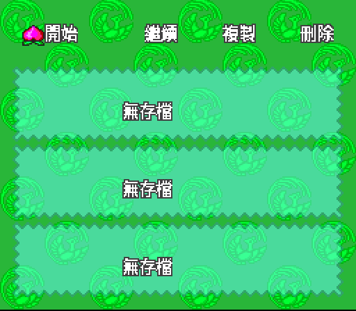

本文是依攻略資料、ROM 地名索引及既有譯稿重新整理的遊玩指南，不是作者親自完整通關的實測紀錄。四張開場截圖來自本專案 v65 正常新遊戲；世界地形另取自原生月之鏡背景，擷取存檔的限制見[地圖來源說明](world-map.md)。六張流程圖是原創示意圖，不表示地形、距離或可直接步行的道路；本文不展示作弊能力值。

## 目錄

- [序章：月之宮殿](#opening)
- [第一章：飯糰村、松葉山與三位隨從](#chapter-1)
- [第二章：金太郎、浦島與月之鏡](#chapter-2)
- [第三章：大江山與冰之塔](#chapter-3)
- [第四章：微笑村、希望之都與自己的城](#chapter-4)
- [第五章：風神谷、失散同伴與夜叉姬的病](#chapter-5)
- [第六章：新村人質、鬼族牢獄與取得船](#chapter-6)
- [第七章：海上水晶、城堡改造與奈落救援](#chapter-7)
- [第八章：勇氣裝備、黃泉之塔與重返月宮](#chapter-8)
- [第九章：滿月水晶、鳳凰與勇氣之劍重鑄](#chapter-9)
- [第十章：地獄、伐折羅王與真正的最終戰](#chapter-10)
- [八片水晶總表](#crystals)
- [同伴、修行與支線](#companions)
- [十三位仙人：路線與修行](#hermits)
- [七間麻雀旅館：補給與事件](#inns)
- [卡關排查](#stuck)
- [資料來源與圖片說明](#sources)

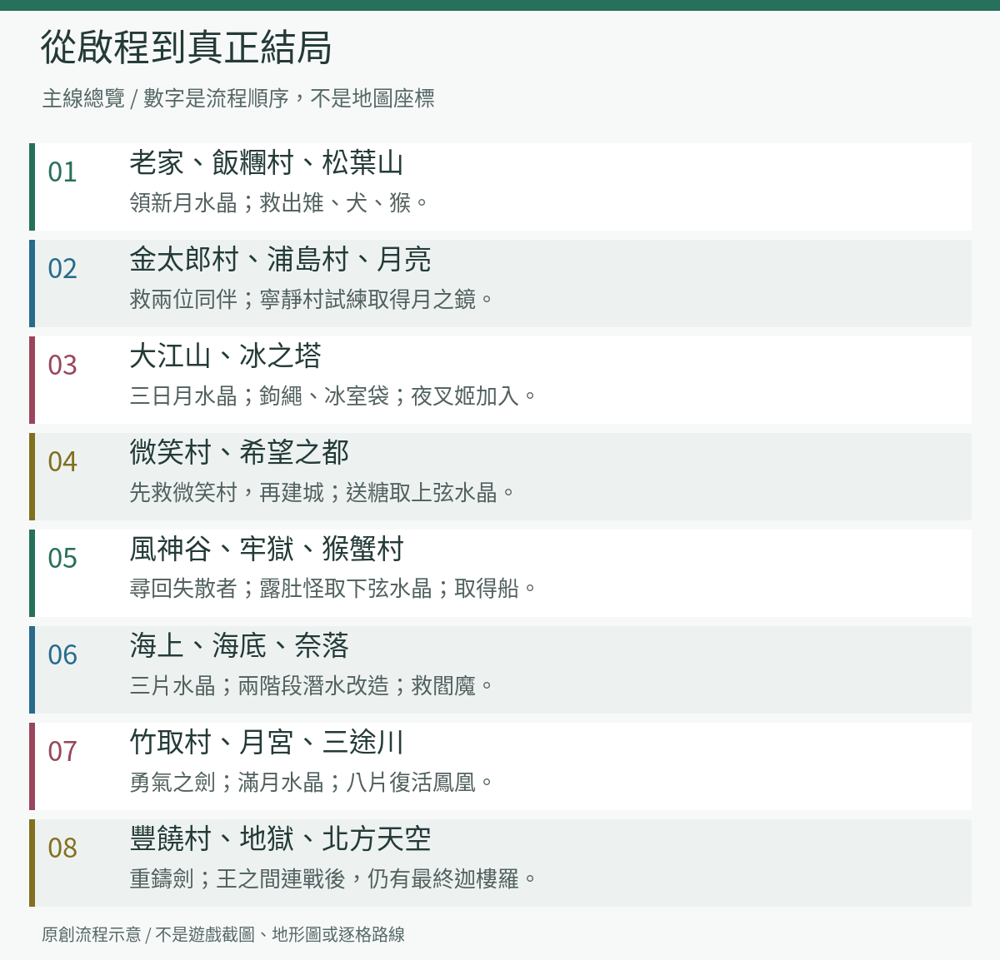

## 出發前先看

- 保留至少兩個一般存檔，重大事件前交替存入；即時存檔只作輔助。
- 選單上的「段」就是等級，「血」是生命，「技」是術的消耗資源，「兩」是金錢。
- 開場的高段數不是中前期練功成果；劇情會使桃太郎重新出發，不要按開場數值規劃後面的戰鬥。
- 先向村民、旅館與事件人物問話，再出村。許多進度需要交付物品、帶對同伴或完成對話，不只是到達目的地。
- 每次進入迷宮前補好回復與解毒物品；連續戰鬥地點不要把所有技都花在雜兵身上。
- 本文把「必要」用在主線門檻；術、裝備及支線若只是有幫助，會另行說明，不把它們一律當成硬性通關條件。

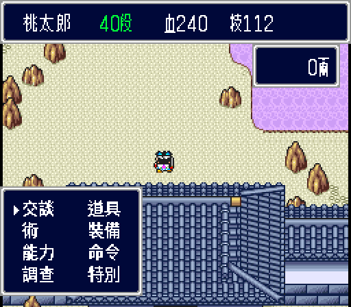

圖中的 40 段、血 240、技 112、0 兩由新遊戲自行初始化，不是作弊值，也不是本文建議的練功目標。截圖來源見[正常新遊戲擷取紀錄](../assets/readme-v65-capture.json)。

## 地名與方位

本文使用「啟程村、花咲村、寢太郎村、希望之都」等 v65 名稱；對照日文攻略時，可查[完整地名索引](../opening-preview-v37/place-names.md)。玩家自訂姓名與城名不作固定翻譯，文中以「桃太郎」與「自己的城」泛稱。

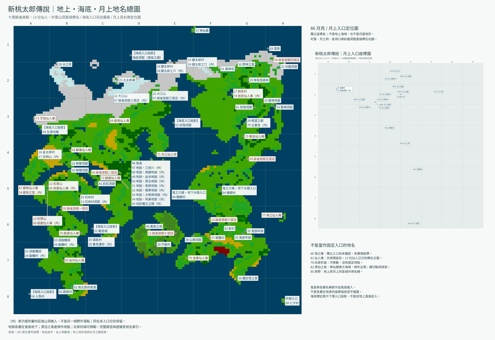

這張圖的海岸線、雪原、陸地與島嶼直接來自 **v65 月之鏡的地上世界背景**，不是自行排列地名的示意圖。玩家位置與水晶閃光是獨立圖層，已在解碼時排除，沒有猜補或重畫其下地形。

**七間麻雀旅館、十三位仙人，以及可定位的村里、山塔、洞窟均直接標名。** 同一張總圖包含海底入口投影與右側月上座標圖；地獄各層連到鬼島，村內與山內地點列在所屬入口旁。共81筆地名有直接定位或所屬入口標籤，不再以右側地名清單代替地圖標註。

**地上原生概覽解析度是 128 × 128，以最近鄰放大二十倍。** 海底標記不是海底地形；月上圖是獨立座標系；地獄名稱不是內部迷宮平面圖。海之庵、漂泊之島確切位置及部分補充地標仍待核對，玩家的城則沒有固定位置。查看[地名大圖](images/world-map-zh-Hant.png)、[全部87筆地名與待核對項目](world-map-index.md)、[乾淨底圖](images/world-map-native.png)、[來源與驗證](world-map.md)。舊[地名關係圖](../maps/world-map-notes.md)僅供名稱比對，不作實際地形依據。

## 主線攻略

本篇的「完整」指從開場走到真正結局的主線流程，另附主要支線、同伴與重要物品。不是全寶箱座標、全怪物圖鑑或所有隱藏玩法的百分之百收集手冊。沒有標段數門檻的戰鬥，請以目前裝備、回復能力與承受敵方攻擊的情況判斷，不必硬練到某個等級。

<a id="opening"></a>

### 序章：月之宮殿

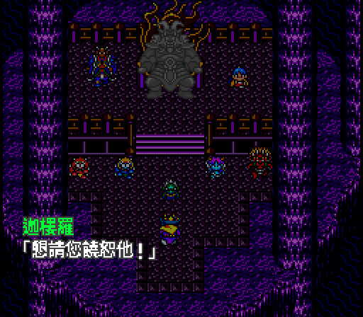

1. 沿宮殿內的道路往深處走，擊敗擋路的兩隻赤鬼。
2. 在最深處與迦樓羅交談，接著進入達伊達王子的劇情戰。
3. 讓事件繼續，故事會回到桃太郎的老家。能力下降是劇情安排，不是存檔損壞，也不必重新開局。

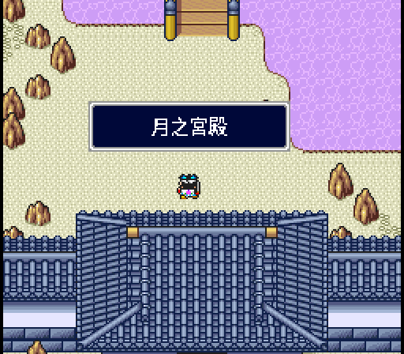

<a id="chapter-1"></a>

### 第一章：飯糰村、松葉山與三位隨從

**本章目標：取得新月水晶，讓雉、犬、猴加入。**

#### 老家至飯糰村

1. 在老家與長輩交談，領取爺爺的 100 兩和奶奶的吉備糰子，銀次會加入。天之仙人的開場提問選「否」可避免這次的人氣下降。
2. 往東南到啟程村。先買武器與身體防具，別把全部金錢花在非必要用品上；另備飯糰、解毒與回復物品。
3. 到啟程村北方的金丹仙人庵，通過戰鬥試練學習金丹。這是推薦優先取得的基本回復術。
4. 往西到滾飯糰洞，向地藏供奉**飯糰**。吉備糰子是給隨從的，別把兩種物品混為一談。
5. 進洞後先找老鼠甚八取得挖土工具，再落入地裂。使用工具挖開土路，朝北方階梯前進。
6. 階梯附近會連戰小蜘蛛、土蜘蛛與兩鐵。土蜘蛛的毒、兩鐵的火焰都是主要危險；中毒及血量過低時先處理，不要為省道具而倒下。
7. 出洞向北，過橋收到村落建成的消息後，**折返飯糰村找甚八，取得新月水晶**。收到通知不等於已領取水晶。

#### 松葉山與雉

1. 在麻雀旅館一號店休息、存檔。東南的脫身仙人庵可學迷宮脫離術，推薦先取得。
2. 往旅館西北進松葉山，擊敗門前的雷鬼與馬鬼；三岔路走中間。
3. 山頂找稻妻仙人，在 **100 秒內擊碎 8 塊岩石中的 5 塊**，對岩石連按 A；學會稻妻並得知下山密道。
4. 下山時用稻妻破壞阻路石。餓鬼所在房間有落穴，**從右側繞近**，不要直接沿正面衝過去。
5. 餓鬼防禦高，還會偷吃回復物品。保留技使用稻妻，縮短戰鬥。
6. 救出雉後交付吉備糰子，讓雉加入。銀次在越過松葉山前會離隊，接下來一小段路不要按雙人隊伍的戰力冒進。

#### 花咲村與犬

1. 下山往東南到花咲村，跟進村民被擄事件，進入花咲村洞窟救人。
2. 水牢會逐漸漲水，淹到頂部會失敗。先向旅館中的銀次取得提示物品；進牢後調查**中央階梯一帶的發光格**逃出，不要原地等候。
3. 首領戰先解決會施放倍力、替主敵加攻擊力的小跟班，再集中對付巴坎鬼（ばっかんき）。戰鬥中給雉吉備糰子，可請牠援護，分擔桃太郎的回復壓力。
4. 回村確認櫻花恢復，將吉備糰子交給犬，讓犬加入。

#### 無聲洞窟與猴

1. 從花咲村向北進入無聲洞窟。部分樓層沒有音樂、視野狹小，是原作設計。
2. 保留回復資源往深處走。遇到妨礙食物使用的異常狀態，別只靠食物硬撐，可以退回整理。
3. 天賊鬼要求選術時，選**小波**。其餘選項會加強敵人或降低我方防禦，使後續回合更難承受。
4. 戰後將吉備糰子交給猴。出洞向北，就是金太郎村。

**離開前核對：**新月水晶已領取；犬、猴、雉都已真正加入，不只是救出；身上仍有回復品。

<a id="chapter-2"></a>

### 第二章：金太郎、浦島與月之鏡

**本章目標：組成桃太郎、金太郎、浦島的隊伍，取得月之鏡。**

#### 足柄山救人

1. 到金太郎村茶店找銀次重新加入。先整理裝備，再進迷宮。
2. 北方解毒仙人的修行是陪中毒的仙人尋找卷軸，應先救人，不要貪開全部寶箱。西方鹿角之里的戰鬥修行可學強力攻擊術，推薦完成。
3. **足柄山入口在金太郎村內、神社後方**，不是在大地圖上找另一個山洞。
4. 深處與金太郎交談後，他會入隊。達伊達王子的戰鬥在兩回合後結束，先防守並照顧剛加入的金太郎。
5. 後續雜兵連戰才是累積金太郎經驗的機會。龍燈鬼戰中，本體與龍會分別攻擊，集中火力並用掩護保住低血量角色。
6. 解放村落後銀次離隊，夜店小遊戲開放。**足柄山通關後不能照原路重入，想收的寶箱要在擊敗首領前處理。**

北方的避鬼仙人要求不遇敵走到大樹，注意地面顏色；避魔仙人的野槌（ノヅチ）討伐修行是可延後的防咒支線，不是往浦島村的硬性門檻。位置與修行重點見[十三位仙人速查](#hermits)。

#### 浦島村、養老瀑布與龍宮城

1. 經麻雀旅館二號店往南。此時別先往旅館東北的橋外硬闖，那一帶敵人較強。
2. 浦島村的玉手箱事件會使隊伍老化。入口就在村內回春泉的後方，沿養老瀑布上行找水源。
3. 水源前迦樓羅的提問選**否**，選是會被送出村。
4. 三鬼戰第二回合浦島出現，解除老化並加入；第三回合銀次加入。浦島只有一段，優先防守、掩護與回復。
5. 建議先打倒會回復的**魅鬼**，再處理會施放大波的怪鬼，最後魃鬼。別把輸出分散到三個目標。
6. 勝利後回春泉恢復，可免費補血與技。與村邊海龜交談前，先在這裡整理隊伍。
7. 搭海龜去龍宮城，深入救出乙姬。這裡是雜兵連戰，沒有額外大型首領；把握機會培養浦島，但別讓他倒下。
8. 宴會後進入月之社，通往月亮；銀次再次離隊。

#### 寧靜村的單挑

1. 從月之祠往西北到寧靜村，進行臥龍試練。
2. 只能派一人應戰，開場會被封術。推薦裝備、血量較穩定的桃太郎，並把回復道具放在出戰者身上。
3. 不要選只靠術、段數又低的角色。保持能承受下一次攻擊的血量，勝利後取得**月之鏡**。
4. 月之鏡用來尋找水晶位置；它與後期的「勇氣之鏡」用途不同。

<a id="chapter-3"></a>

### 第三章：大江山與冰之塔

**本章目標：通過大江山，取得三日月水晶，讓夜叉姬加入並打通寢太郎橋。**

#### 飛燕與登山準備

1. 返回地上，到麻雀旅館二號店東北的天之仙人塔接修行。
2. 回**啟程村神社前，調查左側狛犬後方的地面**，取得飛燕卷軸，再交給天之仙人學飛燕。這是回訪城鎮的便利術，不要在世界地圖盲找卷軸。
3. 大江山在塔北方。按一般流程，帶齊金太郎、浦島、犬、猴、雉並取得月之鏡，再與入口地藏交談。
4. 帶回復、補技與能離開迷宮的物品，另留一個登山前存檔。大江山會消耗很多資源，不能只預留首領戰用量。

#### 上山逐層解題

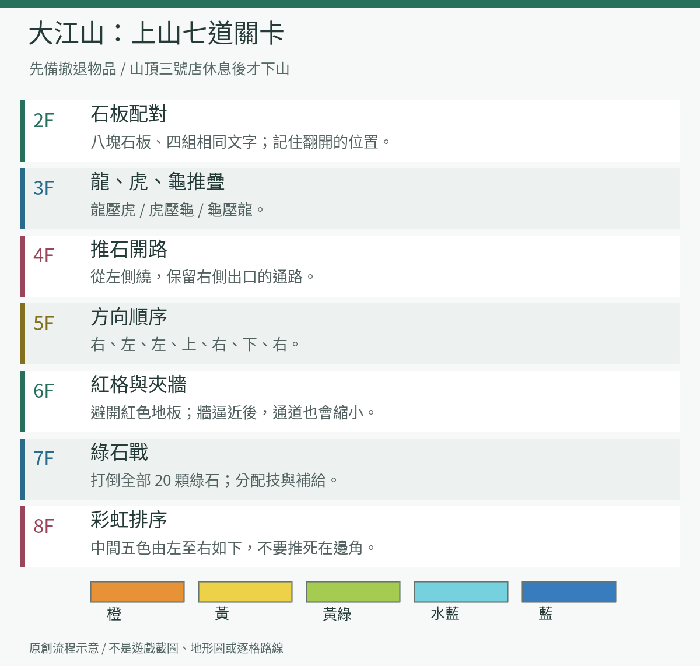

| 樓層 | 解法 | 要注意的事 |
| --- | --- | --- |
| 2F 配對 | 翻開八塊石板，找出相同文字的四組 | 中央空格不算；記下位置，失誤會遇敵 |
| 3F 龍虎龜 | 利用「龍壓虎、虎壓龜、龜壓龍」的循環關係推疊石頭 | 先確認要壓的字，別把可移動石推死在牆邊 |
| 4F 推石開路 | 從左側繞路，保留通向右方出口的通道 | 不要用石頭封死右側通路；推錯可重進本層重試 |
| 5F 方向謎 | **右、左、左、上、右、下、右** | 依序推動指定岩石；日文五十音提示可直接用此答案 |
| 6F 夾牆 | 避開紅色地板，在剩餘通道中前進 | 踩紅格會使兩側牆壁逼近，被夾住會失敗；先看清再走 |
| 7F 色石戰 | 打倒全部 **20 顆綠色石頭** | 紅、黑石不是解題目標；分配技，避免前幾戰就用光 |
| 8F 彩虹 | 中間五顆由左至右排成 **橙、黃、黃綠、水藍、藍** | 顏色是判斷依據，不要推到無法再移動的邊角 |

迦樓羅的提示不值得照單全收。山中有交換血／技狀態的敵人，發現數值異常先確認戰鬥效果，不要立刻認定存檔出錯。上到山頂後先去**麻雀旅館三號店**回復、存檔，再從另一側下山。

#### 下山與酒吞童子

1. 下山 4F 有毒沼，準備浮游玉。想取玄武刀，可從毒沼左上方的洞落下，再調查下層右上方盡頭附近。
2. 出口前先與四天王進行三場單挑，取得兩勝才能挑戰酒吞童子；輸掉兩場會被送回大江山入口。
3. 依角色能力選對手，別把浦島交給不利的物理對決。

| 對手 | 特性 | 應對 |
| --- | --- | --- |
| 金童子 | 反彈普通攻擊，反傷很重 | 用術，避免讓金太郎硬敲 |
| 熊童子 | 吸收攻擊術、轉成回復 | 派物理攻擊較強的桃太郎或金太郎 |
| 虎熊童子 | 雙方脫掉裝備決鬥 | 以本身戰力判斷，不靠昂貴裝備取勝 |
| 星熊童子 | 連續使用火焰、雷擊 | 難度較高，不必為主線硬選；想挑戰就準備快速輸出與回復 |

酒吞童子會連續攻擊，浦島提高防禦、金太郎用張手削弱敵方攻擊，是比全員猛攻更穩的選擇。戰後取得的是**三日月水晶**，不是另一顆新月水晶。到雪原後盡快向東北的寢太郎村移動。

#### 冰之塔與夜叉姬

1. 在寢太郎村西側與寢太郎交談，觸發冰柱襲擊。村民雖避難到地下，仍可存檔、買東西；雪地行走可準備雪鞋。
2. 往西北半島的大太郎庵取得**鉤繩**。西南的浮游仙人戰勝後可學浮游，推薦這時完成。
3. 往浮游仙人北方進冰之塔，銀次加入。隔岸有木樁的缺口，用鉤繩通過。
4. 塔頂迦樓羅的提問選**否**。通過連戰，從醜女取得**冰室袋（氷室のきんちゃく）**，接著打夜叉姬。
5. 夜叉姬會降防、提升自身能力，並以流星攻擊全隊。提前回復，別等全隊只剩一擊的血量才救人。
6. 勝利後夜叉姬加入、銀次離隊。**從正門走出塔**，大太郎會送來塔內剩下的寶箱物品。
7. 回寢太郎村，對寢太郎使用冰室袋，橋才會開通。
8. 過橋遇阿闍世王子，桃太郎單挑到第七回合就會結束，防守與維持血量即可，不必浪費珍貴物品搶勝。

<a id="chapter-4"></a>

### 第四章：微笑村、希望之都與自己的城

**本章目標：先解放微笑村，再解放希望之都、建立城堡並取得上弦水晶。**

1. 過橋後可在寢太郎村東側開始交換支線；主線先往東南的微笑村。它在形似日文「アホ」的花田東北方，容易錯過。
2. 猿樂師（ましら）會帶兩隻藍猴應戰，先解決兩隻助手，再集中打首領。
3. 村內放屁仙人的修行答案是**八次**。這是支線，可以順道學術。
4. 怨恨洞窟是非必要遊戲，會大幅降低人氣；想進神仙鄉或收福神，暫時不要在此消耗人氣。
5. 南下過橋，往橋邊東北到希望之都。城中受阿修羅控制，多數店家無法使用，先找村民聚會的房子取得線索。
6. 開始聚會事件前，先把回復品與根性玉分給隊員，尤其是夜叉姬；她接下來會暫時離隊。兩道俳句謎題的物品分別向**花咲村的花咲爺爺**、**天之仙人**交談取得：櫻花相關物品與黃金佛像。備齊後回來找**蜂乃屋**，不是只在對話中輸入謎底。
7. 進五重塔，荊棘地板用浮游處理。阿修羅在 5F，夜叉姬在決戰前歸隊。阿修羅會分身、限制行動；接近戰末時有全體薔薇攻擊，保持全隊血量。提升物理防禦不等於能抵消這一招，根性玉可作保命準備。
8. 出塔後向蜂乃屋與木匠取得建城用的繩線，在大地圖可建造的位置使用，建立自己的城。
9. 寢太郎、大太郎、阿修羅，以及已完成微笑村事件的猿樂師，加入城中同伴。今後可在城內編組；事件要求「帶著某人」時，應編入外出隊伍，而不是只留在城裡。
10. 到希望之都買**麥芽糖（水アメ）**，交給證城寺和尚，取得**上弦水晶**。買了糖還要完成交付；若先得到其他回禮，繼續送糖，直到道具欄確實有水晶。

交換支線可照這條順序完成：**飯糰 → 酸漿（ほおずき）→ 糖藝（あめざいく）→ 木屐 → 肥皂泡 → 如意小槌（打ち出のこづち）**。木屐換肥皂泡的一步在微笑村；其餘回寢太郎村東側找對應人物。名稱附日文便於比對道具欄，這不是主線必做流程。

<a id="chapter-5"></a>

### 第五章：風神谷、失散同伴與夜叉姬的病

**本章目標：越過風神谷、重整隊伍、治好夜叉姬，通過雷神洞窟。**

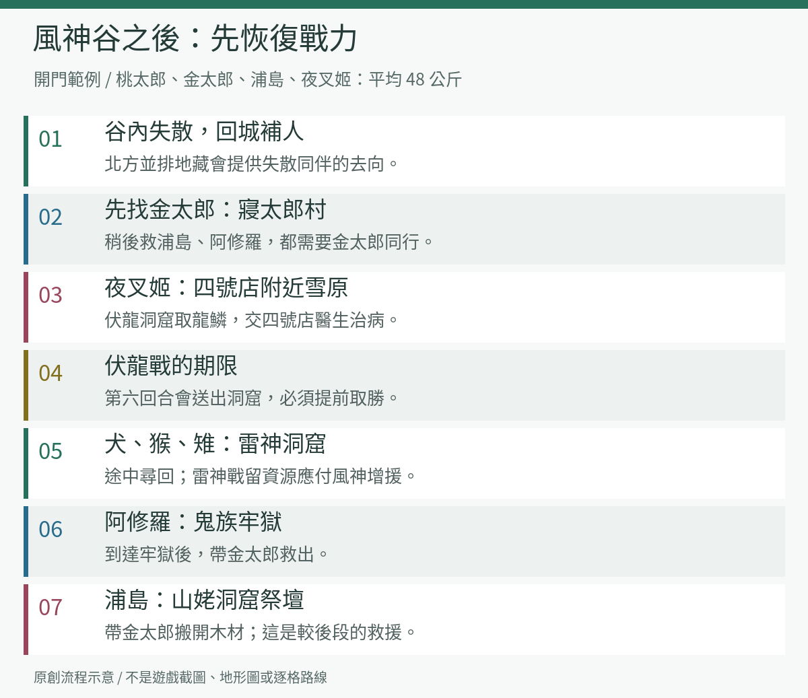

#### 開門與失散事件

1. 希望之都北方森林有眾神之里。微笑村入口的旅商人賣**神之味噌湯**，交給門口貧乏神即可進入；這一帶也能邀請特殊同伴。
2. 往眾神之里西南進伸長怪森林，穿過迷路區。現在聽不懂村民語言很正常，等取得露肚怪再回來拿水晶。
3. 森林北方是風神谷，門要求**隊伍平均體重 48 公斤**。最容易照做的編組是桃太郎、金太郎、浦島、夜叉姬四人；另可用桃太郎、金太郎、夜叉姬、阿修羅。
4. 谷內風神每隔一回合吹走同伴，最後只剩桃太郎。這是事件安排，無法用重新讀取同一場戰鬥保住整隊。
5. 越谷後先問北方並排的地藏，再回城補充可用同伴。不要讓桃太郎一個人繼續硬闖雷神洞窟。

| 被吹走的人 | 尋回地點 | 條件 |
| --- | --- | --- |
| 金太郎 | 寢太郎村 | 優先接回，之後還要靠他救人 |
| 浦島 | 山姥洞窟的造船所祭壇 | 帶金太郎搬開壓住他的木材；較後面才能到 |
| 夜叉姬 | 麻雀旅館四號店附近雪原 | 觸發生病事件，找龍鱗治療 |
| 阿修羅 | 鬼族牢獄 | 帶金太郎救出 |
| 猿樂師（ましら） | 金太郎村 | 前往交談 |
| 雪人 | 啟程村 | 前往交談 |
| 貧乏神 | 希望之都 | 前往交談 |
| 犬、猴、雉 | 雷神洞窟 | 隨洞窟探索尋回 |

這張表只列**實際被吹走的人**；留在城裡的同伴不用到上述地點重找。若採用其他合法體重隊伍，以地藏提供的線索核對事件。

#### 龍鱗與雷神洞窟

1. 往風神谷東方、麻雀旅館四號店附近找夜叉姬。醫生接手後銀次加入，可補足戰力。
2. 到旅館南方的伏龍洞窟，途中可收鬼族命令系統圖。深處與伏龍交戰，**第六回合會被送出洞窟**，因此要以有效輸出速戰。
3. 勝利後查深處寶箱拿龍鱗，交給四號店醫生。夜叉姬病癒後重新編入隊伍。
4. 繼續南下進雷神洞窟。入口達伊達王子戰到三回合便結束，以防守保存資源。
5. 迦樓羅的提問選否。接著三敵同場時，優先處理威脅最大的**鵺（ぬえ）**。
6. 雷神首領戰有第二階段：把雷神逼到一定程度後，風神趕到，雷神會全回復。**第一階段不要把鹿角與補技道具用光**。
7. 風神加入後有持續扣血的龍捲風，隊伍必須有人固定回復。先集中打倒一人，再處理另一人。
8. 出洞到西南的麻雀旅館五號店存檔，買小黃瓜再往南走。鬼之爪痕的黑河童會偷錢、偷物，黃瓜可以分散牠的注意。

五號店北偏西的萬金仙人試練是雙方血量從 1 開始、比誰先回滿，也可以攻擊仙人拖慢他的回復。完成可學萬金丹；這是推薦補強的回復術，勝負條件是先回滿體力，不是打倒仙人。

<a id="chapter-6"></a>

### 第六章：新村人質、鬼族牢獄與取得船

**本章目標：救回人質，取得下弦水晶，解放猴蟹村並拿到船。**

#### 人質與牢獄

1. 從鬼之爪痕南下到新村。人質是城內待機同伴中選出的兩人，可能與其他玩家不同，不是漏招角色。
2. **帶夜叉姬**與迦樓羅交談，按事件前往新村東南的鬼族牢獄。
3. 先查地下牢：與酒吞童子交談取得酒吞劍；如果阿修羅被關在這裡，帶金太郎救出。此時最深處的門未開是正常進度。
4. 返回地面，沿塔外藤蔓向上爬。最上層對付蛇骨婆婆，她會用蛇綁住隊員；趁行動者仍多時集中輸出，回復不要全壓在一人身上。
5. 勝利後由月之社前往月亮，往月之祠西側的夢之村找**夕月**交談，再回地上。
6. 回新村找迦樓羅，通過雜兵連戰和後續事件，人質與夜叉姬歸隊。完成此段才回牢獄地下。
7. 原本關閉的深處門已打開，走過有毒的秘密通道，從另一側出去。

#### 露肚怪與下弦水晶

1. 從牢獄另一側往南找露肚怪之里，給里吉**蜥蜴尾巴**，邀請露肚怪加入。
2. 沒有尾巴就回麻雀旅館一號店至松葉山附近找普通蜥蜴。將牠打至半血以下，讓牠斷尾逃跑；**不要一擊打死**。後期強隊可換弱攻擊方式。
3. 把露肚怪編入外出隊伍，回伸長怪森林與長老交談，取得**下弦水晶**。只是讓露肚怪住進城裡還不夠。

#### 猴蟹村至造船所

1. 從牢獄出口區域往西到猴蟹村，先補好狀態再挑戰風神與雷神。
2. 這回仍是雙首領。風神持續扣血、雷神施放雷火術，先集中一人，避免讓兩人都活很久。
3. 勝利後兩人加入，也會清除村南毒沼。後續深海改造還需要兩人，不要忘了已能在城中編組。
4. 西南金瘡仙人庵的四仙人戰是推薦支線：先壓制會復活其他人的金瘡仙人，再解決其餘敵人。勝利學復活術。
5. 往金瘡仙人北方的山姥洞窟。入口達伊達王子問要不要打，選否可跳過這場戰鬥。
6. 到造船所祭壇。浦島若在此受困，帶金太郎救他；之後對付山姥。
7. 山姥會封術、放猛毒、偷回復物品。解毒品與回復品分配給多名隊員，避免某人被封術後全隊失去治療。
8. 事件完成後回猴蟹村，**站到原本風神、雷神所在的位置**，船匠才會來交船。

<a id="chapter-7"></a>

### 第七章：海上水晶、城堡改造與奈落救援

**本章目標：取得居待、臥待、十六夜水晶，讓城能潛入深海，救出閻魔。**

海上支線可調整先後，下列順序是方便核對依賴關係的建議。**月之鏡要隨身帶著**；地面與海底是不同層，光點不表示船能直接航行到那裡。

#### 出海前的隨身與編組核對

- [ ] 已在猴蟹村收到船，不只是打倒山姥。
- [ ] 帶上月之鏡；找海底水晶時，要先到海底再使用。
- [ ] 釣臥待水晶時帶浦島及釣竿；釣竿從海之仙人處取得，不是到小島後才會自動獲得。
- [ ] 準備城堡改造費；孫市的飛行與潛水改造要實際完成，不能只聽完說明。
- [ ] 前往人魚村前保留使用金丹的技；深海改造回報時，另將風神、雷神編入外出隊伍。

這些是不同支線所需的條件，不要求一開始就全部完成。尤其「拜訪七夕村」影響的是漂泊之島，不要誤當成救閻魔之前必須完成的門檻。

#### 船能到的地方

| 地點 | 位置線索 | 要做的事 |
| --- | --- | --- |
| 麻雀旅館六號店 | 猴蟹村北方島嶼 | 休息、補給與記錄 |
| 兵具屋之島 | 金太郎村西北的海島 | 更新裝備；金條是這裡茶店的特殊商品，不是主線必買 |
| 彩虹洞窟 | 花咲村東北海島，配合月之鏡確認 | 深處寶箱取**居待水晶**，沒有額外首領 |
| 海之仙人庵 | 鬼族牢獄東方列島 | 把仙人的長話聽完，領取**釣竿** |
| 缺口小島 | 寢太郎村西方海上 | **浦島在隊伍中**，在島旁釣魚取得**臥待水晶** |
| 神仙鄉 | 寢太郎村東北海島 | 人氣至少 **90** 才能入內；向仙人領**天樹種子** |
| 七夕村 | 海之仙人庵南方島嶼中央 | 使用天樹種子前往；這次拜訪也是漂泊之島出現的前提 |

七夕村星之井可使用玄武、白虎、朱雀、青龍等刀，取得一次性的能力提升。這是支線，不必為缺少其中一把刀停止主線。想拿勇氣之兜，則要完成七夕村的拜訪。

#### 機關村與普通潛水

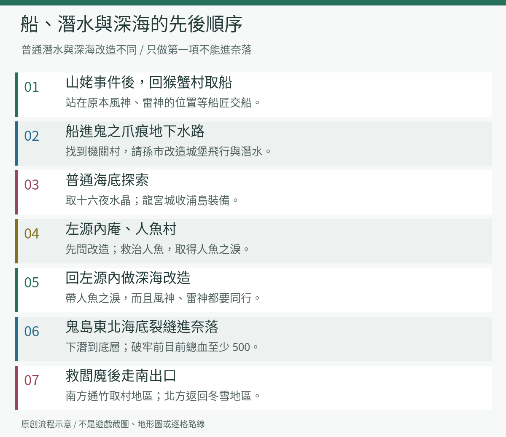

1. 搭船進入**鬼之爪痕的地下水路**，可從西側或中段的水路入口尋找機關村。這不是步行跨過地表裂縫。
2. 找職人孫市改造自己的城。先備足費用，至少安排**飛行、潛水**；此階段的潛水仍不等於能下最深的海域。
3. 用城堡潛到龍宮城，原本關閉的門可以打開，收浦島的正義系武器與衣裝，順便補強隊伍。
4. 去避魔仙人庵東南、吊橋附近海底，用月之鏡確認光點，調查取得**十六夜水晶**。
5. 在兵具屋之島附近海底找左源內庵，交談取得源內杖並得知後續改造條件。

#### 人魚村與深海改造

1. 到啟程村西方海底的人魚村。對仍有氣息的人魚使用金丹救治，仔細調查最深處房間的人魚身旁，取得**人魚之淚**。
2. 把**風神、雷神兩人編入外出隊伍**，帶人魚之淚回左源內庵。
3. 完成改造後，城堡才可進入深海。不要把「孫市已裝潛水」誤當成這項改造已完成。
4. 到鬼島東北方海底裂縫，下潛進奈落洞窟，持續往下到底層，再步行探索。
5. 閻魔牢前先回復。破牢要求**隊伍目前生命值合計至少 500**，不是最大生命總和，也不是桃太郎一人要有 500 血。
6. 救出閻魔後搭城走地下水道。分岔**北出口回冬雪地區，南出口通竹取村一帶**；主線此時選南。

#### 海底位置與交通階段核對

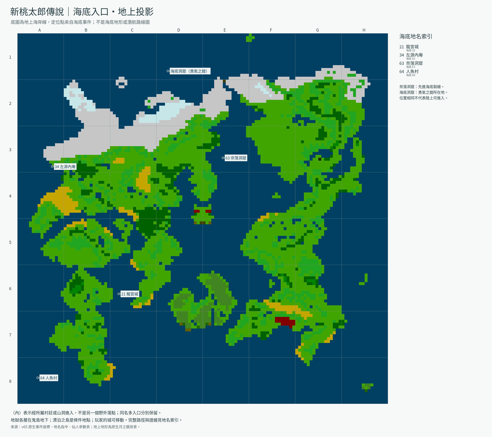

這張圖沿用地上海岸線作定位參考，**不是海底地形，也不是可直線航行的路線圖**。以下格位屬海底分圖，圖號與總圖相同；標記是場景入口，不是寶箱或人物的精確站位。

| 到達階段 | 目的地 | 圖號／格位 | 完成後核對 |
| --- | --- | --- | --- |
| 有船 | 鬼之爪痕地下水路 → 機關村 | 84／地上 E5、F5 的水路入口 | 找孫市，實際完成城堡飛行與普通潛水改造 |
| 城堡可普通潛水 | 龍宮城 | 21／海底 C6 | 重訪開門區域，收浦島的正義系裝備 |
| 城堡可普通潛水 | 左源內庵 | 34／海底 A3 | 初訪取得源內杖，得知深海改造條件 |
| 城堡可普通潛水 | 人魚村 | 64／海底 A8 | 用金丹救人，調查深處人魚身旁，確認取得人魚之淚 |
| 持有人魚之淚，風神與雷神同行 | 再訪左源內庵 | 34／海底 A3 | 交付並完成深海改造；人在城裡待機不等於同行 |
| 深海改造完成 | 奈落洞窟 | 63／海底 E3 | 從裂縫一直往下，破牢前回復隊伍目前血量合計至至少 500 |

**離開奈落前：**確認閻魔已加入，再搭城走南支路。尚缺海上水晶的玩家，日後仍需依[八片水晶表](#crystals)回收；救出閻魔不會自動補齊水晶。

本段交通條件另核對[海上與海底探索資料](https://onibaka.donburako.com/kouryaku/momo_shin/chart_5.html)，入口格位取自本專案原生事件資料。未核實的改造費用沒有填入猜測價格。

<a id="chapter-8"></a>

### 第八章：勇氣裝備、黃泉之塔與重返月宮

**本章目標：找回勇氣之劍，打倒羅生門，完成月宮達伊達王子事件。**

1. 奈落南出口上岸後往北找麻雀旅館七號店。竹林不能放置城堡，先找開闊處停放，免得需要換人時找不到落點。
2. 向西到竹取村。村民前往黃泉之塔救人，屋內的老夫婦仍可交談；向老奶奶取得**勇氣之鏡**。
3. 在屋後竹林使用勇氣之鏡，調查指示處，挖出**生鏽的勇氣之劍**。此劍還有開路用途，先保留，不是垃圾裝備。
4. 推薦取兩件防具：到神仙鄉東方海域，用勇氣之鏡找**漂泊之島**取勇氣之兜；到大太郎庵東北海底，**在海底使用勇氣之鏡**找洞窟，深入取勇氣之鎧。漂泊之島要先拜訪七夕村才會出現。
5. 往竹取村西北進黃泉之塔。踩開關使地板升起，連成道路再走；不要把所有開關都當成「越多越好」。
6. 塔內可收勇氣之沓、夜叉姬的愛之足袋、阿修羅的黃泉之絹，以及鬼族足袋等終盤裝備。按道具欄可裝備角色確認，不要全部塞給桃太郎。
7. 7F 羅生門要求桃太郎單挑，**把回復品交到桃太郎身上再開戰**。維持血量並逐步輸出；這不是等幾回合就必定勝利的劇情戰。
8. 擊敗羅生門，從後方月之社登月。往祠西南到風暴村補給，再往村西進月之洞窟。
9. 月之洞窟由五個相連洞窟構成，穿過後往西到月之宮殿；宮殿寶箱可拿金太郎的希望系斧與身體防具。
10. 地下再次對戰達伊達王子。**這一次要真正打贏，不會像足柄山、雷神洞窟那樣自動停戰**。看完後續事件，再準備八片水晶與鬼島行程。

#### 四件勇氣裝備核對

| 裝備 | 取得位置 | 必要操作與容易漏掉的事 |
| --- | --- | --- |
| 勇氣之劍（生鏽） | 竹取村老夫婦屋後竹林；村入口為圖39／地上 D7 | 先向老奶奶取得勇氣之鏡，再在竹林使用並調查指示處；保留此劍供勇氣岬開路及後續重鑄 |
| 勇氣之兜 | 神仙鄉東方海域的漂泊之島；精確落點尚待核對 | 先拜訪七夕村，取得勇氣之鏡後再到海上使用尋找；深入島內取裝備 |
| 勇氣之鎧 | 大太郎庵東北海底洞窟；海底分圖 D1 的補充入口 | 操作城堡潛海，在海底使用勇氣之鏡；進洞後還要探索深處，入口標記不是寶箱位置 |
| 勇氣之沓 | 黃泉之塔內寶箱；塔入口為圖40／地上 D6 | 解開升降地板通路時留意寶箱，不是打贏羅生門後自動領取 |

**兩面鏡子用途不同：**月之鏡用於水晶線索；本章竹林、漂泊之島與海底勇氣裝備使用的是勇氣之鏡。上表是裝備收集路線，不把兜、鎧、沓一律視為登月的硬性條件。取得方式核對[勇氣地區資料](https://onibaka.donburako.com/kouryaku/momo_shin/chart_6.html)。

<a id="chapter-9"></a>

### 第九章：滿月水晶、鳳凰與勇氣之劍重鑄

**本章目標：集齊八片水晶，取得鳳凰笛，準備最終地獄。**

#### 初訪三途川

1. 回竹取村一帶，到麻雀旅館七號店西北方、兩座地藏並排的勇氣岬。
2. **站在兩座地藏之間使用勇氣之劍**，開路前往鬼島。劍尚未重鑄也能完成這一步。
3. 從鬼島深入三途川，先進河岸小屋找懸衣翁與奪衣婆。此時不能過河，別把所有時間花在沿岸找橋。
4. 懸衣翁拆武器、奪衣婆拆防具，越拖越不利。集中一個目標，靠攻擊術、補助與分工回復撐過，別把戰術全押在裝備普通攻擊上。
5. 戰後確認取得**滿月水晶**。先不要繼續找渡口，回月之宮殿完成鳳凰事件。

#### 八片水晶總核對

<a id="crystals"></a>

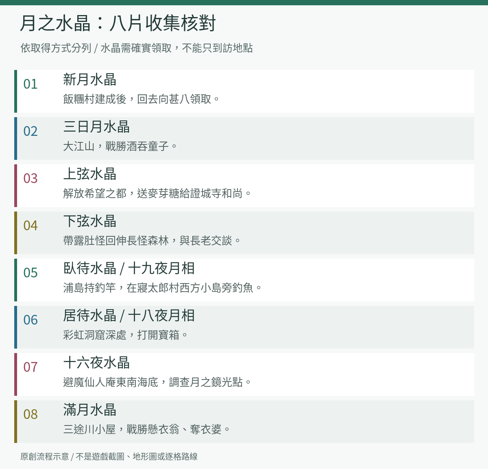

| 水晶道具 | 日文對照 | 取得地點與必要動作 |
| --- | --- | --- |
| 新月水晶 | 新月 | 飯糰村建成後，回去找甚八 |
| 三日月水晶 | 三日月 | 大江山打倒酒吞童子 |
| 上弦水晶 | 上弦 | 解放希望之都，送麥芽糖給證城寺和尚 |
| 下弦水晶 | 下弦 | 帶露肚怪回伸長怪森林找長老 |
| 臥待水晶 | 臥待 | 浦島拿釣竿，在寢太郎村西方缺口小島旁釣魚 |
| 居待水晶 | 居待 | 彩虹洞窟深處寶箱 |
| 十六夜水晶 | 十六夜 | 避魔仙人庵東南海底，用月之鏡找光點並調查 |
| 滿月水晶 | 満月 | 三途川小屋，擊敗懸衣翁與奪衣婆 |

**名稱提醒：**道具名稱沿用「三日月／臥待／居待水晶」；v65 月相標籤另譯為「娥眉月／十九夜／十八夜」。那是同一組月相的不同顯示欄位，並不是額外三片水晶。

#### 鳳凰與最後整備

1. 帶齊八片，到**月之宮殿地下找等待的女性**交談，完成鳳凰復活，領取鳳凰笛。
2. 在月亮上叫出鳳凰，飛往夢之村北方的豐饒村。這個區域不能只靠早期月之祠步行到達。
3. **在繼續終盤重大事件前，另留一個不覆蓋的普通存檔。** 未收的同伴、想逛的城鎮、神仙鄉補給與裝備，先處理完；後續世界狀態會變化，不能保證仍能按原路回收。
4. 與星夜交談，按指示在白砂泉插下勇氣之劍，讓藍色隕星重鑄。完成後檢查桃太郎的裝備。
5. 帶齊復活、補血、補技物品，分給不同隊員；至少兩人能在主要治療者失去行動時救場。
6. 回三途川，在河岸附近使用鳳凰笛跨到對岸。推進迦樓羅、輝夜姬與阿闍世的事件，進入地獄深處。

<a id="chapter-10"></a>

### 第十章：地獄、伐折羅王與真正的最終戰

**本章目標：通過地獄連戰，再打倒北方天空的迦樓羅。伐折羅王不是最後一戰。**

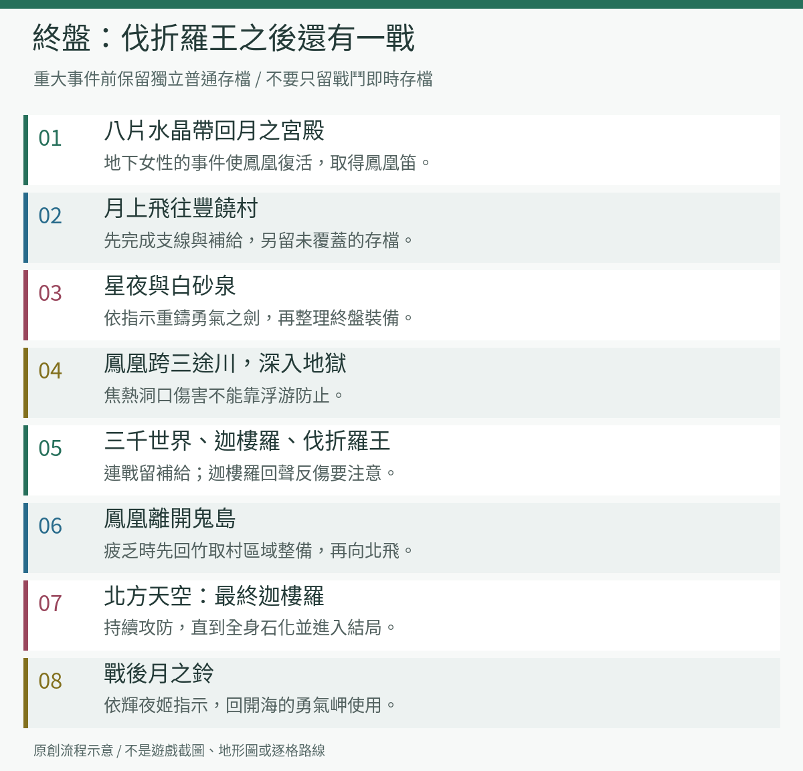

#### 地獄探索要點

沿各區的出口向深處推進，支路寶箱依隊伍需求取用。下表是陷阱與補給重點，**不是逐格迷宮圖，也不代表省略的區域可直接跳過**。遊戲另有血池地獄、大焦熱地獄等地名，仍需走完連接它們的道路。

| 區域 | 主要風險 | 裝備／準備 |
| --- | --- | --- |
| 黑繩地獄 | 某些繩路會斷，掉向熔岩；走錯後記錄岔路再選其他繩路 | 可收風神的金棒、阿修羅的黃泉薔薇 |
| 眾合地獄 | 針山是不能通行的障礙，不是可走的扣血地板 | 找夜叉姬愛之杖、愛之十二單 |
| 焦熱地獄 | 踩洞口噴火扣 50 血，**浮游無法防止** | 可收閻魔的紅蓮獨鈷、黃泉衣 |
| 極寒地獄 | 冰面滑行，可用浮游改善移動 | 找地藏，回復並記錄後再深入 |
| 阿鼻地獄 | 多個分散房間，找有階梯的一間；進入前有三千世界戰 | 先整理全隊血與技，準備長戰 |

**三千世界：**生命很多，會用雷電、海嘯、雪崩等全體攻擊。分工成攻擊、全體回復、備用治療，不要全隊同時耗盡技。這是持久戰，補技要在尚能維持回復循環時使用。

#### 王之間連戰

1. 與迦樓羅交談前，整理裝備與道具。先過雜兵連戰，再戰迦樓羅。
2. **先解決右魂鬼、左魂鬼**，降低每回合敵方行動量。迦樓羅的回聲術會反彈一半傷害，使用鹿角等大輸出前先確認我方承受得起反傷。
3. 下一場伐折羅王會用全體物理、電擊及強化自身的招式，維持全隊血量，不能只救桃太郎。
4. **夜叉姬在場時**，王從開場就攻擊其他人，而夜叉姬不能攻擊父親；讓她以回復、道具與支援為主。**夜叉姬不在場時**，開頭有到第三回合前的準備空檔。兩種編組都可繼續劇情，不必為此回頭重練。
5. 打贏後繼續看事件，先不要關機或認為已通關。迦樓羅還會再度出現並變化。

#### 北方天空的迦樓羅

1. 乘鳳凰離開鬼島。**向北飛會遇到真正的最終首領**；若隊伍已耗盡，先回竹取村所在區域整備，再向北。
2. 最終迦樓羅通常有四次攻擊，另有全體羽翼、火焰攻擊與降防、強化、回復術。首回合也可能造成重大損失，滿血進場仍不能省略防守與救援。
3. 每回合先判斷誰可能在下次行動前倒下，再決定輸出。主要回復者負責治療，備援角色處理復活與補技；不要讓所有人同回合只顧攻擊。
4. 迦樓羅會隨剩餘生命逐漸石化。**部分身體變石頭不表示已結束**，持續戰鬥直到完全石化並進入後續劇情。
5. 此處才完成最終戰。繼續觀看結局；若戰後已恢復操作，依人物指示前往竹取村找輝夜姬，領取**月之鈴**，回曾用勇氣之劍開海的**勇氣岬**使用，完成大地復甦的收尾。

最後一項月之鈴指示另以本專案[輝夜姬戰後對話](../translations/kaguya-moon-bell.draft.zh-Hant.json)核對；這是結局收尾，不是再次開放一套新的迷宮。本攻略沒有實測整段結局的每一步操作，請以當下劇情指示為準。

<a id="companions"></a>

## 同伴、修行與支線速查

### 招募與編組

| 同伴 | 加入方式 | 主線用途或提醒 |
| --- | --- | --- |
| 銀次 | 多次依劇情加入、離開；四號店夜叉姬事件後留在同伴名單 | 離隊前整理道具；失散期可補戰力 |
| 金太郎 | 足柄山救出後加入 | 搬木材、破牢救同伴，物理戰主力 |
| 浦島 | 養老瀑布第二回合加入 | 回復與防禦支援；釣取臥待水晶 |
| 夜叉姬 | 冰之塔擊敗後加入 | 新村人質事件；病癒後記得重新編組 |
| 阿修羅 | 解放希望之都並建城 | 攻擊術；失散到牢獄需金太郎救援 |
| 寢太郎、大太郎 | 解放希望之都並建城 | 可替補失散隊伍，不必為主線全員練滿 |
| 猿樂師（ましら） | 先解放微笑村，再建城 | 特殊演奏型同伴，名稱可與日文對照 |
| 貧乏神 | 眾神之里交談 | 可選同伴，注意自身能力特性 |
| 福神 | 人氣至少 90，於眾神之里邀請 | 可選收集 |
| 天邪鬼 | 眾神之里，備齊他指定的物品一次交付 | 依當次清單準備，不要猜固定答案 |
| 雪人 | 建城後帶風鈴，在雪地遭遇雪人 | 機率加入，不是打贏一次就保證招到 |
| 黑河童 | 帶小黃瓜，在鬼之爪痕戰鬥中只留一隻 | 機率加入，先防偷竊 |
| 露肚怪 | 露肚怪之里交蜥蜴尾巴 | 下弦水晶的必要翻譯者 |
| 風神、雷神 | 猴蟹村打贏兩人 | 人魚之淚深海改造需兩人同行 |
| 閻魔 | 奈落洞窟破牢救出 | 終盤可選戰力 |
| 十一屋（といちや） | 建城後寄存至少 30,000 兩，再付 30,000 兩邀請 | 可選，別先花光主線改造費 |
| 犬、猴、雉 | 分別於花咲村、無聲洞窟、松葉山救出並交吉備糰子 | 是隨從，不占一般四人編組；戰鬥中可用吉備糰子請出援護 |

達伊達王子雖有加入訊息，隨即接續劇情，不能當成可長期培養的正式隊員規劃。

<a id="hermits"></a>

### 十三位仙人：路線與修行

圖號與[地名總圖](images/world-map-zh-Hant.png)一致；本表格位全部是**地上格位**。同格不代表同一入口，尤其松葉山內的稻妻仙人與鹿角之里，必須分別前往。早期可先補金丹、脫身；進度允許後，再取得飛燕、浮游、萬金丹與金瘡，減輕長途探索壓力。

| 圖號 | 地點 | 格位 | 從哪裡進入 | 修行與回報 |
| --- | --- | --- | --- | --- |
| 65 | 金丹仙人庵 | B7 | 啟程村北方 | 戰勝仙人，學基本回復術金丹 |
| 66 | 稻妻仙人庵 | A5 | 登上松葉山，在山頂找仙人 | 100 秒內擊碎 8 塊岩石中的 5 塊，學稻妻；下山用來破岩 |
| 67 | 鹿角仙人庵 | A5 | 金太郎村西方的鹿角之里 | 通過戰鬥修行，學強力攻擊術鹿角；留意技消耗 |
| 68 | 解毒仙人庵 | B4 | 金太郎村北方 | 陪中毒仙人找卷軸，優先救人；學解毒 |
| 69 | 避鬼仙人庵 | C3 | 金太郎村北方繼續探索 | 依地面顏色選路，不遇敵到大樹；學避鬼 |
| 70 | 脫身仙人庵 | B6 | 麻雀旅館一號店東南 | 走出試練洞窟，學脫身；便於長迷宮撤退 |
| 71 | 天之仙人塔 | D4 | 麻雀旅館二號店東北 | 接任務後回啟程村神社前，調查左側狛犬後方地面，把飛燕卷軸帶回 |
| 72 | 避魔仙人庵 | D5 | 麻雀旅館二號店南方 | 野槌討伐修行；依仙人報出的數量完成後回報，學防咒術避魔 |
| 73 | 浮游仙人庵 | A3 | 大太郎庵西南 | 戰勝仙人學浮游；可應付毒沼、荊棘與冰面，不防焦熱洞口 |
| 74 | 放屁仙人庵 | G2 | 進微笑村找仙人，不是在村外找另一間庵 | 聽完後回答八次，通過修行 |
| 75 | 萬金仙人庵 | G4 | 麻雀旅館五號店北偏西 | 雙方由 1 血開始，比誰先回滿，學萬金丹；可攻擊仙人拖慢其回復 |
| 76 | 金瘡仙人庵 | E7 | 猴蟹村西南 | 四仙人戰先壓制會復活同伴的金瘡仙人，勝後學復活術 |
| 77 | 海之仙人庵 | H6 | 取得船後，前往鬼族牢獄東方列島 | 耐心聽完長話取得釣竿；不是再學一項戰鬥術 |

**避魔修行：**仙人會報出已擊敗的野槌數與還需討伐的數量；已達五十隻以上也有直接傳授的對話。不要把總遭遇次數或其他敵人的擊敗數算進去，回來時仍須找仙人交談。本專案的[原文校閱譯稿](../translations/spell-teachers.draft.zh-Hant.json)保留了初訪、完成與數量不足的對話；本表不把所有存檔進度都簡化成「從接任務起再打五十隻」。

**釣竿後續：**把浦島編入外出隊伍，到寢太郎村西方缺口小島旁釣取臥待水晶，詳見[海上探索](#chapter-7)。地名表另有「海之庵」，目前入口未確認，不要把它誤當成海之仙人庵的另一個已定位地點。

#### 飛燕落點與路線說明

飛燕落點列的是**就近、能辨認路線的起點**；攻略沒有逐格距離資料，因此部分無法保證是絕對最短。方向都是大地圖的上北、下南、左西、右東。「宿 1～5」指麻雀旅館一至五號店。飛燕只能前往已去過且已開放的落點；尚未學會飛燕時，將表列落點當作步行路線的起點。

以下路線與修行細節依補充攻略資料整理，所附來源列於各表後；不是逐格實測紀錄。走法直接標示要過哪座橋，或到橋前轉彎、不要過橋；**橋梁標「未確認」不代表不用過橋**。

#### 前期仙人

| 仙人 | 法術與用途 | 如何獲得 | 飛燕落點 → 走法與過橋標示 |
| --- | --- | --- | --- |
| **金丹仙人** | **金丹**：單人恢復 40 體力 | 打敗仙人 | **啟程村** → 出村往北 → **過北面的橋** → 找飯糰地藏東邊的仙人庵。 |
| **脫身仙人** | **脫身**：離開洞窟、塔 | 在限時內利用隱藏通道走出修行洞窟 | **宿 1** → 往**東南** → **過橋** → 再往南到仙人庵。 |
| **稻妻仙人** | **稻妻**：攻擊一組敵人；擊碎擋路岩石 | **100 秒內打碎 8 塊岩石中的 5 塊**，對岩石連按 A | **宿 1** → 往北偏西進**松葉山** → 山內三岔路走**中間** → 上山找仙人庵。位置在山頂，也是整段松葉山流程的中途。**山外是否經過橋，未確認。** |
| **解毒仙人** | **解毒**：解除單人中毒 | 在中毒仙人體力耗盡前找回卷軸；在**從右數第二個凹處的寶箱** | **金太郎村** → 出村往**北偏東**找仙人庵。**途中橋梁未確認**，目前不能可靠標成「過北橋」或「不過北橋」。修行洞窟由仙人帶你進入。 |
| **鹿角仙人** | **鹿角**：全體敵人會心攻擊 | 打敗鹿角仙人 | **金太郎村** → 往**西南** → 沿山群間的路繞行 → **過山群後面的橋** → 進**鹿角之里** → 找村內最深處的小屋。 |

補充資料所附來源：[新桃太郎传说超详尽资料及攻略](https://www.okemu.com/8/54_1.html)。金丹、脫身及鹿角的橋梁與位置可參考該中文攻略；稻妻修行採補充資料所列的 **5 塊**，同步更正本攻略原先的四塊記載。

#### 金太郎村、浦島村與寢太郎村一帶

| 仙人 | 法術與用途 | 如何獲得 | 飛燕落點 → 走法與過橋標示 |
| --- | --- | --- | --- |
| **避鬼仙人** | **避鬼**：暫時不遇到較弱的敵人 | **不遇敵走到修行場的大樹旁**；避開長草的地面 | **宿 2** → 往**北**穿林地找仙人庵。**不要走旅館東北、通往天之仙人塔的橋。**若改從**金太郎村**出發：往北 → **過北橋** → 沿山腳往東到盡頭。 |
| **避魔仙人** | **避魔**：防止敵人的詛咒 | 累計打倒 **50 隻野槌**，之前打倒的也算；完成後回去對話 | **宿 2** → 往**南**走到橋前 → **不要過橋！** → **在橋北岸向東轉** → 找橋**東北側**的仙人庵。**打完 50 隻要找的就是這位。** |
| **天之仙人** | **飛燕**：飛往去過的村莊、旅館 | 找回飛燕卷軸：**啟程村神社前左側狛犬後方的地面**，再交回仙人 | **宿 2** → 往北找通往東側地區的橋 → **過橋** → 向東到海岸 → 沿海岸往東南找**天之仙人塔**；上塔找仙人。 |
| **浮游仙人** | **浮游**：越過部分有傷害的地板、毒沼等 | 打敗仙人；他常閃避普通攻擊，可用法術 | **寢太郎村左側** → **不要過村內寢太郎原本擋住的橋去右村。**從左村出發，往西北到**大太郎庵**一帶，再往西南、往西到靠海的仙人庵；**其餘野外橋梁未確認。** |

避鬼與避魔是兩種不同修行；**累計打倒 50 隻野槌的是避魔仙人**，法術效果是防咒。補充資料所附路線參考：[浅見家の本棚](https://asami-book.com/shinmomo-9/)，涵蓋天之仙人塔、浮游仙人等路線。

**打完野槌後的回報路線：飛宿 2 → 往南 → 到橋前停下 → 不過橋 → 向東。** 過橋補充資料所附來源：[新桃太郎传说超详尽资料及攻略](https://www.okemu.com/8/54_1.html)。

#### 微笑村與後期仙人

| 仙人 | 法術與用途 | 如何獲得 | 飛燕落點 → 走法與過橋標示 |
| --- | --- | --- | --- |
| **放屁仙人** | **放屁**：降低敵方全體攻擊力；讓擋路村民讓開 | 數仙人放屁的次數，答案選 **8 次** | **微笑村** → **不用過橋，也不用出村**；直接找村內**左上角的小屋**。 |
| **萬金仙人** | **萬金丹**：單人體力全滿 | 雙方從 **1 點體力**開始，先全回復者勝；可以攻擊仙人拖慢他的回復 | **宿 5** → 出旅館往**北偏西**找仙人庵，在雷神洞窟出口附近這一區。**途中橋梁未確認。** |
| **金瘡仙人** | **金瘡**：救起大傷／倒下的同伴，恢復半數體力 | 桃太郎同時打敗**鹿角、浮游、萬金、金瘡**四位仙人；優先處理會救人的金瘡與會補血的萬金 | **猴蟹村** → 往**南，沿道路向西南繞到盡頭**找仙人庵；位於**山姥洞窟南邊**。**途中橋梁未確認。**先解放猴蟹村，南方毒沼就會被清除。 |

放屁仙人的屋子位置與答案、後兩位的修行及位置，補充資料所附參考為[新桃太郎伝説完全攻略](https://newmomotaro.hateblo.jp/entry/story4)。

#### 另外兩處與仙人有關的重要地點

| 仙人／地點 | 獲得內容與條件 | 飛燕落點 → 走法與過橋標示 |
| --- | --- | --- |
| **海之仙人** | **釣竿**；聽完長篇說話，問是否再聽一次時選**否**。不教法術。 | 從**宿 5**一帶出海，**需要乘船或能飛行的城**，前往**鬼族牢獄東邊的列島**，找有仙人庵的小島；**不是靠步行過橋到達**。 |
| **神仙鄉的天之仙人** | **天樹種子**，用來前往七夕村；神仙鄉要求**人氣至少 90**。 | **寢太郎村** → **乘船或搭能飛行的城**，往**東北方小島**；進神仙鄉後上山，找山頂屋前的天之仙人。**不必走寢太郎村內通往右村的橋。** |

海之仙人庵與神仙鄉的位置可參考[海上攻略](https://onibaka.donburako.com/kouryaku/momo_shin/chart_5.html)；神仙鄉**不是希望之都北方、要交神之味噌湯才能進的神之里**。

<a id="inns"></a>

### 七間麻雀旅館：補給與事件

下表供路線中途查找，**不是七個必須依序完成的任務**。三號店在大江山內，其格位表示山的兩側入口；六號店位於島上，別按地表直線距離找步行道路。各店商品、價格與服務會受進度影響，本表不假設每間都能買到相同物品。

| 圖號 | 地點 | 格位 | 抵達路線 | 本階段重點 |
| --- | --- | --- | --- | --- |
| 05 | 麻雀旅館一號店 | B6 | 飯糰村事件後，往松葉山之前 | 休息、存檔；脫身仙人在東南，松葉山在西北 |
| 06 | 麻雀旅館二號店 | C5 | 從金太郎村前往浦島村途中 | 南下往浦島村；早期不要急闖東北橋外的強敵區 |
| 07 | 麻雀旅館三號店 | D3、D2 | 完成大江山上山解謎後，在山頂抵達 | 下山與四天王單挑前補好血、技並存檔 |
| 08 | 麻雀旅館四號店 | H1 | 越過風神谷後的雪原 | 夜叉姬生病事件據點；伏龍洞窟在南方，取得龍鱗後回找醫生 |
| 09 | 麻雀旅館五號店 | G4 | 雷神洞窟出口往西南 | 休息、存檔，準備小黃瓜再往鬼之爪痕；萬金仙人在北方 |
| 10 | 麻雀旅館六號店 | F6 | 取得船後，猴蟹村北方島嶼 | 海上探索的中途補給；不是猴蟹村內的旅館 |
| 11 | 麻雀旅館七號店 | E6 | 奈落南出口上岸後向北 | 竹取村與黃泉之塔探索前整備；勇氣岬在西北方 |

兵具屋之島也有旅館，但**不屬於這七間麻雀旅館**。大地圖落點、村內建築和旅館櫃臺是不同層級；需要進一步辨認入口時，查[完整地名索引](world-map-index.md)。

### 人氣與存檔

人氣高有商店與招募好處；神仙鄉的 90 門檻影響天樹種子、七夕村與漂泊之島這條支線。避開怨恨洞窟的降人氣玩法，減少隊員重傷，完成救人事件。人氣不足時可回啟程村調查神社左方池塘，看到稀有鯉魚會增加人氣；這是隨機事件，不保證按幾次必出。

推薦另外保留的普通存檔：大江山前、風神谷前、深海改造完成後、豐饒村重鑄與最終地獄前。遊戲的普通檔位有限，可自行備份舊存檔檔案；**本攻略不會替你修改、搬移或覆蓋任何存檔**。

<a id="stuck"></a>

## 卡關排查

| 現象 | 先查這件事 |
| --- | --- |
| 已到金太郎村，找不到足柄山 | 進村內神社後方，不是在大地圖繞山 |
| 大江山不放行 | 按一般流程補齊同伴、三隨從與月之鏡，回入口地藏交談 |
| 冰之塔缺口過不去 | 鉤繩是否隨身？站在對岸木樁的直線方向使用 |
| 寢太郎仍不醒 | 要對他使用冰室袋，只打倒夜叉姬不夠 |
| 風神谷不開門 | 是平均 48 公斤，不是總重；用本章列出的四人組 |
| 全隊不見了 | 風神事件造成失散，按第五章表格尋回並在城中補人 |
| 伏龍一直送你出去 | 第六回合期限，換有效輸出與較完整隊伍 |
| 牢獄地下門沒開 | 夜叉姬、新村人質、蛇骨婆婆、夢之村夕月事件是否完成？ |
| 聽不懂森林長老 | 先用蜥蜴尾巴招募露肚怪，並帶他同行 |
| 打倒山姥卻沒船 | 回猴蟹村，站原本風神、雷神位置觸發船匠 |
| 城可潛水卻進不了奈落 | 人魚之淚＋風神＋雷神，到左源內做深海改造 |
| 閻魔牢打不破 | 回復當前血量，使隊伍總血至少 500 |
| 找不到漂泊之島 | 先去七夕村，再到神仙鄉東方海域用勇氣之鏡 |
| 拿到釣竿卻釣不到水晶 | 帶浦島，到寢太郎村西方缺口小島旁使用釣竿；不是在任意海岸釣魚 |
| 找不到勇氣之鎧洞窟 | 大太郎庵東北方先潛海，再使用勇氣之鏡；不是站在陸上用月之鏡 |
| 人魚村救完人但不能深海改造 | 人魚之淚須調查取得；風神、雷神要編入同行隊伍，再回左源內庵 |
| 三途川沒有橋 | 先取得滿月水晶，再集八片復活鳳凰，回岸邊呼叫 |
| 鳳凰事件沒發生 | 道具欄核對八片，而非只看曾去過八個地點；找月宮地下的女性 |
| 打完伐折羅王還沒結局 | 還有鳳凰逃離與北方天空的最終迦樓羅 |
| 命名仍是日文、測驗不是中文選項 | v65 不包含實驗中的英文命名／中文選擇題功能 |

<a id="sources"></a>

## 資料來源與圖片範圍

- 原作流程參考：[鬼ばか一代《新桃太郎伝説》攻略](https://onibaka.donburako.com/kouryaku/momo_shin/)。本文自行整理遊戲條件與行動順序，未転載該站地圖、截圖或攻略段落。
- 地名以本專案 ROM 索引為準；攻略內容不表示 v65 已完成所有自然事件與通關驗證。
- 四張正常新遊戲截圖均保留原畫面，只作最近鄰放大。世界地形的背景解碼另有[逐像素驗證紀錄](world-map-verification.json)；後期流程示意圖不等同於後期實機截圖。

### 逐章參考

資料核對日期：2026-10-08。這是獨立編寫的繁體中文指南，依多個來源整理遊戲事實，並非日文攻略的逐段翻譯。外站圖片、地圖、文章段落均未收錄進本資料夾。

| 本文範圍 | 查核來源 |
| --- | --- |
| 序章、第一章 | 鬼ばか一代：[開場](https://onibaka.donburako.com/kouryaku/momo_shin/op.html)、[花木地區](https://onibaka.donburako.com/kouryaku/momo_shin/chart_1.html)；ゲーム攻略＆情報データベース：[開場至花咲村](https://tvgamedb.com/snec/shinmomoden/kouryaku-1/) |
| 第二、三章 | [冬雪地區](https://onibaka.donburako.com/kouryaku/momo_shin/chart_2.html)、[同伴救援至浦島村](https://tvgamedb.com/snec/shinmomoden/kouryaku-2/)、[大江山逐層解題與單挑](https://tvgamedb.com/snec/shinmomoden/kouryaku-3/) |
| 第四章 | [微笑村與交換事件](https://onibaka.donburako.com/kouryaku/momo_shin/chart_3.html)、[冰塔至建城](https://tvgamedb.com/snec/shinmomoden/kouryaku-4/) |
| 第五、六章 | [希望之都至造船所](https://onibaka.donburako.com/kouryaku/momo_shin/chart_4.html)、[失散同伴地點](https://onibaka.donburako.com/kouryaku/momo_shin/data_nakama.html) |
| 第七章 | [海上與海底探索](https://onibaka.donburako.com/kouryaku/momo_shin/chart_5.html) |
| 第八章 | [勇氣地區與月宮](https://onibaka.donburako.com/kouryaku/momo_shin/chart_6.html) |
| 第九、十章 | [三途川至王之間](https://onibaka.donburako.com/kouryaku/momo_shin/chart_7.html)、[北方天空最終戰](https://onibaka.donburako.com/kouryaku/momo_shin/chart_8.html)、[本專案月之鈴對話](../translations/kaguya-moon-bell.draft.zh-Hant.json) |
| 清單與支線 | [八片水晶](https://tvgamedb.com/snec/shinmomoden/tukinosuishou/)、[同伴招募](https://tvgamedb.com/snec/shinmomoden/nakama-get/)、[人氣](https://tvgamedb.com/snec/shinmomoden/shinmomoden-ninkido/) |

資料取捨：鬼ばか一代的大江山段落將酒吞童子的水晶寫成新月；本文依另一站水晶專文與[本專案原文校閱譯稿](../translations/ooeyama-shuten-confrontation.draft.zh-Hant.json)採「三日月」。開場數值採本專案正常新遊戲擷取紀錄，不沿用外站的不同段數記載。怨恨洞窟的方位有資料疑點，因此不給未經確認的精確方向。

### 圖片清單

| 圖片 | 性質與用途 |
| --- | --- |
| 標題、開場、月宮、選單四張圖 | 本專案 v65 正常新遊戲截圖；[原始擷取紀錄](../assets/readme-v65-capture.json)；未使用作弊、外部存檔或記憶體改寫 |
| 世界地形圖 | v65 月之鏡原生背景與入口事件座標，直接標出地上、海底投影與月上地名，內部地點連到所屬入口；[擷取來源與定位依據](world-map.md) |
| 海底入口分圖 | 同一批原生入口資料，投影在地上海岸線上；第七章用於定位，不代表實際海底地形 |
| 主線總覽、大江山、救援、深海、水晶、終盤六張圖 | 本攻略原創 PNG 圖解，描述條件與流程，不冒充遊戲畫面或迷宮地圖 |

六張圖可由 [render-diagrams.mjs](render-diagrams.mjs) 重建，需安裝 Node.js、ImageMagick 與繁體中文字型。產生器會檢查每段文字邊界、圖片尺寸與非空白像素；不讀取或修改 ROM、存檔。

世界地形圖由另一支 [render-world-map.mjs](render-world-map.mjs) 從月之鏡快照與對應原生畫面重建，細節見[地圖來源說明](world-map.md)。它只讀取擷取資料，不修改 ROM 或來源存檔。

```sh
node walkthrough/render-diagrams.mjs /path/to/NotoSansCJKtc-Regular.otf
```

字型未附在資料夾中；圖片中的遊戲畫面權利仍屬原權利人。攻略可在 VS Code Markdown 預覽或 GitHub 中閱讀，所有內嵌圖片均為專案內相對連結，不依賴外站圖床。