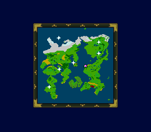

# 地名總圖：來源與驗證

[回攻略](README.md) · [開啟地名大圖](images/world-map-zh-Hant.png) · [乾淨原尺寸底圖](images/world-map-native.png)

這是真正從《新桃太郎傳說》v65 的月之鏡畫面取出的**地上世界地形**。海岸線、陸地、雪原與島嶼不是依攻略文字猜畫，也沒有取用外站地圖。

## 可以與不可以用來做什麼

- 總圖為 4400 × 3020；地上地形由原生 128 × 128 放大二十倍，沒有生成額外細節。
- A–H、1–8 只作查圖索引。可觀察大陸與海域的相對位置，不宜據此計算步數、地表格子或船能走的精確路徑。
- 地上圖直接加入海底入口投影；右側嵌入月上座標圖。海底投影不是海底地形，月上圖不是月面地形，地獄各層標在鬼島入口旁而非虛構各層地表座標。
- 81筆地名有直接定位或所屬入口標籤，包含七間麻雀旅館與十三位仙人。三號店掛在大江山入口，臥龍洞窟掛在風暴村，機關村標的是地下水路入口。
- 海之庵、漂泊之島確切位置及部分補充地標仍待核對；玩家的城可移動，仙人庵是共用預設名，原野與月亮是區域名稱。不是87個獨立入口全部核實，也不是全部水晶與寶箱定位圖。
- 藍色海域與原作配色完整保留；格線、定位點、地名與引線是額外排版層，原尺寸底圖沒有這些標註。

## 地名與座標依據

地名採[正式繁中地名索引](../opening-preview-v37/place-names.md)，位置直接讀取 v65 ROM 的原生入口事件，不取自外站圖片或舊版示意圖。場景事件根索引在 `0xac000 + scene * 3`；世界場景為地上 `4c`、海底 `df`、月上 `cf`。入口指令 `69` 或 `5d` 提供點或矩形範圍，`53` 提供目標場景，`2b` 設定地名。十三位仙人另以原生參數表 `0x4c38a` 至 `0x4c396` 對應名稱。JSON 保留入口、轉場與地名來源偏移；不是全地點實機走訪證明。

早期20點版的飛燕表仍作交叉核對與投影校準：

1. ROM 檔案偏移 `0x59568` 的 26 筆清單，將飛燕選項對應到場景編號。
2. `0x681c9` 的三位元組索引，將場景編號對應到 bank `86` 的原生傳送紀錄；座標讀取程式位於 CPU `86:8163`。
3. 只採用紀錄首個世界編號為 `0x4c` 的 20 筆地面位置，讀出世界 X、Y；以 `floor(X / 2)`、`floor(Y / 2)` 對應到月之鏡的 128 × 128 底圖。
4. 月上村莊使用獨立分圖；鬼島飛燕紀錄沒有固定地面 X、Y，現由其原生入口事件定位，不猜讀其他欄位。

以正常按鍵飛到啟程村、走出村莊並使用月之鏡，實測世界座標 `(54,237)`，圖中原生標記中心為 `(27,118)`。另一個來源快照的 `(163,131)` 對應 `(81,65)`，兩者均吻合投影規則。快照 PPU 中標記左上角需加 `(4,4)`，再扣除背景裁切原點 `(64,47)`；世界位置可讀自 RAM `0x1573`、`0x157d`。

啟程村校準快照 SHA-256：`ca3b67c6e62bdb82cd13c7149790021092ef26f88af9029a71742b3f4978c7b3`。此校準延續下述既有測試存檔，沒有修改存檔或 ROM，也不宣稱是全程正常遊玩的存檔。

每筆名稱、地名索引、場景編號、ROM 紀錄位置、原始世界座標與投影位置見 [world-map-locations.json](world-map-locations.json)。編號只是查圖用，不代表全部主線順序。

現行圖號為地名索引加一（01–87），不沿用舊20點編號。名稱、格位、內部入口及待核對項目見[全部地名索引](world-map-index.md)。月上分圖 A–H／1–8 使用自身範圍，不與地上格位混用。

驗證除了地名資料涵蓋率，也檢查總圖實際標籤：海底地名必須標明層級、地獄各層必須連到鬼島、臥龍洞窟必須連到風暴村。月上分圖合成後的像素必須與縮放來源完全一致，不能只在報告中宣稱存在。

## 原生擷取



上圖保留原生 256 × 224 畫面。粉色點代表**來源存檔當時的位置，不是讀者目前所在處**；白色閃光是該存檔的水晶提示，不是城鎮座標。

使用專案既有四人地圖存檔的副本，以正式 v65 ROM 和正常按鍵開啟月之鏡。**來源存檔的角色能力值曾被調整，因此不宣稱它是正常全流程遊玩的截圖。** 本次沒有增加道具、改寫記憶體、注入事件入口或啟用作弊；月之鏡原本已在桃太郎的道具中。攻略只採用地圖，不展示能力值。

原始存檔與 ROM 皆未覆寫；沒有讀寫遊戲裝置。地圖上與該存檔進度有關的玩家、水晶標記不放進正式地形版。

## 如何取得乾淨地形

原生背景與精靈是不同圖層，故不必用修圖工具塗掉標記：

1. 解析 Snes9x v12 快照的 PPU 與 VRAM 區段。
2. 依 mode 1 的 BG2 圖塊排列、4bpp 圖塊資料及 CGRAM 調色盤，重建背景。
3. 取畫面座標 `(64, 47)` 起的 128 × 128 地圖區域；依 SNES 掃描線規則處理一列偏移。
4. 用原擷取器的 RGB565 色彩轉換方式，與原生 PPM 畫面逐像素比較。
5. 差異必須全部落在快照中原生玩家／水晶精靈的範圍內；背景其餘位置必須完全相同。
6. 將乾淨背景無損輸出 PNG，再加格線、地名、定位點、標題與限制說明。未對地形做平滑、生成、補畫或位置調整。

本次結果：**16,248 / 16,384 像素與原生畫面完全一致，136 個差異全部位於原生標記範圍；範圍外差異為零。** 被遮住的地形來自實際背景圖塊，不是推估。另通過原尺寸 PNG 解碼回 RGB 的完全一致檢查，以及排版文字邊界檢查。

詳細雜湊、裁切區、圖層參數及標記座標見 [world-map-verification.json](world-map-verification.json)。

## 擷取紀錄

日期：2026-10-08。Snes9x libretro 核心原始碼版本：`1bcc369e89f08243e0a462882fb1f3e42e51de3a`。

| 輸入 | SHA-256 |
| --- | --- |
| 正式 v65 ROM | `6a726fb79df36a21b46a1eeec33409930ec282d110c312e4025e5538af25d470` |
| 原始四人地圖存檔 | `686a94ffbe01cfbcf7e2b82a1585e9b1d66ccb9a9785c3e1d50e23419b926a20` |
| 原生擷取器 | `9552601a7a00817a07bf8028d98d40979de46afb71434616b7ed3812836b6dcb` |
| Snes9x libretro 核心 | `241473252322eb9e9d5c9d419c26fc7abc9d6a42a875c6d2805ecae5c0b327e3` |

從原始四人存檔依序操作；每列以上一列結束時的狀態繼續。輸入格式為 `影格:持續影格數:按鍵`。

| 步驟 | 總影格 | 按鍵序列 |
| --- | --- | --- |
| 開道具、選持有人 | 360 | `30:3:a,100:3:right,180:3:a` |
| 選桃太郎 | 360 | `30:3:a` |
| 選月之鏡 | 360 | `30:3:down,90:3:down,150:3:down,210:3:left,270:3:a` |
| 使用並等待地圖 | 600 | `30:3:a` |

擷取時清空 `MOMOTARO_CHEATS`、`MOMOTARO_TRACE`，不載入額外 SRAM。最後一幀與其快照是渲染器的輸入。私有存檔、ROM、原始 PPM 與快照不隨攻略散布。

## 重建

需要 Node.js、ImageMagick、繁體中文字型，以及同一次月之鏡擷取的 Snes9x v12 快照、256 × 224 P6 PPM。座標 JSON 已隨攻略提供；重新擷取座標時另需本機正式 v65 ROM。不同場景或圖層配置會被檢查拒絕，不會默默輸出猜測地圖。

```sh
node walkthrough/extract-world-locations.mjs 'opening-preview-v65/opening-zh-Hant.sfc'
node walkthrough/render-world-map.mjs /path/to/state.bin /path/to/frame.ppm /path/to/NotoSansCJKtc-Regular.otf
```

程式：[extract-world-locations.mjs](extract-world-locations.mjs)、[render-world-map.mjs](render-world-map.mjs)。渲染時檢查 20 處地名座標、文字邊界、標籤與引線避讓；生成的三張 PNG、座標 JSON 與驗證報告可直接閱讀，不需要模擬器。遊戲原始圖像的權利仍屬原權利人。